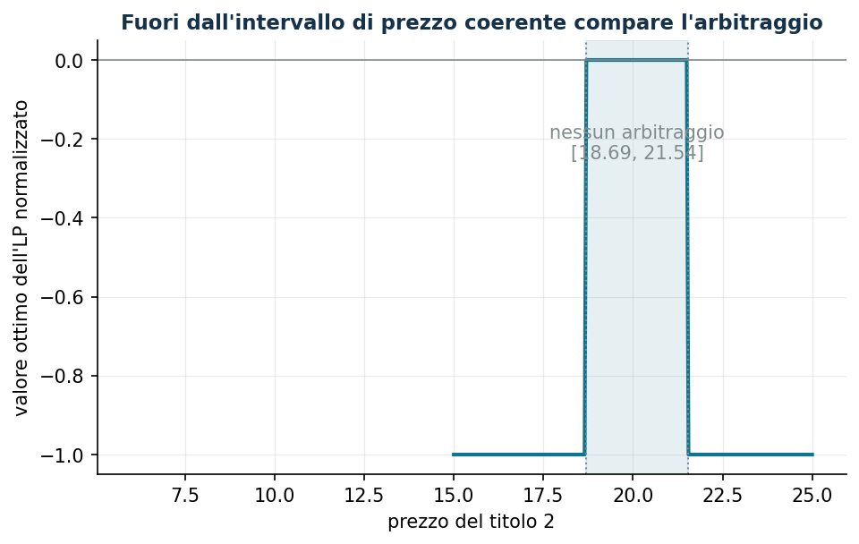

# Arbitraggio e prezzatura senza arbitraggio

**Classe: LP** · Script: `python/lab14_arbitraggio.py`

[](https://colab.research.google.com/github/fabiofurini/laboratorio-ricerca-operativa/blob/main/notebooks/lab14_arbitraggio.ipynb)

Un **arbitraggio** è una strategia che crea denaro dal nulla: incassa oggi senza
alcun rischio di perdita domani (tipo A), oppure non costa nulla oggi e può solo
guadagnare (tipo B). Rilevarlo è un LP; la dualità — prezzi ombra, scarti
complementari, dualità forte — diventa la teoria della prezzatura. È
l'applicazione più pulita della coppia primale-duale di tutto il laboratorio.

## Il modello

Mercato a uno stadio: oggi si compra o si vende ai prezzi $s^0_i$; domani si
realizza uno tra $m$ stati del mondo e il titolo $i$ paga $s^1_{ij}$. Il titolo
$0$ è privo di rischio: costa $1$ e paga $R = 1 + r$ in ogni stato. Variabili:
le posizioni $x_i$ (libere: acquisto o vendita allo scoperto).

$$
\begin{aligned}
\min ~ \sum_{i=0}^{n} s^0_i x_i & & \\
\text{soggetto a} \quad \sum_{i=0}^{n} s^1_{ij} x_i &\ge 0, & \forall j \in \{1, 2, \dots, m\}, \\
x_i &\gtreqless 0, & \forall i \in \{0, 1, \dots, n\}.
\end{aligned}
$$

Il portafoglio nullo è ammissibile, quindi l'ottimo è sempre $\le 0$. Se
l'ottimo è $< 0$ c'è un **arbitraggio di tipo A** e, essendo i vincoli omogenei,
il modello è illimitato: per un certificato finito si aggiunge la
**normalizzazione** $\sum_i s^0_i x_i \ge -1$ («incasso oggi al più 1»).

## La dualità è la prezzatura

Con le regole della dualità (primale di minimo): ogni stato genera una $p_j \ge 0$,
ogni posizione libera un vincolo duale di **uguaglianza**:

$$
\sum_{j=1}^{m} s^1_{ij}\, p_j = s^0_i \quad \forall i \in \{0, 1, \dots, n\},
\qquad p_j \ge 0 .
$$

Dal vincolo del titolo 0: $\sum_j p_j = 1/R$, quindi $q_j = R\, p_j$ sono
**probabilità neutrali al rischio** e

$$
s^0_i = \frac{1}{R} \sum_{j=1}^{m} q_j\, s^1_{ij} :
$$

*il prezzo di oggi è il valore atteso scontato dei payoff di domani sotto $q$.*

!!! note "Teorema fondamentale della prezzatura"
    Non esiste alcun arbitraggio (tipo A né tipo B) **se e solo se** esiste una
    misura neutrale al rischio con $q_j > 0$ per ogni stato. È dualità forte
    (niente tipo A ⇒ il duale è ammissibile) più scarti complementari (niente
    tipo B ⇒ esiste una misura con $q > 0$).

## Caso di studio

Tre stati, $R = 1{,}04$, due titoli rischiosi con payoff $(10, 15, 13)$ e
$(30, 15, 25)$ — dati in `dati/arbitraggio_payoff.csv`.

```text
Prezzi (6, 20):      senza normalizzazione: UNBOUNDED (tipo A)
  normalizzato: ottimo -1  ->  incasso 1 oggi, payoff (0; 0; 0,20) >= 0
  a mano: (-27, 1, 1) incassa 1 con payoff (11,92; 1,92; 9,92)
Prezzi (13, 18.69):  ottimo 0, nessun arbitraggio
  duali dei vincoli di stato p* = (0,2846; 0,6769; 0)
  q = R p*             = (0,296;  0,704;  0)   somma 1
  verifica prezzatura: s0 = (1; 13; 18,6923) riprodotti esattamente
```

I duali **prezzano**: ogni titolo, anche nuovo, vale il suo payoff atteso
scontato sotto $q$. La $q_3 = 0$ segnala che lo stato 3 non serve a prezzare
questi titoli — ed è il motivo per cui il teorema richiede $q > 0$: con
$q_3 = 0$ resta un arbitraggio di tipo B latente sullo stato 3.

## Sensitività: l'intervallo dei prezzi coerenti

Con i soli titoli 0 e 1 quotati (1 e 13), i prezzi del titolo 2 che **non**
creano arbitraggio sono un intervallo, calcolato con due LP (min e max di
$\sum_j s^1_{2j} p_j$ sulle misure coerenti):

$$
s^0_2 \in [18{,}69,\; 21{,}54] .
$$



Dentro l'intervallo il valore dell'LP normalizzato è 0 (prezzi coerenti); fuori
scende a −1: esiste un arbitraggio, in una direzione o nell'altra.

**Prezzare un titolo nuovo.** Una call sul titolo 1 con strike 12 paga
$(0, 3, 1)$:

- **mercato completo** (titoli 0, 1, 2 quotati): misura unica, prezzo unico
  $2{,}0308$;
- **mercato incompleto** (solo 0 e 1): infinite misure coerenti, prezzo in
  $[1{,}4615,\; 2{,}0308]$ — fuori da quell'intervallo chiunque costruirebbe un
  arbitraggio combinando call e titoli quotati.

??? example "Mostra lo script completo — `lab14_arbitraggio.py`"
    ```python
    """Capitolo 14 — Arbitraggio e prezzatura senza arbitraggio (LP).

    Caso di studio: un mercato a uno stadio con 3 stati del mondo, un titolo privo
    di rischio (rendimento lordo R = 1,04) e 2 titoli rischiosi.

    Contenuto:
      1. Rilevare un arbitraggio (LP normalizzato): prezzi (6, 20) -> guadagno 1 oggi
      2. Prezzi coerenti (13, 18.6923): ottimo 0 e probabilita' neutrali al rischio
         dai duali dei vincoli di stato
      3. Intervallo di prezzo senza arbitraggio per il titolo 2 (due LP + griglia)
      4. Prezzatura di una call: mercato completo (prezzo unico) vs incompleto (range)
    """
    import gurobipy as gp
    import numpy as np
    import pandas as pd
    from gurobipy import GRB

    from stile import ARANCIO, GRIGIO, ROSSO, TEAL, intestazione, plt, salva_dat, salva_dati, salva_figura

    # ----------------------------------------------------------------------
    # 1. DATI: payoff s1[i][j] del titolo i nello stato j; titolo 0 privo di rischio
    # ----------------------------------------------------------------------
    r = 0.04
    R = 1 + r                                     # rendimento lordo del titolo 0
    s1 = np.array([[R, R, R],                     # titolo 0
                   [10.0, 15.0, 13.0],            # titolo 1
                   [30.0, 15.0, 25.0]])           # titolo 2
    n1, n_stati = s1.shape                        # 3 titoli (0,1,2), 3 stati

    salva_dati(pd.DataFrame(s1, columns=[f"stato_{j+1}" for j in range(n_stati)],
                            index=["titolo_0", "titolo_1", "titolo_2"]).reset_index(names="titolo"),
               "arbitraggio_payoff")


    def lp_arbitraggio(s0, normalizza=True):
        """min sum s0_i x_i  soggetto a  payoff >= 0 in ogni stato (x libere).

        Con `normalizza` aggiunge  sum s0_i x_i >= -1  (incasso oggi al piu' 1):
        senza, in presenza di arbitraggio di tipo A il modello e' illimitato."""
        m = gp.Model("arbitraggio")
        m.Params.OutputFlag = 0
        m.Params.DualReductions = 0               # distingue UNBOUNDED da INFEASIBLE
        x = m.addVars(n1, lb=-GRB.INFINITY, name="x")
        v_stato = m.addConstrs(
            (gp.quicksum(s1[i, j] * x[i] for i in range(n1)) >= 0
             for j in range(n_stati)), name="stato")
        if normalizza:
            m.addConstr(gp.quicksum(s0[i] * x[i] for i in range(n1)) >= -1,
                        name="normalizzazione")
        m.setObjective(gp.quicksum(s0[i] * x[i] for i in range(n1)), GRB.MINIMIZE)
        m.optimize()
        return m, x, v_stato


    # ----------------------------------------------------------------------
    # 2. RILEVARE UN ARBITRAGGIO: prezzi (1, 6, 20)
    # ----------------------------------------------------------------------
    intestazione("Prezzi (6, 20): c'e' arbitraggio?")
    s0_arb = np.array([1.0, 6.0, 20.0])
    m_nb, _, _ = lp_arbitraggio(s0_arb, normalizza=False)
    print(f"LP senza normalizzazione: status {m_nb.Status} "
          f"({'UNBOUNDED: arbitraggio di tipo A' if m_nb.Status == GRB.UNBOUNDED else 'ottimo'})")
    m_a, x_a, _ = lp_arbitraggio(s0_arb)
    print(f"LP normalizzato: valore ottimo {m_a.ObjVal:.4f} "
          f"(= incasso oggi di 1 senza alcun rischio)")
    print("Strategia:", {f"x{i}": round(x_a[i].X, 4) for i in range(n1)})
    payoff = s1.T @ np.array([x_a[i].X for i in range(n1)])
    print("Payoff nei tre stati:", np.round(payoff, 4), "(tutti >= 0)")
    # la strategia "a mano" del capitolo: (-27, 1, 1)
    x_libro = np.array([-27.0, 1.0, 1.0])
    print(f"Strategia (-27, 1, 1): costo {s0_arb @ x_libro:.0f}, "
          f"payoff {np.round(s1.T @ x_libro, 2)} (equivalente, in scala diversa)")

    # ----------------------------------------------------------------------
    # 3. PREZZI COERENTI: ottimo 0 e probabilita' neutrali al rischio
    # ----------------------------------------------------------------------
    intestazione("Prezzi (13, 18.6923): niente arbitraggio e prezzatura")
    s0_ok = np.array([1.0, 13.0, 18.692308])
    m_b, x_b, v_stato = lp_arbitraggio(s0_ok, normalizza=False)
    print(f"Valore ottimo: {m_b.ObjVal:.4f}  (strategia nulla: nessun arbitraggio)")
    p = np.array([v_stato[j].Pi for j in range(n_stati)])
    q = R * p
    print(f"Duali dei vincoli di stato p* = {np.round(p, 4)}")
    print(f"Probabilita' neutrali al rischio q = R p* = {np.round(q, 4)} "
          f"(somma = {q.sum():.4f})")
    print("Verifica prezzatura: s0_i = sum_j p_j s1_ij =",
          np.round(s1 @ p, 4))

    # ----------------------------------------------------------------------
    # 4. INTERVALLO DI PREZZO SENZA ARBITRAGGIO PER IL TITOLO 2
    # ----------------------------------------------------------------------
    intestazione("Intervallo di prezzo senza arbitraggio per il titolo 2")


    def bound_prezzo(payoff_nuovo, quotati, senso):
        """min/max di sum_j p_j payoff_j sulle misure p >= 0 coerenti coi quotati."""
        d = gp.Model("prezzatura")
        d.Params.OutputFlag = 0
        pp = d.addVars(n_stati, name="p")
        for i, prezzo in quotati:
            d.addConstr(gp.quicksum(s1[i, j] * pp[j] for j in range(n_stati)) == prezzo)
        d.setObjective(gp.quicksum(payoff_nuovo[j] * pp[j] for j in range(n_stati)), senso)
        d.optimize()
        assert d.Status == GRB.OPTIMAL
        return d.ObjVal


    quotati_01 = [(0, 1.0), (1, 13.0)]
    lo = bound_prezzo(s1[2], quotati_01, GRB.MINIMIZE)
    hi = bound_prezzo(s1[2], quotati_01, GRB.MAXIMIZE)
    print(f"Con titolo 0 e titolo 1 quotati (1 e 13): prezzo del titolo 2 "
          f"senza arbitraggio in [{lo:.4f}, {hi:.4f}]")

    griglia = np.linspace(15, 25, 201)
    valori = []
    for prezzo2 in griglia:
        mg, _, _ = lp_arbitraggio(np.array([1.0, 13.0, prezzo2]))
        valori.append(mg.ObjVal)
    curva = pd.DataFrame({"prezzo_titolo2": griglia, "valore_lp": valori})
    salva_dati(curva, "arbitraggio_curva_prezzo")
    salva_dat(curva, "cap14_arbitraggio_curva")
    print(f"Griglia {griglia[0]:.0f}..{griglia[-1]:.0f}: valore LP = 0 solo dentro "
          f"l'intervallo, negativo fuori (arbitraggio)")

    # ----------------------------------------------------------------------
    # 5. PREZZATURA DI UNA CALL SUL TITOLO 1 (STRIKE 12)
    # ----------------------------------------------------------------------
    intestazione("Prezzatura di una call sul titolo 1, strike 12")
    call = np.maximum(s1[1] - 12.0, 0.0)
    print("Payoff della call nei tre stati:", call)
    quotati_012 = [(0, 1.0), (1, 13.0), (2, 18.692308)]
    lo_c = bound_prezzo(call, quotati_012, GRB.MINIMIZE)
    hi_c = bound_prezzo(call, quotati_012, GRB.MAXIMIZE)
    print(f"Mercato completo (titoli 0, 1, 2 quotati): prezzo unico "
          f"[{lo_c:.4f}, {hi_c:.4f}]")
    lo_i = bound_prezzo(call, quotati_01, GRB.MINIMIZE)
    hi_i = bound_prezzo(call, quotati_01, GRB.MAXIMIZE)
    print(f"Mercato incompleto (solo titoli 0 e 1):    intervallo    "
          f"[{lo_i:.4f}, {hi_i:.4f}]")

    # ----------------------------------------------------------------------
    # 6. FIGURA: guadagno da arbitraggio al variare del prezzo del titolo 2
    # ----------------------------------------------------------------------
    fig, ax = plt.subplots()
    ax.plot(curva["prezzo_titolo2"], curva["valore_lp"], color=TEAL, lw=2)
    ax.axvspan(lo, hi, color=TEAL, alpha=0.10)
    ax.axvline(lo, color=GRIGIO, ls=":", lw=1)
    ax.axvline(hi, color=GRIGIO, ls=":", lw=1)
    ax.axhline(0, color=GRIGIO, lw=0.8)
    ax.annotate(f"nessun arbitraggio\n[{lo:.2f}, {hi:.2f}]",
                ((lo + hi) / 2, -0.25), ha="center", color=GRIGIO)
    ax.plot([6], [0], alpha=0)  # noop
    ax.set_xlabel("prezzo del titolo 2")
    ax.set_ylabel("valore ottimo dell'LP normalizzato")
    ax.set_title("Fuori dall'intervallo di prezzo coerente compare l'arbitraggio")
    salva_figura(fig, "cap14_arbitraggio_curva")

    print("\nFatto: capitolo 14 (arbitraggio).")
    ```

## Esercizi

1. Con i prezzi $(6, 20)$, trovare una strategia che incassa 5 oggi senza rischi
   domani.
2. Porre il prezzo del titolo 2 all'estremo superiore $21{,}5385$: verificare che
   l'ottimo è 0 e calcolare la misura di prezzatura. Che cosa succede a
   $21{,}60$?
3. Nel mercato completo, prezzare una call sul titolo 2 con strike 20 e
   verificare il prezzo con le probabilità neutrali al rischio.
