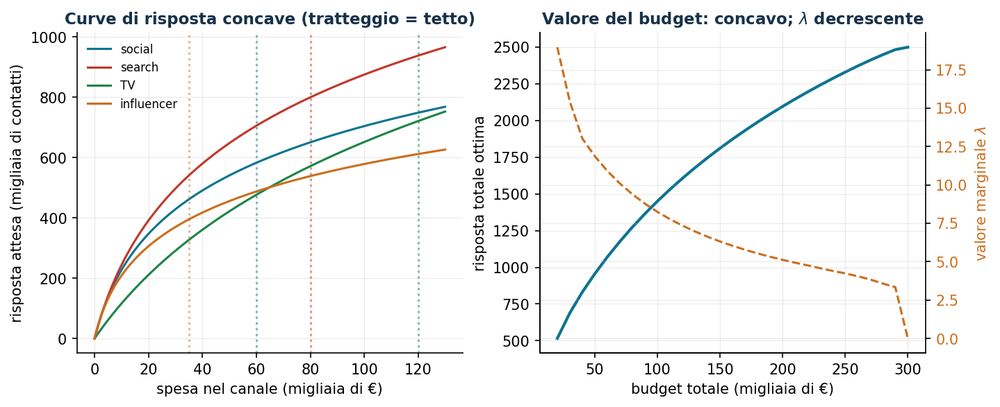
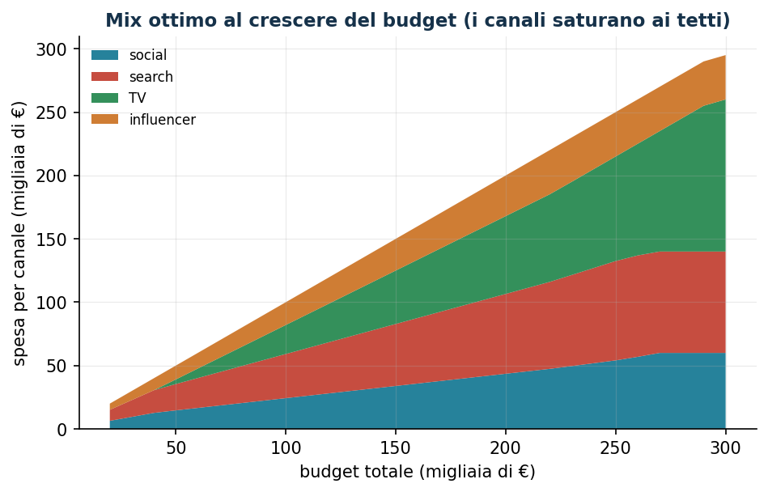

# Allocazione del budget pubblicitario

**Classe:** NLP convesso · **Script:** `python/lab08_budget.py`

Come ripartire una campagna da 100.000 € tra canali con rendimenti marginali
decrescenti? La teoria dice qualcosa di forte e verificabile: **all'ottimo i
rendimenti marginali si eguagliano** — ed è esattamente ciò che il solver
restituisce, cifra per cifra.

**Il problema a parole.** *Decidiamo* la spesa $x_i$ per canale. *L'obiettivo*:
massima risposta totale. *I vincoli*: budget $b$ e tetti $u_i$.

## Modello

Risposta concava $r_i(x) = a_i \log(1 + k_i x)$ per ogni canale:

$$
\max \sum_{i=1}^{n} r_i(x_i)
\quad\text{soggetto a}\quad \sum_{i=1}^{n} x_i \le b, \qquad x_i \le u_i,
\qquad x_i \ge 0, \;\;\forall i \in \{1,\dots,n\}.
$$

**Condizione KKT all'ottimo:** $r_i'(x_i^*) = \lambda$ per ogni canale interno:
l'ultimo euro rende lo stesso ovunque; i canali al tetto hanno marginale
$> \lambda$, quelli a zero marginale iniziale $< \lambda$.

!!! example "Esempio a mano (2 canali, b = 50)"
    $r_1 = 100\log(1 + 0{,}2x)$, $r_2 = 60\log(1 + 0{,}1x)$. Eguagliando i marginali
    con $x_2 = 50 - x_1$: $x_1 = 35{,}6$, $x_2 = 14{,}4$, $\lambda = 2{,}46$.

## Risultati e verifica delle KKT

```text
     canale |  spesa | tetto | marginale
     social |   24,3 |    60 |  8,2693
     search |   34,8 |    80 |  8,2693
         TV |   22,9 |   120 |  8,2693
 influencer |   18,0 |    35 |  8,2693
Verifica: +1000 € di budget -> risposta +8,244 ≈ lambda
```

I quattro marginali coincidono alla quarta cifra. Nota manageriale: la TV riceve
*meno* dei social nonostante il tetto più alto — non conta la dimensione del canale
ma la velocità con cui satura ($k_i$).





## Sensitività

```text
b =  20: lambda = 18,97      b = 180: lambda = 5,54
b = 100: lambda =  8,24      b = 300: lambda = 0,00  (tutti ai tetti)
```

La curva di $\lambda$ è l'argomento quantitativo per negoziare il budget: si
finanzia il marketing finché $\lambda$ supera il rendimento di un euro investito
altrove.


## Codice

Lo script completo del capitolo — dati, modello, soluzione, sensitività e figure —
è [`python/lab08_budget.py`](https://github.com/fabiofurini/laboratorio-ricerca-operativa/blob/main/python/lab08_budget.py)
(riproducibile con `python3 python/lab08_budget.py` dalla cartella `python/`).

??? example "Mostra lo script completo — `lab08_budget.py`"

    ```python
    """Capitolo 8 — Allocazione del budget pubblicitario (NLP convesso).

    Caso di studio: campagna da 100.000 € su 4 canali (social, search, TV, influencer)
    con curve di risposta concave (rendimenti marginali decrescenti).

    Contenuto:
      1. Massimizzazione della risposta totale con budget e tetti per canale
      2. Verifica numerica della condizione KKT: ritorno marginale uguale sui canali attivi
      3. Curva valore-budget e valore marginale di un euro
      4. Mix ottimo al crescere del budget
    """
    import numpy as np
    import pandas as pd
    from scipy.optimize import minimize

    from stile import (ARANCIO, CICLO, GRIGIO, TEAL, intestazione, plt, salva_dat, salva_dati,
                       salva_figura)

    # ----------------------------------------------------------------------
    # 1. DATI: risposta logaritmica R_i(x) = a_i * log(1 + b_i x)   [x in migliaia di €]
    # ----------------------------------------------------------------------
    canali = ["social", "search", "TV", "influencer"]
    a = np.array([260.0, 380.0, 520.0, 190.0])   # scala della risposta (contatti utili, migliaia)
    b = np.array([0.14, 0.09, 0.025, 0.20])      # velocità di saturazione
    u = np.array([60.0, 80.0, 120.0, 35.0])      # tetto per canale (migliaia di €)
    B = 100.0                                    # budget totale (migliaia di €)

    salva_dati(pd.DataFrame({"canale": canali, "a": a, "b": b, "tetto": u}), "budget_canali")


    def risposta(x):
        return float(np.sum(a * np.log1p(b * x)))


    def marginale(x):
        return a * b / (1 + b * x)


    def alloca(budget):
        """max sum a_i log(1+b_i x_i)  soggetto a  sum x_i <= budget, 0 <= x_i <= u_i (concavo)."""
        res = minimize(lambda x: -risposta(x), x0=np.full(4, budget / 4),
                       bounds=[(0, ui) for ui in u],
                       constraints=[{"type": "ineq", "fun": lambda x: budget - x.sum()}],
                       method="SLSQP", options={"ftol": 1e-10, "maxiter": 500})
        assert res.success, res.message
        return res.x, -res.fun


    intestazione(f"Allocazione ottima con budget B = {B:.0f} mila €")
    x_opt, R_opt = alloca(B)
    print(f"Risposta totale: {R_opt:,.1f} (migliaia di contatti utili)\n")
    print(f"{'canale':>11} | {'spesa':>8} | {'tetto':>6} | {'risposta':>9} | {'marginale':>9}")
    marg = marginale(x_opt)
    for i, ch in enumerate(canali):
        print(f"{ch:>11} | {x_opt[i]:8.1f} | {u[i]:6.0f} | {a[i] * np.log1p(b[i] * x_opt[i]):9.1f} "
              f"| {marg[i]:9.4f}")
    print(f"\nSpesa totale: {x_opt.sum():.1f} / {B:.0f}")

    # ----------------------------------------------------------------------
    # 2. VERIFICA KKT: marginale uguale sui canali attivi e non al tetto
    # ----------------------------------------------------------------------
    intestazione("Verifica KKT")
    interni = [(0 < x_opt[i] < u[i] - 1e-6) for i in range(4)]
    marg_interni = marg[interni]
    print(f"Canali interni (né a 0 né al tetto): {[canali[i] for i in range(4) if interni[i]]}")
    print(f"Ritorni marginali sui canali interni: {np.round(marg_interni, 4)}")
    print(f"→ tutti uguali al prezzo ombra del budget: lambda ≈ {marg_interni.mean():.4f}")
    print("L'ultimo euro investito produce lo stesso ritorno in tutti i canali attivi.")

    # verifica per perturbazione
    _, R_piu = alloca(B + 1)
    print(f"Verifica: +1000 € di budget → risposta +{R_piu - R_opt:.4f} ≈ lambda")

    # ----------------------------------------------------------------------
    # 3. CURVA VALORE-BUDGET e mix ottimo
    # ----------------------------------------------------------------------
    intestazione("Curva valore-budget")
    budgets = np.arange(20, 301, 10)
    valori, mixes, lambde = [], [], []
    for bb in budgets:
        xx, rr = alloca(float(bb))
        _, rr2 = alloca(float(bb) + 1)
        valori.append(rr)
        mixes.append(xx)
        lambde.append(rr2 - rr)
    mixes = np.array(mixes)
    curva = pd.DataFrame({"budget": budgets, "risposta": valori, "lambda": lambde})
    salva_dati(curva, "budget_curva_valore")
    for bb, rr, ll in zip(budgets[::4], valori[::4], lambde[::4]):
        print(f"  B = {bb:3d}: risposta {rr:8.1f}, valore marginale di 1000 € = {ll:6.3f}")

    # ----------------------------------------------------------------------
    # 4. FIGURE
    # ----------------------------------------------------------------------
    xx = np.linspace(0, 130, 300)
    salva_dat(pd.DataFrame({"x": xx, **{ch: a[i] * np.log1p(b[i] * xx)
                                        for i, ch in enumerate(canali)}}), "cap08_risposte")
    salva_dat(curva, "cap08_valore_budget")
    salva_dat(pd.DataFrame({"budget": budgets, **{ch: mixes[:, i]
                                                  for i, ch in enumerate(canali)}}), "cap08_mix")
    fig, (ax1, ax2) = plt.subplots(1, 2, figsize=(10.5, 4.0))
    for i, ch in enumerate(canali):
        ax1.plot(xx, a[i] * np.log1p(b[i] * xx), label=ch, color=CICLO[i])
        ax1.axvline(u[i], color=CICLO[i], ls=":", alpha=0.5)
    ax1.set_xlabel("spesa nel canale (migliaia di €)")
    ax1.set_ylabel("risposta attesa (migliaia di contatti)")
    ax1.set_title("Curve di risposta concave (tratteggio = tetto)")
    ax1.legend(fontsize=8)
    ax2.plot(curva["budget"], curva["risposta"], color=TEAL, lw=2)
    ax2.set_xlabel("budget totale (migliaia di €)")
    ax2.set_ylabel("risposta totale ottima")
    ax2b = ax2.twinx()
    ax2b.plot(curva["budget"], curva["lambda"], color=ARANCIO, ls="--")
    ax2b.set_ylabel("valore marginale $\\lambda$", color=ARANCIO)
    ax2b.tick_params(axis="y", labelcolor=ARANCIO)
    ax2b.spines.right.set_visible(True)
    ax2.set_title("Valore del budget: concavo; $\\lambda$ decrescente")
    salva_figura(fig, "cap08_curve")

    fig, ax = plt.subplots()
    ax.stackplot(budgets, mixes.T, labels=canali, colors=CICLO, alpha=0.9)
    for i in range(4):
        ax.axhline(0, lw=0)  # noop per legenda pulita
    ax.set_xlabel("budget totale (migliaia di €)")
    ax.set_ylabel("spesa per canale (migliaia di €)")
    ax.set_title("Mix ottimo al crescere del budget (i canali saturano ai tetti)")
    ax.legend(fontsize=8, loc="upper left")
    salva_figura(fig, "cap08_mix")

    print("\nFatto: capitolo 8.")
    ```

## Esercizi

1. Esempio a mano con $b = 80$: $x = (54{,}4;\, 25{,}6)$, $\lambda = 1{,}68$.
2. Risposta esponenziale satura per la TV: serve ancora il tetto $u_i$?
3. Canale con marginale iniziale $5 < \lambda$: resta a zero; interpretarne il
   "costo ridotto".
4. Copertura equa tra segmenti: $\max z$ con $z \le$ copertura di ogni segmento.
