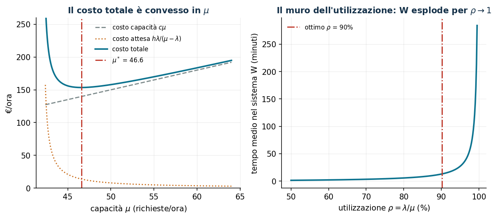
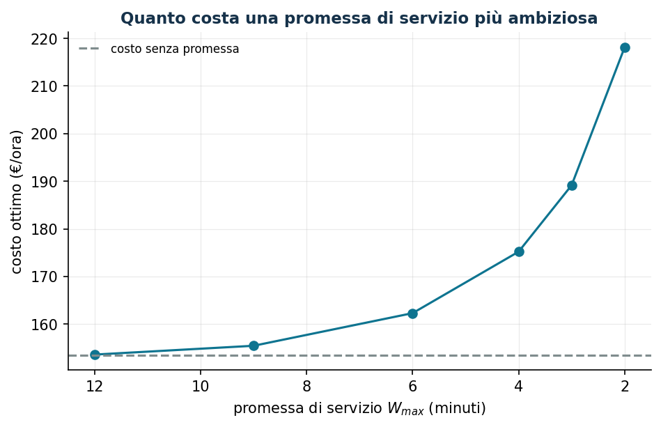

# Capacità di servizio e tempi di attesa

**Classe:** NLP convesso (coda M/M/1) · **Script:** `python/lab11_code.py`

Quanta capacità assegnare a un call center, uno sportello, un servizio cloud? Più
capacità costa; poca capacità fa esplodere le attese. Messaggio centrale,
contro-intuitivo per chi ragiona "a efficienza": **l'utilizzazione ottima non è il
100%**.

**Il problema a parole.** *Decidiamo* la capacità $\mu$. *L'obiettivo*: costo di
capacità + valore del tempo dei clienti nel sistema. *Il vincolo*: stabilità
$\mu > \lambda$.

## Modello

Coda **M/M/1** (arrivi di Poisson a tasso $\lambda$, servizio esponenziale, un
servente): tempo medio nel sistema $w(\mu) = 1/(\mu - \lambda)$, clienti medi
$l(\mu) = \lambda/(\mu - \lambda)$.

$$
\min_{\mu > \lambda}\; c\,\mu + h\,\frac{\lambda}{\mu - \lambda}
\qquad\Longrightarrow\qquad
\mu^* = \lambda + \sqrt{h\lambda/c}
$$

"Capacità = domanda + **cuscinetto**": il cuscinetto cresce con il valore del tempo
dei clienti, decresce con il costo della capacità, e scala come $\sqrt\lambda$
(economie di scala → pooling).

!!! example "Esempio a mano"
    $\lambda = 8$/h, $c = 2$, $h = 4$: $\mu^* = 8 + \sqrt{16} = 12$, $\rho = 67\%$,
    $w = 15$ min, costo 32 €/h. "Tagliare gli sprechi" a $\mu = 9$ ($\rho = 89\%$)
    costerebbe 50 €/h.

## Caso di studio

$\lambda = 42$ richieste/ora, $c = 3$ €, $h = 1{,}5$ €.

```text
mu* = 46,583 (analitico = numerico)   costo 153,50 €/h
rho = 90,2%   w = 13,1 minuti
```



Tra $\rho = 90\%$ e $\rho = 99\%$ il tempo di attesa **si moltiplica per dieci**:
"saturare le risorse" e "dare un buon servizio" sono in conflitto matematico, non
organizzativo.

## Il prezzo di una promessa di servizio

Con la promessa $w \le w_{\max}$ serve $\mu \ge \lambda + 1/w_{\max}$:

```text
w_max = 12 min: costo 153,60 (quasi gratis)     w_max = 3 min: 189,15
w_max =  6 min: costo 162,30                    w_max = 2 min: 218,10 (+42%)
```



Quando il vincolo è attivo, $dC/dw_{\max} = -c/w_{\max}^2 + h\lambda$: a 6 minuti
vale $-237$ €/h per ora di promessa — il numero da dare al marketing *prima* che
firmi lo SLA.

**Robustezza:** con $\lambda \in [36, 48]$ l'ottimo nominale ($\mu^* = 46{,}6 < 48$)
**diverge** nel caso peggiore; il dimensionamento robusto ($\mu = 52{,}9$) costa
+13% — un premio assicurativo contro il disastro.

## Esercizi

1. Ricavare $dC/dw_{\max} = -c/w_{\max}^2 + h\lambda$ e verificarla a 4 e 9 minuti.
2. Costo d'attesa quadratico $h/(\mu - \lambda)^2$: $\mu^* = \lambda + (2h/c)^{1/3}$.
3. Pooling: due code separate ($\lambda = 21$ ciascuna) vs una unica ($\lambda = 42$)
   a parità di capacità totale.
4. Frontiera (costo, $w$): dove ogni minuto promesso in meno costa più di 10 €/h?
   (Sotto ~4 minuti.)
