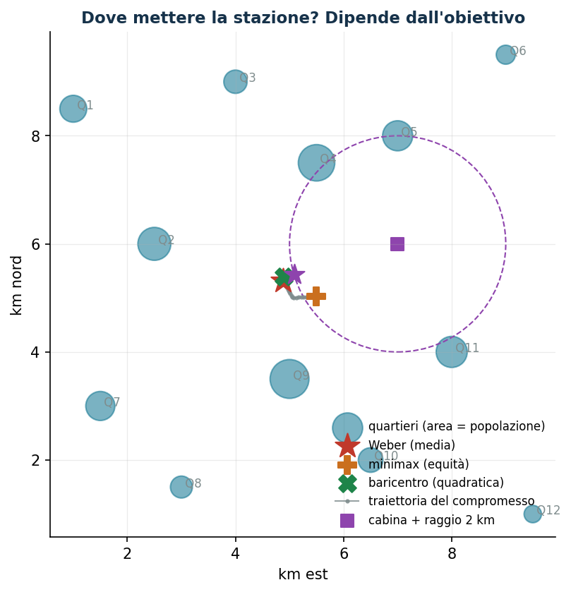
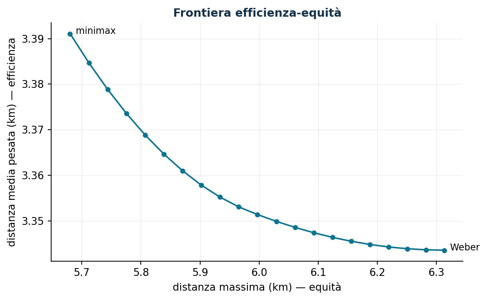

# Localizzazione continua di un servizio

**Classe:** NLP convesso · **Script:** `python/lab09_localizzazione.py`

Dove collocare una stazione di ricarica, un micro-hub, un presidio sanitario per
essere "vicini" alla domanda? Dipende da cosa significa vicini: distanza **media**
(efficienza), **massima** (equità) o **quadratica** (baricentro). Tre obiettivi,
tre punti diversi sulla mappa.

**Il problema a parole.** *Decidiamo* le coordinate $(x, y)$. *L'obiettivo* è la
vera scelta manageriale (media / massimo / quadratica). *I vincoli* delimitano
l'area ammissibile.

## Modello

Quartieri $i \in I$ in $(a_i, b_i) \in \mathbb{R}^2$ con pesi $w_i \ge 0$:

$$
\text{Weber:}\ \min \sum_{i=1}^{n} w_i \sqrt{(x - a_i)^2 + (y - b_i)^2}
\qquad
\text{Minimax:}\ \min z \ \text{ soggetto a } \ \sqrt{(x - a_i)^2 + (y - b_i)^2} \le z, \ \forall i \in \{1,\dots,n\}
$$

$$
\text{Quadratico:}\ \min \sum_{i=1}^{n} w_i \left[ (x - a_i)^2 + (y - b_i)^2 \right]
\ \Rightarrow\ \text{baricentro pesato (forma chiusa)}
$$

Tutti convessi. Vincolo geografico tipico (convesso): entro raggio $r$ da
un'infrastruttura.

!!! example "Esempio a mano (1D)"
    Clienti nei km 0, 4, 10 con pesi 1, 1, 3. Weber = **mediana pesata** = 10;
    baricentro = 6,8; minimax = 5. Tre obiettivi ragionevoli, tre risposte diverse:
    la scelta dell'obiettivo *è* la decisione manageriale.

## Caso di studio

12 quartieri (pesi 5–25 mila abitanti), vincolo: entro 2 km dalla cabina elettrica
in (7, 6). Dati in `dati/localizzazione_quartieri.csv`.

```text
Baricentro : (4,90, 5,40)
Weber      : (4,89, 5,31)  dist. media 3,344 km   max 6,314 km
Minimax    : (5,50, 5,03)  dist. media 3,391 km   max 5,680 km
Weber vincolato: (5,08, 5,43)  costo +0,2% (vincolo attivo, ottimo sul bordo)
```



Il minimax si sposta di oltre mezzo km per proteggere le periferie; il vincolo della
cabina costa quasi nulla (+0,2%): scoprire che un vincolo temuto è quasi gratis è un
risultato manageriale importante quanto l'ottimo.

## Sensitività: frontiera efficienza-equità

Metodo ε-constraint: minima distanza media con tetto $D$ sulla massima.



La frontiera è quasi piatta: garantire 0,63 km in meno al quartiere più lontano
costa solo 47 metri di distanza media — l'equità qui è "quasi gratis".


## Codice

Lo script completo del capitolo — dati, modello, soluzione, sensitività e figure —
è [`python/lab09_localizzazione.py`](https://github.com/fabiofurini/laboratorio-ricerca-operativa/blob/main/python/lab09_localizzazione.py)
(riproducibile con `python3 python/lab09_localizzazione.py` dalla cartella `python/`).

??? example "Mostra lo script completo — `lab09_localizzazione.py`"

    ```python
    """Capitolo 9 — Localizzazione continua di un servizio (NLP convesso).

    Caso di studio: dove collocare una stazione di ricarica rapida in una città
    con 12 quartieri, pesati per popolazione.

    Contenuto:
      1. Baricentro pesato (distanza quadratica): soluzione in forma chiusa
      2. Punto di Weber (distanza euclidea): scipy
      3. Minimax (protegge il quartiere più lontano): riformulazione con variabile z
      4. Compromesso alpha·media + (1-alpha)·massimo: curva efficienza-equità
    """
    import numpy as np
    import pandas as pd
    from scipy.optimize import minimize

    from stile import (ARANCIO, GRIGIO, ROSSO, TEAL, VERDE, intestazione, plt, salva_dat,
                       salva_dati, salva_figura, salva_tikz)

    rng = np.random.default_rng(7)

    # ----------------------------------------------------------------------
    # 1. DATI: 12 quartieri (coordinate km, peso = popolazione in migliaia)
    # ----------------------------------------------------------------------
    nomi = [f"Q{k}" for k in range(1, 13)]
    coord = np.array([
        [1.0, 8.5], [2.5, 6.0], [4.0, 9.0], [5.5, 7.5], [7.0, 8.0], [9.0, 9.5],
        [1.5, 3.0], [3.0, 1.5], [5.0, 3.5], [6.5, 2.0], [8.0, 4.0], [9.5, 1.0]])
    peso = np.array([12.0, 18.0, 9.0, 22.0, 15.0, 6.0, 14.0, 8.0, 25.0, 10.0, 16.0, 5.0])
    salva_dati(pd.DataFrame({"quartiere": nomi, "x": coord[:, 0], "y": coord[:, 1], "peso": peso}),
               "localizzazione_quartieri")


    def dist(p):
        return np.sqrt(((coord - p) ** 2).sum(axis=1))


    def f_weber(p):
        return float(peso @ dist(p))


    def f_max(p):
        return float(dist(p).max())


    # ----------------------------------------------------------------------
    # 2. TRE OBIETTIVI CLASSICI
    # ----------------------------------------------------------------------
    intestazione("Tre localizzazioni ottime")
    baricentro = (peso[:, None] * coord).sum(axis=0) / peso.sum()   # forma chiusa
    print(f"Baricentro pesato (dist. quadratica): ({baricentro[0]:.3f}, {baricentro[1]:.3f}) km")

    res_w = minimize(f_weber, x0=baricentro, method="Nelder-Mead",
                     options={"xatol": 1e-8, "fatol": 1e-10})
    weber = res_w.x
    print(f"Punto di Weber (dist. media pesata) : ({weber[0]:.3f}, {weber[1]:.3f}) km, "
          f"costo {res_w.fun:,.1f} (migliaia ab · km)")

    res_m = minimize(f_max, x0=baricentro, method="Nelder-Mead",
                     options={"xatol": 1e-8, "fatol": 1e-10})
    minimax = res_m.x
    print(f"Minimax (quartiere più lontano)     : ({minimax[0]:.3f}, {minimax[1]:.3f}) km, "
          f"distanza massima {res_m.fun:.3f} km")

    print(f"\nCon il punto di Weber: distanza media pesata {f_weber(weber) / peso.sum():.3f} km, "
          f"massima {f_max(weber):.3f} km")
    print(f"Con il minimax      : distanza media pesata {f_weber(minimax) / peso.sum():.3f} km, "
          f"massima {f_max(minimax):.3f} km")

    # ----------------------------------------------------------------------
    # 3. FRONTIERA EFFICIENZA-EQUITÀ (metodo del vincolo, epsilon-constraint):
    #    minimizzare la distanza media pesata imponendo dist_max <= D
    # ----------------------------------------------------------------------
    intestazione("Frontiera efficienza-equità (min media con tetto sulla massima)")
    media_pesi = peso.sum()
    D_grid = np.linspace(f_max(minimax) + 1e-4, f_max(weber), 21)
    punti = []
    for D in D_grid:
        res = minimize(lambda p: f_weber(p) / media_pesi, x0=minimax, method="SLSQP",
                       constraints=[{"type": "ineq", "fun": lambda p, D=D: D - f_max(p)}],
                       options={"ftol": 1e-10, "maxiter": 400})
        punti.append((D, res.x[0], res.x[1], f_weber(res.x) / media_pesi, f_max(res.x)))
    comp = pd.DataFrame(punti, columns=["D_max", "x", "y", "dist_media", "dist_max"])
    salva_dati(comp, "localizzazione_frontiera")
    for _, r in comp.iloc[::5].iterrows():
        print(f"  tetto D = {r['D_max']:5.3f} km: posizione ({r['x']:5.2f}, {r['y']:5.2f}), "
              f"media {r['dist_media']:5.3f} km, max {r['dist_max']:5.3f} km")

    # ----------------------------------------------------------------------
    # 4. VINCOLO GEOGRAFICO: entro 2 km da una cabina elettrica
    # ----------------------------------------------------------------------
    intestazione("Weber con vincolo: entro R = 2 km dalla cabina in (7, 6)")
    cabina, R = np.array([7.0, 6.0]), 2.0
    res_v = minimize(f_weber, x0=cabina, method="SLSQP",
                     constraints=[{"type": "ineq",
                                   "fun": lambda p: R**2 - ((p - cabina) ** 2).sum()}])
    print(f"Ottimo vincolato: ({res_v.x[0]:.3f}, {res_v.x[1]:.3f}), costo {res_v.fun:,.1f}")
    print(f"Costo del vincolo: +{res_v.fun - res_w.fun:,.1f} rispetto al Weber libero "
          f"({(res_v.fun / res_w.fun - 1) * 100:.1f}%)")
    attivo = np.isclose(((res_v.x - cabina) ** 2).sum(), R**2, rtol=1e-3)
    print(f"Il vincolo è {'attivo (ottimo sul bordo del cerchio)' if attivo else 'non attivo'}")

    # ----------------------------------------------------------------------
    # 5. FIGURE (TikZ generato + dati pgfplots + anteprima matplotlib)
    # ----------------------------------------------------------------------
    salva_dat(comp, "cap09_frontiera")

    r = ["% Mappa dei quartieri e localizzazioni ottime (generato da lab09_localizzazione.py)",
         "\\begin{tikzpicture}[scale=0.82, >=stealth]",
         "  \\draw[black!20, very thin] (0,0) grid[step=1] (10.5,10);",
         "  \\draw[->, black!50] (0,0) -- (10.8,0) node[below left, font=\\scriptsize] {km est};",
         "  \\draw[->, black!50] (0,0) -- (0,10.3) node[below left, rotate=90, font=\\scriptsize] {km nord};"]
    for k, nome in enumerate(nomi):
        raggio = 0.11 * np.sqrt(peso[k])
        r.append(f"  \\fill[teal, opacity=0.45] ({coord[k, 0]:.2f},{coord[k, 1]:.2f}) "
                 f"circle ({raggio:.2f});")
        r.append(f"  \\node[font=\\tiny, text=black!55, anchor=west] at "
                 f"({coord[k, 0] + raggio:.2f},{coord[k, 1]:.2f}) {{{nome}}};")
    r.append("  % traiettoria del compromesso efficienza-equità")
    traj = " -- ".join(f"({rr['x']:.3f},{rr['y']:.3f})" for _, rr in comp.iterrows())
    r.append(f"  \\draw[black!45, thick, densely dotted] {traj};")
    r.append(f"  % vincolo geografico: cerchio della cabina")
    r.append(f"  \\draw[viola, dashed, thick] ({cabina[0]},{cabina[1]}) circle ({R});")
    r.append(f"  \\node[rectangle, fill=viola, minimum size=2.2mm, inner sep=0] at "
             f"({cabina[0]},{cabina[1]}) {{}};")
    # etichette con angoli diversi per evitare sovrapposizioni (i punti sono vicini)
    punti_not = [(weber, "rossomattone", 190, "Weber"),
                 (minimax, "arancio", -55, "minimax"),
                 (baricentro, "verde", 120, "baricentro"),
                 (res_v.x, "viola", 35, "Weber vincolato")]
    for pt, colore, angolo, etich in punti_not:
        r.append(f"  \\node[star, star points=5, fill={colore}, minimum size=3.2mm, inner sep=0pt,"
                 f" label={{[font=\\scriptsize, text={colore}, label distance=2.5mm]"
                 f"{angolo}:{etich}}}] at ({pt[0]:.3f},{pt[1]:.3f}) {{}};")
    r.append("\\end{tikzpicture}")
    salva_tikz("\n".join(r), "cap09_mappa")

    fig, ax = plt.subplots(figsize=(7.2, 6.2))
    ax.scatter(coord[:, 0], coord[:, 1], s=peso * 28, color=TEAL, alpha=0.55,
               label="quartieri (area = popolazione)")
    for k, nome in enumerate(nomi):
        ax.annotate(f" {nome}", coord[k], fontsize=8, color=GRIGIO)
    ax.scatter(*weber, marker="*", s=300, color=ROSSO, zorder=5, label="Weber (media)")
    ax.scatter(*minimax, marker="P", s=160, color=ARANCIO, zorder=5, label="minimax (equità)")
    ax.scatter(*baricentro, marker="X", s=140, color=VERDE, zorder=5, label="baricentro (quadratica)")
    ax.plot(comp["x"], comp["y"], ".-", color=GRIGIO, lw=1, ms=4, alpha=0.8,
            label="traiettoria del compromesso")
    cerchio = plt.Circle(cabina, R, fill=False, color="#8E44AD", ls="--")
    ax.add_patch(cerchio)
    ax.scatter(*cabina, marker="s", s=70, color="#8E44AD", label="cabina + raggio 2 km")
    ax.scatter(*res_v.x, marker="*", s=200, color="#8E44AD", zorder=5)
    ax.set_xlabel("km est"); ax.set_ylabel("km nord")
    ax.set_title("Dove mettere la stazione? Dipende dall'obiettivo")
    ax.legend(fontsize=8, loc="lower right")
    ax.set_aspect("equal")
    salva_figura(fig, "cap09_mappa")

    fig, ax = plt.subplots()
    ax.plot(comp["dist_max"], comp["dist_media"], "-o", color=TEAL, ms=4)
    for idx, etich in [(0, "minimax"), (20, "Weber")]:
        r = comp.iloc[idx]
        ax.annotate(f"  {etich}", (r["dist_max"], r["dist_media"]), fontsize=9)
    ax.set_xlabel("distanza massima (km) — equità")
    ax.set_ylabel("distanza media pesata (km) — efficienza")
    ax.set_title("Frontiera efficienza-equità")
    salva_figura(fig, "cap09_frontiera")

    print("\nFatto: capitolo 9.")
    ```

## Esercizi

1. Ricalcolare a mano il baricentro pesato dai CSV.
2. Peso di Q12 da 5 a 40: Weber migra di 1,23 km; il minimax **non si muove**
   (ignora i pesi).
3. Due strutture con assegnazione al più vicino: perché il problema non è più
   convesso?
4. Distanza Manhattan: mostrare che Weber diventa un LP (mediane pesate per
   coordinata).
5. Moltiplicatore del raggio: con $r = 2 \to 2{,}1$ il costo scende da 535,79 a
   535,22.
