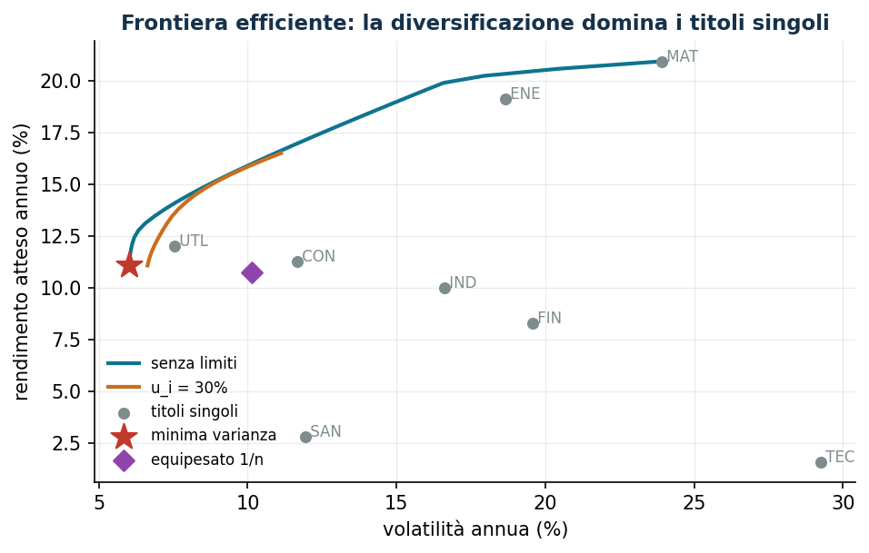
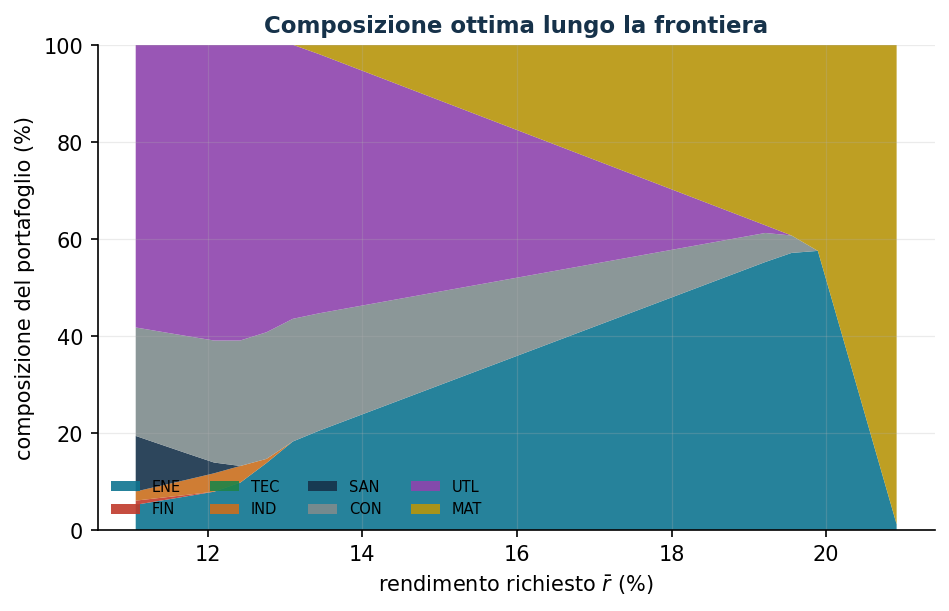

# Portafoglio di Markowitz

**Classe:** QP convesso · **Script:** `python/lab06_markowitz.py`

Quanto investire in ciascun titolo per bilanciare rendimento atteso e rischio? Il
risultato non è un numero ma una **frontiera efficiente**: il menu completo dei
compromessi tra cui il decisore sceglie.

**Il problema a parole.** *Decidiamo* le quote di capitale $x_i$. *L'obiettivo*:
minima varianza del portafoglio. *I vincoli*: quote a somma 1, rendimento atteso
minimo $\bar r$, limiti $\ell_i \le x_i \le u_i$.

## Modello

Dati: rendimenti attesi $\mu_i$, covarianze $q_{ij}$ (matrice
$\boldsymbol Q \succeq 0$).

$$
\min \sum_{i=1}^{n}\sum_{j=1}^{n} q_{ij}\, x_i x_j
\quad\text{soggetto a}\;\quad
\sum_{i=1}^{n} \mu_i x_i \ge \bar r,\qquad
\sum_{i=1}^{n} x_i = 1,\qquad x_i \le u_i,\qquad x_i \ge \ell_i
\;\;\forall i \in \{1,\dots,n\}.
$$

La varianza contiene le **covarianze**: è lì che nasce la diversificazione. Ogni
matrice di covarianza è semidefinita positiva → QP convesso, ottimo globale
certificato.

!!! example "Esempio a mano (2 titoli non correlati)"
    $\sigma_1 = 20\%$, $\sigma_2 = 30\%$: minimizzando
    $0{,}04 x_1^2 + 0{,}09 (1 - x_1)^2$ si ottiene $x_1 = 9/13 = 69{,}2\%$ e
    volatilità di portafoglio $16{,}6\%$ — **meno di entrambi i titoli**.

## Caso di studio

Otto ETF settoriali, $\mu$ e $\boldsymbol Q$ **stimati** da 60 rendimenti mensili
simulati (`dati/markowitz_rendimenti.csv`).

```text
Minima varianza globale : rendimento 11,06%, volatilità  6,03%
Equipesato (1/n)        : rendimento 10,74%, volatilità 10,13%   (dominato!)
Composizione min varianza: ENE 5%  IND 2%  SAN 12%  CON 22%  UTL 58%
```





Tre messaggi: (1) la minima varianza è meno rischiosa del miglior titolo singolo;
(2) l'equipesato $1/n$ è dominato; (3) il tetto $u_i = 30\%$ taglia la parte alta
della frontiera — il costo dei vincoli di mandato *si vede*.

## Sensitività

```text
r_min =  6…10%: vol 6,03%  (vincolo NON attivo: coincide col min varianza)
r_min = 12%   : vol 6,10%  d(varianza)/d(r_min) ≈ 0,022
```

Fino all'11,06% (rendimento della minima varianza) il vincolo di rendimento è
inattivo e non costa nulla; oltre, ogni punto di rendimento si paga in varianza.

!!! warning "La fragilità delle stime"
    Su 60 mesi l'errore standard del rendimento stimato è ≈2,6% annuo per titolo: i
    portafogli ottimizzati inseguono gli errori di stima. Rimedi: vincoli $u_i$,
    shrinkage, o ottimizzare solo il rischio.


## Codice

Lo script completo del capitolo — dati, modello, soluzione, sensitività e figure —
è [`python/lab06_markowitz.py`](https://github.com/fabiofurini/laboratorio-ricerca-operativa/blob/main/python/lab06_markowitz.py)
(riproducibile con `python3 python/lab06_markowitz.py` dalla cartella `python/`).

??? example "Mostra lo script completo — `lab06_markowitz.py`"

    ```python
    """Capitolo 6 — Portafoglio di Markowitz (QP convesso).

    Caso di studio: 8 titoli (ETF settoriali), 60 rendimenti mensili simulati con
    un modello a un fattore di mercato + rumore idiosincratico.

    Contenuto:
      1. Stima di mu e Q dai dati storici
      2. Portafoglio a minima varianza globale e con rendimento minimo
      3. Frontiera efficiente e composizione lungo la frontiera
      4. Effetto dei limiti massimi per titolo (u_i)
    """
    import gurobipy as gp
    import numpy as np
    import pandas as pd
    from gurobipy import GRB

    from stile import (ARANCIO, CICLO, GRIGIO, ROSSO, TEAL, intestazione, plt, salva_dat,
                       salva_dati, salva_figura)

    rng = np.random.default_rng(42)

    # ----------------------------------------------------------------------
    # 1. DATI: 60 mesi di rendimenti simulati (modello a un fattore)
    # ----------------------------------------------------------------------
    titoli = ["ENE", "FIN", "TEC", "IND", "SAN", "CON", "UTL", "MAT"]
    n, T = len(titoli), 60
    beta = np.array([1.1, 1.3, 1.5, 1.0, 0.6, 0.8, 0.4, 1.2])       # esposizione al mercato
    alfa_ann = np.array([0.05, 0.06, 0.11, 0.05, 0.045, 0.05, 0.035, 0.06])  # extra-rendimento
    sigma_idio = np.array([0.05, 0.055, 0.07, 0.04, 0.03, 0.035, 0.02, 0.06])  # vol. mensile idio

    mercato = rng.normal(0.004, 0.035, T)                 # fattore di mercato mensile
    R = (alfa_ann[None, :] / 12 + np.outer(mercato, beta)
         + rng.normal(0, sigma_idio, (T, n)))             # matrice T x n dei rendimenti

    rend = pd.DataFrame(R, columns=titoli)
    rend.insert(0, "mese", range(1, T + 1))
    salva_dati(rend, "markowitz_rendimenti")

    mu = R.mean(axis=0) * 12                # rendimento atteso annualizzato
    Q = np.cov(R.T) * 12                    # covarianza annualizzata
    vol = np.sqrt(np.diag(Q))

    intestazione("Statistiche dei titoli (annualizzate)")
    for i, tt in enumerate(titoli):
        print(f"  {tt}: mu = {mu[i]:6.2%}   vol = {vol[i]:6.2%}")


    def portafoglio(r_min=None, u=1.0):
        """QP: minima varianza con eventuale rendimento minimo e limite per titolo."""
        m = gp.Model("markowitz")
        m.Params.OutputFlag = 0
        x = m.addVars(n, ub=u, name="x")
        m.addConstr(x.sum() == 1, name="budget")
        if r_min is not None:
            m.addConstr(gp.quicksum(mu[i] * x[i] for i in range(n)) >= r_min, name="rendimento")
        m.setObjective(gp.quicksum(Q[i, j] * x[i] * x[j]
                                   for i in range(n) for j in range(n)), GRB.MINIMIZE)
        m.optimize()
        if m.Status != GRB.OPTIMAL:
            return None, None, None
        w = np.array([x[i].X for i in range(n)])
        return w, float(mu @ w), float(np.sqrt(w @ Q @ w))


    # ----------------------------------------------------------------------
    # 2. PORTAFOGLI NOTEVOLI
    # ----------------------------------------------------------------------
    intestazione("Portafogli notevoli")
    w_mv, r_mv, v_mv = portafoglio()
    print(f"Minima varianza globale : rendimento {r_mv:6.2%}, volatilità {v_mv:6.2%}")
    w_eq = np.ones(n) / n
    print(f"Equipesato (1/n)        : rendimento {mu @ w_eq:6.2%}, "
          f"volatilità {np.sqrt(w_eq @ Q @ w_eq):6.2%}")
    r_obb = 0.08
    w_8, r_8, v_8 = portafoglio(r_min=r_obb)
    print(f"Rendimento minimo 8%    : rendimento {r_8:6.2%}, volatilità {v_8:6.2%}")
    print("\nComposizione (quote > 1%):")
    for nome, w in [("min varianza", w_mv), ("rend. min 8%", w_8)]:
        quote = ", ".join(f"{titoli[i]} {w[i]:.1%}" for i in range(n) if w[i] > 0.01)
        print(f"  {nome:>14}: {quote}")

    # ----------------------------------------------------------------------
    # 3. FRONTIERA EFFICIENTE (con e senza limite u_i = 30%)
    # ----------------------------------------------------------------------
    intestazione("Frontiera efficiente")
    r_grid = np.linspace(r_mv, mu.max() * 0.999, 30)
    frontiere = {}
    for u, etich in [(1.0, "senza limiti"), (0.30, "u_i = 30%")]:
        punti, composizioni = [], []
        for r in r_grid:
            w, rr, vv = portafoglio(r_min=r, u=u)
            if w is not None:
                punti.append((vv, rr))
                composizioni.append(w)
        frontiere[etich] = (np.array(punti), np.array(composizioni))
        print(f"  frontiera '{etich}': {len(punti)} punti calcolati")

    pf = frontiere["senza limiti"][0]
    salva_dati(pd.DataFrame({"volatilita": pf[:, 0], "rendimento": pf[:, 1]}),
               "markowitz_frontiera")

    # ----------------------------------------------------------------------
    # 4. FIGURE (dati pgfplots + anteprima matplotlib)
    # ----------------------------------------------------------------------
    pf_lim = frontiere["u_i = 30%"][0]
    salva_dat(pd.DataFrame({"vol": pf[:, 0] * 100, "rend": pf[:, 1] * 100}), "cap06_front_libera")
    salva_dat(pd.DataFrame({"vol": pf_lim[:, 0] * 100, "rend": pf_lim[:, 1] * 100}),
              "cap06_front_limiti")
    salva_dat(pd.DataFrame({"titolo": titoli, "vol": vol * 100, "mu": mu * 100}), "cap06_titoli")
    salva_dat(pd.DataFrame({
        "nome": ["minvar", "equipesato"],
        "vol": [v_mv * 100, float(np.sqrt(w_eq @ Q @ w_eq)) * 100],
        "rend": [r_mv * 100, float(mu @ w_eq) * 100],
    }), "cap06_speciali")
    punti_sl, comp_sl = frontiere["senza limiti"]
    salva_dat(pd.DataFrame({"rend": punti_sl[:, 1] * 100,
                            **{titoli[i]: comp_sl[:, i] * 100 for i in range(n)}}),
              "cap06_composizione")

    fig, ax = plt.subplots()
    for (etich, (punti, _)), colore in zip(frontiere.items(), [TEAL, ARANCIO]):
        ax.plot(punti[:, 0] * 100, punti[:, 1] * 100, "-", color=colore, lw=2, label=etich)
    ax.scatter(vol * 100, mu * 100, color=GRIGIO, s=28, zorder=3, label="titoli singoli")
    for i, tt in enumerate(titoli):
        ax.annotate(" " + tt, (vol[i] * 100, mu[i] * 100), fontsize=8, color=GRIGIO)
    ax.scatter([v_mv * 100], [r_mv * 100], marker="*", s=200, color=ROSSO, zorder=4,
               label="minima varianza")
    ax.scatter([np.sqrt(w_eq @ Q @ w_eq) * 100], [mu @ w_eq * 100], marker="D", s=60,
               color="#8E44AD", zorder=4, label="equipesato 1/n")
    ax.set_xlabel("volatilità annua (%)")
    ax.set_ylabel("rendimento atteso annuo (%)")
    ax.set_title("Frontiera efficiente: la diversificazione domina i titoli singoli")
    ax.legend(fontsize=8)
    salva_figura(fig, "cap06_frontiera")

    punti, comp = frontiere["senza limiti"]
    fig, ax = plt.subplots()
    ax.stackplot(punti[:, 1] * 100, (comp.T * 100), labels=titoli, colors=CICLO, alpha=0.9)
    ax.set_xlabel("rendimento richiesto $\\bar r$ (%)")
    ax.set_ylabel("composizione del portafoglio (%)")
    ax.set_title("Composizione ottima lungo la frontiera")
    ax.legend(fontsize=7, ncol=4, loc="lower left")
    ax.set_ylim(0, 100)
    salva_figura(fig, "cap06_composizione")

    # sensitività: prezzo del vincolo di rendimento (moltiplicatore ~ pendenza frontiera)
    intestazione("Sensitività: costo (in varianza) del rendimento richiesto")
    for r in [0.06, 0.08, 0.10, 0.12]:
        w, rr, vv = portafoglio(r_min=r)
        if w is None:
            print(f"  r_min = {r:.0%}: inammissibile (oltre il rendimento massimo)")
            continue
        eps = 0.002
        w2, _, vv2 = portafoglio(r_min=r + eps)
        pend = (vv2**2 - vv**2) / eps if w2 is not None else float("nan")
        print(f"  r_min = {r:5.1%}: vol {vv:6.2%}  |  d(varianza)/d(r_min) ≈ {pend:7.4f}")

    print("\nFatto: capitolo 6.")
    ```

## Esercizi

1. Due titoli con $\rho = 0{,}5$: la diversificazione conviene ancora?
   ($x_1 = 6/7$, vol 19,6%)
2. Frontiere con $u = 1$, $0{,}3$, $0{,}2$: rendimento massimo 20,9% / 16,7% / 14,7%.
3. Rieseguire con seed diverso: quanto cambiano le composizioni?
4. Tracking error minimo con rendimento ≥ 12% (TE = 1,1% annuo).
5. Costi di transazione quadratici dal portafoglio equipesato.
