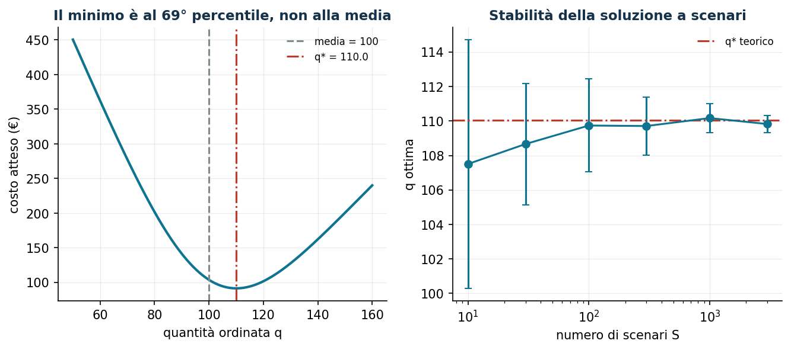
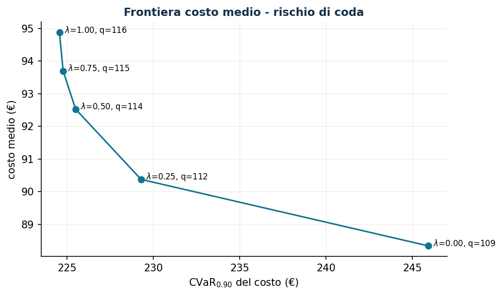

# Il Newsvendor e le sue varianti

**Classe:** convesso 1D / LP stocastico a scenari · **Script:** `python/lab12_newsvendor.py`

Scegliere una quantità **prima** di osservare la domanda: moda e stagionali,
freschi, farmaci, capacità alberghiera. È la porta d'ingresso dell'ottimizzazione
stocastica, con un risultato netto: **la quantità ottima non è la domanda media**.

**Il problema a parole.** *Decidiamo* la sola quantità $q$. *L'obiettivo*: minimo
costo atteso dell'errore — troppo ($c_o$ per unità invenduta) o troppo poco ($c_u$
per vendita persa).

## Modello base e regola del quantile

$$
\min_{q \ge 0}\; c_o\, \mathbb{E}[(q - D)^+] + c_u\, \mathbb{E}[(D - q)^+]
\qquad\Longrightarrow\qquad
F(q^*) = \alpha^* = \frac{c_u}{c_u + c_o}
$$

Ragionamento marginale: l'unità in più rende $c_u$ con probabilità $1 - F(q)$ e
costa $c_o$ con probabilità $F(q)$; conviene finché $F(q) \le \alpha^*$.

!!! example "Esempio a mano (domanda discreta)"
    $D \in \{80, 100, 120\}$ equiprobabili, $c_u = 9$, $c_o = 4$:
    $C(80) = 180$, $C(100) = 86{,}7$, $C(120) = \mathbf{80}$. Si ordina il
    **massimo**: con $c_u \gg c_o$ restare corti costa più del doppio che restare
    lunghi. (Regola discreta: il più piccolo $q$ con $F(q) \ge 0{,}6923$.)

## Caso di studio

Panetteria: $p = 15$, $c = 6$, $v = 2$ € → $c_u = 9$, $c_o = 4$; $D$ normale
$(100, 20)$.

```text
alpha* = 9/13 = 0,6923      q* = 110,05  (media = 100)
costo atteso in q*: 91,43 €   |   ordinando la media: 103,72 €
```



## La formulazione lineare a scenari

$$
\min\; c_o \sum_{s=1}^{k} \pi_s o_s + c_u \sum_{s=1}^{k} \pi_s u_s
\quad\text{soggetto a}\;\; o_s \ge q - d_s,\;\; u_s \ge d_s - q,
\;\;\forall s \in \{1, 2, \dots,k\};\;\; q \ge 0;\;\; o_s, u_s \ge 0
$$

Il **trucco delle parti positive**: l'obiettivo schiaccia $o_s$ e $u_s$ sui valori
$\max\{q - d_s, 0\}$ e $\max\{d_s - q, 0\}$ senza variabili binarie — lo stesso
meccanismo tornerà nel CVaR e nella SVM.

```text
LP con 600 scenari: q = 108,61 = quantile empirico al 69,23% (è un teorema)
VSS = 11,17 €/ciclo (-11%): il valore di modellare l'incertezza
Stabilità: con 30 scenari q balla di ±3,5 unità tra repliche
```

## Livelli di servizio e rischio

```text
Cycle service level 95%: q = 132,9 (costo +45,59 €)   Fill rate in q*: già 96%!
Media-CVaR (alpha=0,9): lambda 0 -> 1: q da 108,6 a 116,2
  costo medio +6,5 €  |  CVaR90 da 245,9 a 224,6 (-21,4 €)
```



!!! warning "Non confondere i livelli di servizio"
    In $q^*$ la probabilità di *non* avere stock-out è il 69%, ma il *fill rate*
    (domanda servita in media) è il 96%: promesse molto diverse a costi molto
    diversi. Leggere bene lo SLA.

**Multiprodotto** (3 prodotti, budget 1200 €, domande correlate $\rho = 0{,}7$): il
budget comprime le quantità sotto i quantili ottimi; duale del budget $-0{,}55$
(un euro in più rende 55 centesimi per ciclo). Con $\rho = 0$ il costo atteso scende
del 18%: **la correlazione è un costo**, e il modello lo quantifica.


## Codice

Lo script completo del capitolo — dati, modello, soluzione, sensitività e figure —
è [`python/lab12_newsvendor.py`](https://github.com/fabiofurini/laboratorio-ricerca-operativa/blob/main/python/lab12_newsvendor.py)
(riproducibile con `python3 python/lab12_newsvendor.py` dalla cartella `python/`).

??? example "Mostra lo script completo — `lab12_newsvendor.py`"

    ```python
    """Capitolo 12 — Il Newsvendor e le sue varianti (LP stocastico a scenari).

    Caso di studio: panetteria che decide quanti panettoni artigianali produrre.
    Prezzo p = 15 €, costo c = 6 €, recupero v = 2 € → Cu = 9, Co = 4.
    Domanda normale con media 100 e deviazione standard 20 

    Contenuto:
      1. Regola del quantile: alpha* = 9/13 = 0,6923 → q* ≈ 110
      2. LP a scenari: coincide con il quantile empirico
      3. Valore della soluzione stocastica (VSS) e stabilità al numero di scenari
      4. Vincoli di servizio (cycle service level, fill rate)
      5. Avversione al rischio: frontiera costo medio - CVaR
      6. Multiprodotto con budget condiviso e domande correlate
    """
    import gurobipy as gp
    import numpy as np
    import pandas as pd
    from gurobipy import GRB
    from scipy import stats

    from stile import (ARANCIO, GRIGIO, ROSSO, TEAL, VERDE, intestazione, plt, salva_dat,
                       salva_dati, salva_figura)

    rng = np.random.default_rng(42)

    p, c, v = 15.0, 6.0, 2.0
    Cu, Co = p - c, c - v                 # 9 e 4
    mu_d, sigma_d = 100.0, 20.0

    # ----------------------------------------------------------------------
    # 1. REGOLA DEL QUANTILE (soluzione analitica)
    # ----------------------------------------------------------------------
    intestazione("Regola del quantile")
    alpha_star = Cu / (Cu + Co)
    q_star = stats.norm.ppf(alpha_star, mu_d, sigma_d)
    print(f"Frattile critico alpha* = Cu/(Cu+Co) = {Cu:.0f}/{Cu + Co:.0f} = {alpha_star:.4f}")
    print(f"Quantità ottima q* = F^-1({alpha_star:.4f}) = {q_star:.2f} unità (media = {mu_d:.0f})")


    def costo_atteso(q):
        """E[Co(q-D)^+ + Cu(D-q)^+] per domanda normale (funzione di perdita normale)."""
        z = (q - mu_d) / sigma_d
        # E[(D-q)^+] = sigma*(phi(z) - z*(1-Phi(z)))
        perdita = sigma_d * (stats.norm.pdf(z) - z * (1 - stats.norm.cdf(z)))
        ecc = q - mu_d + perdita          # E[(q-D)^+] = q - mu + E[(D-q)^+]
        return Co * ecc + Cu * perdita


    print(f"Costo atteso in q*: {costo_atteso(q_star):.2f} €  |  in q = media: "
          f"{costo_atteso(mu_d):.2f} €")

    qq = np.linspace(50, 160, 400)
    salva_dat(pd.DataFrame({"q": qq, "costo": [costo_atteso(q) for q in qq]}), "cap12_costo")

    # ----------------------------------------------------------------------
    # 2. LP A SCENARI
    # ----------------------------------------------------------------------
    intestazione(f"LP a scenari (S = {600})")
    S = 600   # con la licenza pip (2000 var/vincoli) il CVaR richiede S <= 600
    dom = np.maximum(rng.normal(mu_d, sigma_d, S), 0.0)
    salva_dati(pd.DataFrame({"scenario": range(1, S + 1), "domanda": dom}), "newsvendor_scenari")


    def newsvendor_lp(dom_s, prob=None, lam=0.0, alpha_cvar=0.90):
        """LP: min (1-lam)·costo atteso + lam·CVaR_alpha(costo). lam=0 → risk neutral."""
        Sn = len(dom_s)
        pi = np.full(Sn, 1 / Sn) if prob is None else prob
        m = gp.Model("newsvendor")
        m.Params.OutputFlag = 0
        q = m.addVar(name="q")
        o = m.addVars(Sn, name="o")                 # eccedenza
        u = m.addVars(Sn, name="u")                 # carenza
        m.addConstrs((o[s] >= q - dom_s[s] for s in range(Sn)), name="ecc")
        m.addConstrs((u[s] >= dom_s[s] - q for s in range(Sn)), name="car")
        costo_s = {s: Co * o[s] + Cu * u[s] for s in range(Sn)}
        atteso = gp.quicksum(pi[s] * costo_s[s] for s in range(Sn))
        if lam > 0:
            eta = m.addVar(lb=-GRB.INFINITY, name="eta")
            xi = m.addVars(Sn, name="xi")
            m.addConstrs((xi[s] >= costo_s[s] - eta for s in range(Sn)), name="cvar")
            cvar = eta + gp.quicksum(pi[s] * xi[s] for s in range(Sn)) / (1 - alpha_cvar)
            m.setObjective((1 - lam) * atteso + lam * cvar, GRB.MINIMIZE)
        else:
            m.setObjective(atteso, GRB.MINIMIZE)
        m.optimize()
        assert m.Status == GRB.OPTIMAL
        costi = np.array([Co * max(q.X - d, 0) + Cu * max(d - q.X, 0) for d in dom_s])
        return q.X, float(costi @ pi), costi


    q_lp, costo_lp, costi_s = newsvendor_lp(dom)
    q_emp = np.quantile(dom, alpha_star)
    print(f"q ottima dell'LP: {q_lp:.2f}  |  quantile empirico al {alpha_star:.2%}: {q_emp:.2f}")
    print(f"Costo atteso (sugli scenari): {costo_lp:.2f} €  |  teorico: {costo_atteso(q_lp):.2f} €")

    # ----------------------------------------------------------------------
    # 3. VSS E STABILITÀ
    # ----------------------------------------------------------------------
    intestazione("Valore della soluzione stocastica (VSS)")
    costi_det = np.array([Co * max(mu_d - d, 0) + Cu * max(d - mu_d, 0) for d in dom])
    print(f"Decisione 'ingenua' q = E[D] = {mu_d:.0f}: costo atteso {costi_det.mean():.2f} €")
    print(f"Decisione stocastica q = {q_lp:.1f}     : costo atteso {costo_lp:.2f} €")
    print(f"VSS = {costi_det.mean() - costo_lp:.2f} € per ciclo di vendita")

    intestazione("Stabilità: q ottima al variare del numero di scenari")
    righe = []
    for Sn in [10, 30, 100, 300, 1000, 3000]:
        stime = []
        for rep in range(30):
            dd = np.maximum(rng.normal(mu_d, sigma_d, Sn), 0)
            stime.append(np.quantile(dd, alpha_star))
        righe.append((Sn, np.mean(stime), np.std(stime)))
        print(f"  S = {Sn:5d}: q media {np.mean(stime):7.2f}, dev. std tra repliche {np.std(stime):5.2f}")
    stab = pd.DataFrame(righe, columns=["S", "q_media", "q_std"])
    salva_dat(stab, "cap12_stabilita")

    # ----------------------------------------------------------------------
    # 4. VINCOLI DI SERVIZIO
    # ----------------------------------------------------------------------
    intestazione("Livelli di servizio")
    for beta in [0.90, 0.95, 0.99]:
        q_sl = stats.norm.ppf(beta, mu_d, sigma_d)
        extra = costo_atteso(q_sl) - costo_atteso(q_star)
        print(f"  cycle service level {beta:.0%}: q = {q_sl:6.2f} "
              f"(costo +{extra:5.2f} € rispetto all'ottimo economico)")
    q_fill = q_star
    fill = 1 - (costo_atteso(q_star) / Cu - Co / Cu * 0) / mu_d  # solo per stampa didattica
    perdita_att = sigma_d * (stats.norm.pdf((q_star - mu_d) / sigma_d)
                             - (q_star - mu_d) / sigma_d
                             * (1 - stats.norm.cdf((q_star - mu_d) / sigma_d)))
    print(f"  fill rate in q*: {1 - perdita_att / mu_d:.2%} "
          f"(la probabilità di NON avere stock-out è invece {alpha_star:.2%})")

    # ----------------------------------------------------------------------
    # 5. AVVERSIONE AL RISCHIO: frontiera costo-CVaR
    # ----------------------------------------------------------------------
    intestazione("Frontiera costo medio - CVaR (alpha = 0,90)")
    alpha_cv = 0.90
    front = []
    for lam in [0, 0.25, 0.5, 0.75, 1.0]:
        q_l, cm, costi_l = newsvendor_lp(dom, lam=lam, alpha_cvar=alpha_cv)
        var_l = np.quantile(costi_l, alpha_cv)
        cvar_l = costi_l[costi_l >= var_l - 1e-9].mean()
        front.append((lam, q_l, cm, cvar_l))
        print(f"  lambda = {lam:4.2f}: q = {q_l:7.2f}, costo medio = {cm:6.2f}, "
              f"CVaR90 = {cvar_l:6.2f}")
    front = pd.DataFrame(front, columns=["lam", "q", "costo_medio", "cvar"])
    salva_dat(front, "cap12_frontiera_cvar")
    print("Aumentando lambda si ordina di più: costa in media, protegge dagli scenari peggiori.")

    # ----------------------------------------------------------------------
    # 6. MULTIPRODOTTO CON BUDGET E DOMANDE CORRELATE
    # ----------------------------------------------------------------------
    intestazione("Multiprodotto: 3 dolci, budget produzione 1200 €")
    nomi_p = ["panettone", "pandoro", "torrone"]
    mu_m = np.array([100.0, 80.0, 60.0])
    sig_m = np.array([20.0, 25.0, 15.0])
    costi_c = np.array([6.0, 5.0, 4.0])
    Cu_m = np.array([9.0, 7.0, 5.0])
    Co_m = np.array([4.0, 3.5, 2.5])
    rho_corr = 0.7
    Sigma = np.diag(sig_m) @ (np.full((3, 3), rho_corr) + (1 - rho_corr) * np.eye(3)) @ np.diag(sig_m)
    Sm = 300  # limite licenza pip: il multiprodotto ha 3+6S variabili
    dom_m = np.maximum(rng.multivariate_normal(mu_m, Sigma, Sm), 0)
    budget = 1200.0

    mm = gp.Model("newsvendor_multi")
    mm.Params.OutputFlag = 0
    qm = mm.addVars(3, name="q")
    om = mm.addVars(3, Sm, name="o")
    um = mm.addVars(3, Sm, name="u")
    mm.addConstrs((om[i, s] >= qm[i] - dom_m[s, i] for i in range(3) for s in range(Sm)))
    mm.addConstrs((um[i, s] >= dom_m[s, i] - qm[i] for i in range(3) for s in range(Sm)))
    v_bud = mm.addConstr(gp.quicksum(costi_c[i] * qm[i] for i in range(3)) <= budget, name="budget")
    mm.setObjective(gp.quicksum((Co_m[i] * om[i, s] + Cu_m[i] * um[i, s]) / Sm
                                for i in range(3) for s in range(Sm)), GRB.MINIMIZE)
    mm.optimize()
    assert mm.Status == GRB.OPTIMAL
    print(f"{'prodotto':>10} | {'q senza budget':>14} | {'q con budget':>12}")
    for i in range(3):
        q_solo = np.quantile(dom_m[:, i], Cu_m[i] / (Cu_m[i] + Co_m[i]))
        print(f"{nomi_p[i]:>10} | {q_solo:14.1f} | {qm[i].X:12.1f}")
    spesa = sum(costi_c[i] * qm[i].X for i in range(3))
    print(f"Spesa: {spesa:.2f} / {budget:.0f} €  |  prezzo ombra del budget: {v_bud.Pi:.4f} "
          f"(riduzione del costo atteso per 1 € di budget in più)")

    # ----------------------------------------------------------------------
    # 7. FIGURE
    # ----------------------------------------------------------------------
    fig, (ax1, ax2) = plt.subplots(1, 2, figsize=(10.5, 4.0))
    ax1.plot(qq, [costo_atteso(q) for q in qq], color=TEAL, lw=2)
    ax1.axvline(mu_d, color=GRIGIO, ls="--", label=f"media = {mu_d:.0f}")
    ax1.axvline(q_star, color=ROSSO, ls="-.", label=f"q* = {q_star:.1f}")
    ax1.set_xlabel("quantità ordinata q"); ax1.set_ylabel("costo atteso (€)")
    ax1.set_title("Il minimo è al 69° percentile, non alla media")
    ax1.legend(fontsize=8)
    ax2.errorbar(stab["S"], stab["q_media"], yerr=stab["q_std"], fmt="-o", color=TEAL,
                 capsize=3)
    ax2.axhline(q_star, color=ROSSO, ls="-.", label="q* teorico")
    ax2.set_xscale("log")
    ax2.set_xlabel("numero di scenari S"); ax2.set_ylabel("q ottima")
    ax2.set_title("Stabilità della soluzione a scenari")
    ax2.legend(fontsize=8)
    salva_figura(fig, "cap12_quantile_stabilita")

    fig, ax = plt.subplots()
    ax.plot(front["cvar"], front["costo_medio"], "-o", color=TEAL)
    for _, r in front.iterrows():
        ax.annotate(f"  $\\lambda$={r['lam']:.2f}, q={r['q']:.0f}", (r["cvar"], r["costo_medio"]),
                    fontsize=8)
    ax.set_xlabel("CVaR$_{0.90}$ del costo (€)"); ax.set_ylabel("costo medio (€)")
    ax.set_title("Frontiera costo medio - rischio di coda")
    salva_figura(fig, "cap12_frontiera")

    print("\nFatto: capitolo 12.")
    ```

## Esercizi

1. Penalità $b = 3$ €: $\alpha^* = 0{,}75$, $q^* = 113{,}5$.
2. Scenari da 24 osservazioni storiche vs distribuzione stimata: quale consigliare?
3. Deperibili ($v = -1$): $\alpha^* = 0{,}5625$, $q^* = 103{,}2$.
4. EVPI: quanto vale al massimo una previsione perfetta? (88,33 €/ciclo.)
5. Vincolo di fill rate al 98% vs cycle service level al 98%: confrontare.
6. Multiprodotto con $\rho = 0$: perché il costo scende?
