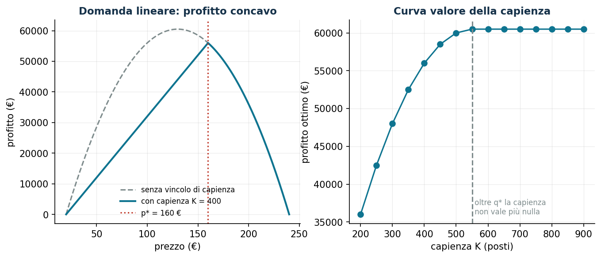
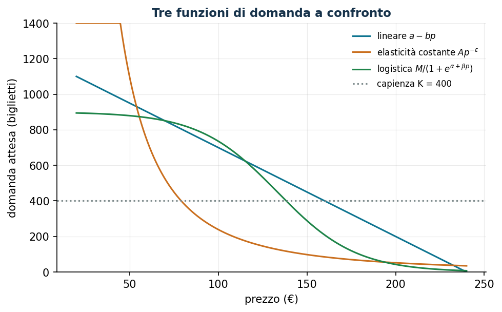

# Pricing e revenue management

**Classe:** NLP concavo / non convesso · **Script:** `python/lab07_pricing.py`

Quale prezzo massimizza il profitto quando la domanda diminuisce al crescere del
prezzo? Qui il prezzo è una *variabile*: la domanda diventa endogena e il profitto
$p \cdot q$ introduce un termine bilineare — il primo incontro con la non convessità.

**Il problema a parole.** *Decidiamo* prezzo $p$ e quantità $q$. *L'obiettivo*:
massimo profitto $(p - c)q$. *I vincoli*: $q \le d(p)$ (domanda) e $q \le k$
(capacità).

## Modello

**Dati (input del modello).**

| Simbolo | Tipo | Significato |
|---|---|---|
| $d(\cdot)$ | funzione $\mathbb{Q}_{\ge 0} \to \mathbb{Q}_{\ge 0}$ | domanda attesa al prezzo $p$, decrescente in $p$ |
| $c$ | $\in \mathbb{Q}_{\ge 0}$ | costo marginale unitario (€) |
| $k$ | $\in \mathbb{Q}_{> 0}$ | capacità disponibile (posti, camere, unità) |

**Variabili decisionali.** Introduciamo le seguenti $2$ variabili non negative:

$$
\begin{cases}
p = \text{prezzo di vendita deciso dall'impresa (€)}\\[1ex]
q = \text{quantità venduta (unità)}
\end{cases}
$$

Usando queste variabili, un modello di pricing per il problema è il seguente:

$$
\begin{aligned}
\max ~~ p\,q - c\,q & & \\
\text{soggetto a} \quad q &\le d(p), & \\
q &\le k, & \\
p &\ge 0, & \\
q &\ge 0. &
\end{aligned}
$$

Descrizione della funzione obiettivo e dei vincoli:

- la funzione obiettivo massimizza il profitto $p\,q - c\,q = (p - c)\,q$, ricavo meno
  costo variabile; contiene il prodotto tra le due variabili $p$ e $q$ (termine
  *bilineare*, non convesso), ed è qui che nasce tutta la difficoltà del capitolo;
- il vincolo di **domanda** impone di non vendere più di quanto il mercato chiede al
  prezzo $p$ (un vincolo, lineare se $d$ è lineare);
- il vincolo lineare di **capacità** impone di non vendere più della capacità
  disponibile; quando è attivo, è lui a determinare il prezzo ottimo (un vincolo
  lineare);
- i vincoli di non negatività su $p$ e $q$ definiscono le variabili del modello.

Funzioni di domanda usate nel caso di studio, con i rispettivi dati (tutti razionali
positivi): lineare $d(p) = a - b\,p$; a elasticità costante
$d(p) = \theta\, p^{-\varepsilon}$ con $\varepsilon > 1$; logistica
$d(p) = m / \bigl(1 + e^{-\alpha + \beta p}\bigr)$.

Perché $q \le d(p)$ e non $q = d(p)$? All'ottimo la disuguaglianza è attiva da sola
(vendere meno del possibile a quel prezzo non conviene mai se $p > c$), ma scriverla
come $\le$ mantiene la regione ammissibile più semplice e il modello ammissibile
anche quando $d(p) > k$. La non convessità sta nel prodotto $p \cdot q$: con domanda
lineare, sostituendo $q = a - b\,p$, il profitto ridotto $(p - c)(a - b\,p)$ è una
parabola concava, ma Gurobi risolve comunque la versione bilineare all'ottimo globale
(`NonConvex=2`).

!!! example "Esempio a mano (concerto)"
    $d(p) = 1200 - 5p$ (quindi $a = 1200$, $b = 5$), $c = 20$ €, $k = 400$ posti.

    1. Senza capacità: $p^\circ = (a/b + c)/2 = 130$ €, $q^\circ = 550$.
    2. La capacità morde ($550 > 400$): $\tilde p = (a - k)/b = 160$ €, profitto
       $(160 - 20) \cdot 400 = 56.000$ €.
    3. Valore di un posto in più: $\frac{d\Pi}{dk} = (\tilde p - c) + k \frac{d\tilde p}{dk}
       = 140 - 80 = 60$ € — **non** il margine pieno: per riempire il posto si
       abbassa il prezzo a tutti.

## Risultati

Stessi dati dell'esempio, più le varianti a elasticità costante
($\theta = 6 \cdot 10^6$, $\varepsilon = 2{,}2$) e logistica ($m = 900$,
$\alpha = 6$, $\beta = 0{,}045$).

```text
Gurobi:  p* = 160,00 EUR, q* = 400, profitto = 56.000,00 EUR
Valore marginale di un posto: 59,80 EUR (teoria: 60,00)
Elasticita' costante: p* = 79,11 EUR  (ottimo nel punto in cui d(p) = k)
Logistica           : p* = 138,29 EUR, profitto = 47.316,83 EUR
```





!!! tip "L'ottimo nel punto di spigolo"
    Con elasticità costante l'ottimo *non vincolato* sarebbe
    $c\,\varepsilon/(\varepsilon - 1) = 36{,}67$ €, ma a quel prezzo la domanda
    supererebbe di gran lunga la capienza. Per $p$ sotto $79{,}11$ € si vende
    comunque $k$ (conviene quindi alzare il prezzo); sopra, il profitto
    $(p - c)\,\theta p^{-\varepsilon}$ decresce. L'ottimo
    $\tilde p = (\theta/k)^{1/\varepsilon} = 79{,}11$ € sta nel *punto di spigolo*
    dove $d(p) = k$: non annulla nessuna derivata. Mai cercare l'ottimo solo tra i
    punti stazionari quando ci sono vincoli.

## Versione multiprodotto

Due categorie di biglietti con sostituzione (alzare il prezzo della platea spinge
parte della domanda in galleria): $d_1(p_1, p_2) = 500 - 2p_1 + 0{,}6\,p_2$,
$d_2(p_1, p_2) = 900 + 0{,}8\,p_1 - 4p_2$, costi $(30, 15)$ €, capacità
$(150, 300)$ posti.

```text
platea   : p1* = 234,04 EUR   q1* = 150/150 (piena)
galleria : p2* = 196,81 EUR   q2* = 300/300 (piena)
profitto totale: 85.148,94 EUR
```

Entrambe le categorie si riempiono, ma i prezzi non sono "quelli che svuotano"
ciascuna sala presa da sola: il modello sfrutta la sostituzione, tenendo la platea
cara per spingere domanda verso la galleria. Con prodotti sostituti i prezzi vanno
decisi **congiuntamente**: ottimizzarli uno alla volta lascia soldi sul tavolo.


## Codice

Lo script completo del capitolo — dati, modello, soluzione, sensitività e figure —
è [`python/lab07_pricing.py`](https://github.com/fabiofurini/laboratorio-ricerca-operativa/blob/main/python/lab07_pricing.py)
(riproducibile con `python3 python/lab07_pricing.py` dalla cartella `python/`).

??? example "Mostra lo script completo — `lab07_pricing.py`"

    ```python
    """Capitolo 7 — Pricing e revenue management (NLP, in parte non convesso).

    Caso di studio: prezzo del biglietto di un concerto in un teatro da 400 posti.

    Contenuto:
      1. Domanda lineare: soluzione analitica e QP (bilineare) con Gurobi
      2. Valore marginale di un posto in più (per perturbazione)
      3. Domanda a elasticità costante e logistica (vincoli funzionali Gurobi, globale)
      4. Versione multiprodotto (2 categorie con sostituzione)
    """
    import gurobipy as gp
    import numpy as np
    import pandas as pd
    from gurobipy import GRB

    from stile import (ARANCIO, GRIGIO, ROSSO, TEAL, VERDE, intestazione, plt, salva_dat,
                       salva_dati, salva_figura)

    # ----------------------------------------------------------------------
    # 1. DOMANDA LINEARE: D(p) = a - b p
    # ----------------------------------------------------------------------
    a, b, c, K = 1200.0, 5.0, 20.0, 400.0   # domanda, pendenza, costo unitario, capienza

    intestazione("Domanda lineare: analitico vs Gurobi (QP bilineare)")
    p_libero = (a / b + c) / 2                 # ottimo senza vincolo di capacità
    q_libero = a - b * p_libero
    print(f"Ottimo NON vincolato: p* = {p_libero:.2f} €, q* = {q_libero:.0f} biglietti")
    if q_libero > K:
        p_vinc = (a - K) / b
        print(f"La capienza K = {K:.0f} è vincolante → p* = (a-K)/b = {p_vinc:.2f} €, q* = {K:.0f}")

    m = gp.Model("pricing_lineare")
    m.Params.OutputFlag = 0
    m.Params.NonConvex = 2                      # obiettivo bilineare p*q
    p = m.addVar(lb=0, ub=a / b, name="p")
    q = m.addVar(lb=0, name="q")
    m.addConstr(q <= a - b * p, name="domanda")
    v_cap = m.addConstr(q <= K, name="capienza")
    m.setObjective(p * q - c * q, GRB.MAXIMIZE)
    m.optimize()
    assert m.Status == GRB.OPTIMAL
    print(f"Gurobi:  p* = {p.X:.2f} €, q* = {q.X:.0f}, profitto = {m.ObjVal:,.2f} €")

    # valore marginale di un posto (perturbazione: non ci sono duali LP in un QP non convesso)
    v_cap.RHS = K + 1
    m.optimize()
    val_posto = m.ObjVal - (p_vinc - c) * K if False else None
    m2_obj = m.ObjVal
    v_cap.RHS = K
    m.optimize()
    print(f"Valore marginale di un posto in più: {m2_obj - m.ObjVal:.2f} € "
          f"(teoria: p - c + K·dp/dK = {p_vinc - c - K / b:.2f} €)")

    # ----------------------------------------------------------------------
    # 2. SENSITIVITÀ: prezzo e profitto al variare della capienza
    # ----------------------------------------------------------------------
    intestazione("Sensitività alla capienza")
    capienze = np.arange(200, 901, 50)
    righe = []
    for KK in capienze:
        q_opt = min(KK, q_libero)
        p_opt = (a - q_opt) / b
        profitto = (p_opt - c) * q_opt
        marg = (p_opt - c - q_opt / b) if q_opt < q_libero else 0.0
        righe.append((KK, p_opt, q_opt, profitto, max(marg, 0)))
        print(f"  K = {KK:3.0f}: p* = {p_opt:6.2f} €, profitto = {profitto:9.2f} €, "
              f"valore posto = {max(marg, 0):5.2f} €")
    sens = pd.DataFrame(righe, columns=["K", "prezzo", "quantita", "profitto", "valore_posto"])
    salva_dati(sens, "pricing_sensitivita_capienza")

    # ----------------------------------------------------------------------
    # 3. ALTRE FUNZIONI DI DOMANDA (Gurobi, vincoli non lineari globali)
    # ----------------------------------------------------------------------
    intestazione("Elasticità costante e domanda logistica (Gurobi)")
    A_el, eps = 6.0e6, 2.2                     # D(p) = A p^-eps
    M_log, alfa, beta_l = 900.0, 6.0, 0.045    # D(p) = M / (1 + exp(-alfa + beta*p))


    def prezzo_elasticita():
        """max (p-c)·q  soggetto a  q·p^eps <= A, q <= K  (globale, NonConvex=2).

        La forma q·r <= A con r = p^eps è equivalente a q <= A p^(-eps) ma
        numericamente ben scalata (r ~ 10^4 invece di p^(-eps) ~ 10^-5)."""
        m = gp.Model("elasticita")
        m.Params.OutputFlag = 0
        m.Params.NonConvex = 2
        m.Params.FuncNonlinear = 1           # p^eps trattato come vincolo NL esatto
        p = m.addVar(lb=float(c), ub=400.0, name="p")
        q = m.addVar(ub=float(K), name="q")
        r = m.addVar(name="r")               # r = p^eps
        m.addGenConstrPow(p, r, eps)
        m.addQConstr(q * r <= A_el)          # bilineare
        m.setObjective((p - c) * q, GRB.MAXIMIZE)
        m.optimize()
        assert m.Status == GRB.OPTIMAL
        return p.X, m.ObjVal


    def prezzo_logistica():
        """max (p-c)·q  soggetto a  q(1+e) <= M, e = exp(-alfa + beta p), q <= K."""
        m = gp.Model("logistica")
        m.Params.OutputFlag = 0
        m.Params.NonConvex = 2
        m.Params.FuncNonlinear = 1
        p = m.addVar(lb=float(c), ub=400.0, name="p")
        q = m.addVar(ub=float(K), name="q")
        t = m.addVar(lb=-GRB.INFINITY, name="t")   # t = -alfa + beta p
        e = m.addVar(name="e")                     # e = exp(t)
        m.addConstr(t == -alfa + beta_l * p)
        m.addGenConstrExp(t, e)
        m.addConstr(q + q * e <= M_log)            # q (1 + e) <= M  (bilineare)
        m.setObjective((p - c) * q, GRB.MAXIMIZE)
        m.optimize()
        assert m.Status == GRB.OPTIMAL
        return p.X, m.ObjVal


    p_el, prof_el = prezzo_elasticita()
    p_log, prof_log = prezzo_logistica()
    print(f"Elasticità costante (eps = {eps}): p* = {p_el:7.2f} €, profitto = {prof_el:9.2f} €")
    print(f"  teoria senza capacità: p* = c·eps/(eps-1) = {c * eps / (eps - 1):.2f} €")
    print(f"Logistica: p* = {p_log:7.2f} €, profitto = {prof_log:9.2f} €")

    # ----------------------------------------------------------------------
    # 4. MULTIPRODOTTO: 2 categorie con sostituzione (QP non convesso)
    # ----------------------------------------------------------------------
    intestazione("Due categorie (platea/galleria) con sostituzione")
    # D1 = a1 - b11 p1 + b12 p2 ; D2 = a2 + b21 p1 - b22 p2
    a1, a2 = 500.0, 900.0
    b11, b12, b21, b22 = 2.0, 0.6, 0.8, 4.0
    c1, c2, K1, K2 = 30.0, 15.0, 150.0, 300.0

    mm = gp.Model("pricing_multi")
    mm.Params.OutputFlag = 0
    mm.Params.NonConvex = 2
    p1 = mm.addVar(lb=0, ub=300, name="p1")
    p2 = mm.addVar(lb=0, ub=300, name="p2")
    q1 = mm.addVar(lb=0, name="q1")
    q2 = mm.addVar(lb=0, name="q2")
    mm.addConstr(q1 <= a1 - b11 * p1 + b12 * p2, name="dom1")
    mm.addConstr(q2 <= a2 + b21 * p1 - b22 * p2, name="dom2")
    mm.addConstr(q1 <= K1, name="cap1")
    mm.addConstr(q2 <= K2, name="cap2")
    mm.setObjective((p1 - c1) * q1 + (p2 - c2) * q2, GRB.MAXIMIZE)
    mm.optimize()
    assert mm.Status == GRB.OPTIMAL
    print(f"platea   : p1* = {p1.X:6.2f} €, q1* = {q1.X:5.1f} / {K1:.0f}")
    print(f"galleria : p2* = {p2.X:6.2f} €, q2* = {q2.X:5.1f} / {K2:.0f}")
    print(f"profitto totale: {mm.ObjVal:,.2f} €")

    # ----------------------------------------------------------------------
    # 5. FIGURE
    # ----------------------------------------------------------------------
    pp = np.linspace(20, 240, 400)
    fig, (ax1, ax2) = plt.subplots(1, 2, figsize=(10.5, 4.0))
    prof_nc = (pp - c) * (a - b * pp)
    prof_c = (pp - c) * np.minimum(a - b * pp, K)
    salva_dat(pd.DataFrame({"p": pp, "senza": prof_nc, "con": prof_c}), "cap07_profitto")
    salva_dat(sens, "cap07_capienza")
    salva_dat(pd.DataFrame({
        "p": pp,
        "lineare": np.maximum(a - b * pp, 0),
        "elast": np.minimum(A_el * pp ** (-eps), 1400),
        "logistica": M_log / (1 + np.exp(-alfa + beta_l * pp)),
    }), "cap07_domande")
    ax1.plot(pp, prof_nc, color=GRIGIO, ls="--", label="senza vincolo di capienza")
    ax1.plot(pp, prof_c, color=TEAL, lw=2, label=f"con capienza K = {K:.0f}")
    ax1.axvline(p_vinc, color=ROSSO, ls=":", label=f"p* = {p_vinc:.0f} €")
    ax1.set_xlabel("prezzo (€)"); ax1.set_ylabel("profitto (€)")
    ax1.set_title("Domanda lineare: profitto concavo")
    ax1.legend(fontsize=8)
    ax2.plot(sens["K"], sens["profitto"], "-o", color=TEAL)
    ax2.axvline(q_libero, color=GRIGIO, ls="--")
    ax2.annotate(" oltre q* la capienza\n non vale più nulla", (q_libero, sens["profitto"].min()),
                 fontsize=8, color=GRIGIO)
    ax2.set_xlabel("capienza K (posti)"); ax2.set_ylabel("profitto ottimo (€)")
    ax2.set_title("Curva valore della capienza")
    salva_figura(fig, "cap07_profitto")

    fig, ax = plt.subplots()
    D_lin = np.maximum(a - b * pp, 0)
    D_el = A_el * pp ** (-eps)
    D_log = M_log / (1 + np.exp(-alfa + beta_l * pp))
    ax.plot(pp, D_lin, label="lineare $a-bp$", color=TEAL)
    ax.plot(pp, np.minimum(D_el, 1400), label="elasticità costante $Ap^{-\\varepsilon}$", color=ARANCIO)
    ax.plot(pp, D_log, label="logistica $M/(1+e^{\\alpha+\\beta p})$", color=VERDE)
    ax.axhline(K, color=GRIGIO, ls=":", label=f"capienza K = {K:.0f}")
    ax.set_xlabel("prezzo (€)"); ax.set_ylabel("domanda attesa (biglietti)")
    ax.set_ylim(0, 1400)
    ax.set_title("Tre funzioni di domanda a confronto")
    ax.legend(fontsize=8)
    salva_figura(fig, "cap07_domande")

    print("\nFatto: capitolo 7.")
    ```

## Esercizi

1. Verificare il valore del posto per $k = 300$ (100 €) con Gurobi e con la formula.
2. Costo marginale $c = 60$: $\tilde p$ resta 160 (capacità ancora attiva), profitto
   40.000 €, valore posto 20 €.
3. Penalità reputazionale $-2(p - 120)^2$: il problema resta concavo? Cambia l'ottimo?
4. $\tilde p(\varepsilon)$ per $\varepsilon \in [1{,}3;\, 3]$ con $k = 400$.
5. +50 posti di platea (+3.287 €) o di galleria (+3.838 €): quale ampliamento
   conviene?
