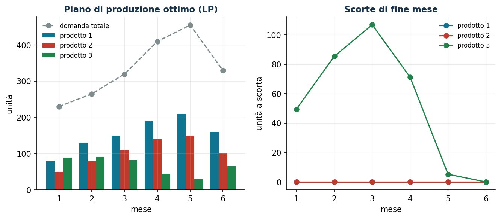
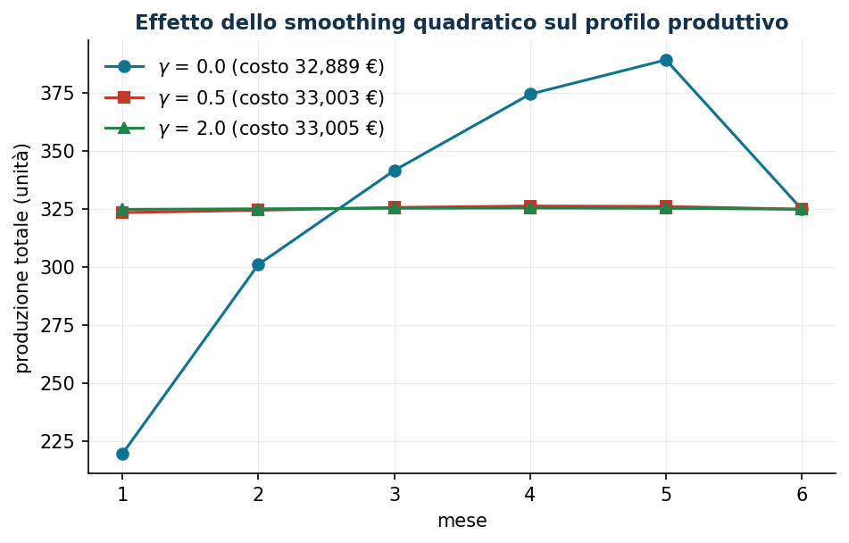

# Produzione e scorte multiperiodali

**Classe:** LP / QP convesso · **Script:** `python/lab04_produzione.py`

Un'azienda decide quanto produrre oggi e quanto conservare a scorta per la domanda
futura. Produrre in anticipo costa giacenza; produrre all'ultimo momento rischia di
sbattere contro il limite di capacità proprio nei mesi di picco.

**Il problema a parole.** *Decidiamo* quante unità di ogni prodotto produrre in ogni
mese e quante tenerne a scorta. *L'obiettivo* è minimizzare produzione + giacenza.
*I vincoli*: bilancio di magazzino mese per mese (con domanda servita per intero) e
ore macchina disponibili.

## Modello

Dati: domanda $d_{it} \ge 0$, costi unitari $c_{it}, h_{it} \ge 0$, ore per unità
$a_i > 0$, ore disponibili $b_t \ge 0$, scorta iniziale $s_{i0}$.
Variabili continue: $x_{it} \ge 0$ (produzione), $s_{it} \ge 0$ (scorta di fine mese).

$$
\begin{aligned}
\min\;& \sum_{i=1}^{n}\sum_{t=1}^{m} \bigl( c_{it}\, x_{it} + h_{it}\, s_{it} \bigr)\\
\text{soggetto a}\;\;\;& s_{i,t-1} + x_{it} = d_{it} + s_{it}, && \forall i \in \{1,\dots,n\},\ \forall t \in \{1,\dots,m\},\\
& \sum_{i=1}^{n} a_i\, x_{it} \le b_t, && \forall t \in \{1,\dots,m\},\\
& x_{it} \ge 0,\quad s_{it} \ge 0, && \forall i \in \{1,\dots,n\},\ \forall t \in \{1,\dots,m\}.
\end{aligned}
$$

Il **bilancio** è la contabilità di magazzino e lega i mesi tra loro; la **capacità**
è la risorsa scarsa condivisa, e il suo prezzo ombra dirà quanto vale un'ora in più.

!!! example "Esempio a mano (1 prodotto, 2 mesi)"
    $d = (60, 100)$, capacità $80$/mese, $c = 10$, $h = 1$. L'unico piano ammissibile
    è $x = (80, 80)$ con $s_1 = 20$: costo $1620$ €. Con un'ora in più nel mese 2 il
    costo scende di 1 € (un'unità evita un mese di giacenza): il duale del mese 2 è
    $-1$; quello del mese 1 è $0$.

## Caso di studio

Tre prodotti × sei mesi, domanda con picco nei mesi 4–5, capacità 420–460 ore/mese
(dati in `dati/produzione_domanda.csv`).

```text
Costo totale ottimo: 32.889,33 EUR
mese       1      2      3      4      5      6
prod.1  80.0  130.0  150.0  190.0  210.0  160.0
prod.2  50.0   80.0  110.0  140.0  150.0  100.0
prod.3  89.5   91.0   81.4   44.3   29.0   64.8     (scorte fino a 107 unità)
```



Il solver scopre da solo il **pre-build**: il prodotto 3 (2,1 ore/unità) viene
prodotto in anticipo e accumulato per liberare capacità nei mesi di picco; le scorte
tornano a zero nel mese finale.

## Sensitività

```text
mese 1: uso 330/420 | Pi =  0,000 €/ora
mese 2: uso 420/420 | Pi = -0,762     mese 5: uso 460/460 | Pi = -3,048
mese 3: uso 460/460 | Pi = -1,524     mese 6: uso 420/420 | Pi = -3,810
Verifica: +1 ora nel mese 6 -> costo -3,810 (esatto)
```

I duali crescono di $0{,}762 = h_3/a_3$ al mese: un'ora in più nel mese $t$ permette
di produrre $1/a_3$ unità del prodotto 3 *un mese più tardi*, risparmiando un mese di
giacenza. La curva del valore della capacità è convessa e decrescente; sotto il 97%
della capacità attuale il problema diventa **inammissibile**.



La variante QP con $\gamma \sum_{t>1} (X_t - X_{t-1})^2$ appiattisce il profilo
produttivo (variazione mensile massima da 81 a 1 unità) per soli +114 € (+0,35%).

!!! tip "Take-away manageriale"
    Conviene comprare ore straordinarie nei mesi 5–6 fino a 3–3,8 €/ora sotto il
    prezzo interno; il piano livellato costa lo 0,35% in più; sotto il 97% della
    capacità il servizio completo non è garantibile.


## Codice

Lo script completo del capitolo — dati, modello, soluzione, sensitività e figure —
è [`python/lab04_produzione.py`](https://github.com/fabiofurini/laboratorio-ricerca-operativa/blob/main/python/lab04_produzione.py)
(riproducibile con `python3 python/lab04_produzione.py` dalla cartella `python/`).

??? example "Mostra lo script completo — `lab04_produzione.py`"

    ```python
    """Capitolo 4 — Produzione e scorte multiperiodali (LP / QP convesso).

    Caso di studio: azienda che produce 3 componenti (prodotti 1, 2, 3) su un orizzonte
    di 6 mesi con una risorsa condivisa (ore macchina).

    Contenuto:
      1. LP a costo minimo con servizio obbligatorio
      2. Prezzi ombra della capacità e analisi dei duali
      3. Variante QP con piano di produzione regolare (smoothing)
      4. Sensitività: costo ottimo al variare della capacità
    """
    import gurobipy as gp
    import numpy as np
    import pandas as pd
    from gurobipy import GRB

    from stile import (ARANCIO, GRIGIO, TEAL, intestazione, plt, salva_dat, salva_dati,
                       salva_figura)

    # ----------------------------------------------------------------------
    # 1. DATI
    # ----------------------------------------------------------------------
    prodotti = ["1", "2", "3"]
    mesi = list(range(1, 7))

    # domanda (unità/mese): stagionalità crescente con picco nei mesi 4-5
    domanda = {
        ("1", 1): 110, ("1", 2): 130, ("1", 3): 150, ("1", 4): 190, ("1", 5): 210, ("1", 6): 160,
        ("2", 1): 70,  ("2", 2): 80,  ("2", 3): 110, ("2", 4): 140, ("2", 5): 150, ("2", 6): 100,
        ("3", 1): 50,  ("3", 2): 55,  ("3", 3): 60,  ("3", 4): 80,  ("3", 5): 95,  ("3", 6): 70,
    }
    costo_prod = {"1": 12.0, "2": 18.0, "3": 25.0}   # €/unità
    costo_giac = {"1": 0.8, "2": 1.2, "3": 1.6}      # €/unità/mese
    ore_unit = {"1": 0.9, "2": 1.4, "3": 2.1}        # ore macchina per unità
    capacita = {1: 420, 2: 420, 3: 460, 4: 460, 5: 460, 6: 420}  # ore/mese
    scorta_iniziale = {"1": 30, "2": 20, "3": 10}

    df = pd.DataFrame(
        [(i, t, domanda[i, t], costo_prod[i], costo_giac[i], ore_unit[i], scorta_iniziale[i])
         for i in prodotti for t in mesi],
        columns=["prodotto", "mese", "domanda", "costo_prod", "costo_giac", "ore_unit", "scorta_iniziale"])
    salva_dati(df, "produzione_domanda")
    salva_dati(pd.DataFrame({"mese": mesi, "capacita_ore": [capacita[t] for t in mesi]}),
               "produzione_capacita")


    def costruisci_lp():
        """LP base: minimo costo di produzione + giacenza, servizio obbligatorio."""
        m = gp.Model("produzione_scorte")
        m.Params.OutputFlag = 0
        x = m.addVars(prodotti, mesi, name="x")           # quantità prodotta
        s = m.addVars(prodotti, mesi, name="s")           # scorta a fine mese
        # bilancio delle scorte: s_{i,t-1} + x_it = d_it + s_it
        m.addConstrs(
            ((scorta_iniziale[i] if t == 1 else s[i, t - 1]) + x[i, t] == domanda[i, t] + s[i, t]
             for i in prodotti for t in mesi), name="bilancio")
        # capacità della risorsa condivisa
        v_cap = m.addConstrs(
            (gp.quicksum(ore_unit[i] * x[i, t] for i in prodotti) <= capacita[t]
             for t in mesi), name="capacita")
        m.setObjective(
            gp.quicksum(costo_prod[i] * x[i, t] + costo_giac[i] * s[i, t]
                        for i in prodotti for t in mesi), GRB.MINIMIZE)
        return m, x, s, v_cap


    # ----------------------------------------------------------------------
    # 2. LP BASE: soluzione e duali
    # ----------------------------------------------------------------------
    intestazione("LP base: costo minimo con servizio obbligatorio")
    m, x, s, v_cap = costruisci_lp()
    m.optimize()
    assert m.Status == GRB.OPTIMAL
    print(f"Costo totale ottimo: {m.ObjVal:,.2f} €")

    piano = pd.DataFrame(
        [(i, t, x[i, t].X, s[i, t].X) for i in prodotti for t in mesi],
        columns=["prodotto", "mese", "produzione", "scorta"])
    salva_dati(piano, "produzione_piano_ottimo")
    print("\nPiano di produzione (unità/mese):")
    print(piano.pivot(index="prodotto", columns="mese", values="produzione").round(1))
    print("\nScorte a fine mese:")
    print(piano.pivot(index="prodotto", columns="mese", values="scorta").round(1))

    print("\nVincoli di capacità: utilizzo, prezzo ombra e range di validità")
    righe_duali = []
    for t in mesi:
        uso = sum(ore_unit[i] * x[i, t].X for i in prodotti)
        c = v_cap[t]
        righe_duali.append((t, uso, capacita[t], c.Pi, c.SARHSLow, c.SARHSUp))
        print(f"  mese {t}: uso {uso:6.1f}/{capacita[t]} ore | "
              f"prezzo ombra {c.Pi:6.3f} €/ora | valido per b_t in [{c.SARHSLow:6.1f}, {c.SARHSUp:6.1f}]")
    duali = pd.DataFrame(righe_duali, columns=["mese", "ore_usate", "capacita", "prezzo_ombra",
                                               "rhs_min", "rhs_max"])
    salva_dati(duali, "produzione_duali_capacita")

    # verifica del prezzo ombra per perturbazione (mese col duale più negativo:
    # nella convenzione Gurobi, per un vincolo <= in un problema di minimo Pi <= 0)
    t_star = duali.loc[duali["prezzo_ombra"].idxmin(), "mese"]
    pi_star = duali["prezzo_ombra"].min()
    m2, x2, s2, v2 = costruisci_lp()
    v2[t_star].RHS = capacita[t_star] + 1
    m2.optimize()
    print(f"\nVerifica: +1 ora nel mese {t_star} → costo passa da {m.ObjVal:.2f} a {m2.ObjVal:.2f} "
          f"(variazione {m2.ObjVal - m.ObjVal:+.3f} = prezzo ombra {pi_star:.3f})")

    # ----------------------------------------------------------------------
    # 3. VARIANTE QP: piano regolare (smoothing della produzione totale)
    # ----------------------------------------------------------------------
    intestazione("Variante QP: piano regolare (penalità sulle variazioni)")
    risultati_qp = {}
    for gamma in [0.0, 0.5, 2.0]:
        mq, xq, sq, _ = costruisci_lp()
        mq.update()                       # necessario prima di getObjective()
        tot = {t: gp.quicksum(xq[i, t] for i in prodotti) for t in mesi}
        obj = mq.getObjective()
        mq.setObjective(obj + gamma * gp.quicksum((tot[t] - tot[t - 1]) * (tot[t] - tot[t - 1])
                                                  for t in mesi[1:]), GRB.MINIMIZE)
        mq.optimize()
        profilo = [sum(xq[i, t].X for i in prodotti) for t in mesi]
        risultati_qp[gamma] = (mq.ObjVal, profilo)
        var_max = max(abs(profilo[k] - profilo[k - 1]) for k in range(1, len(profilo)))
        print(f"  gamma={gamma:4.1f}: costo {mq.ObjVal:10.2f} €, variazione mensile max {var_max:6.1f} unità")

    # ----------------------------------------------------------------------
    # 4. FIGURE (dati per pgfplots + anteprima matplotlib)
    # ----------------------------------------------------------------------
    salva_dat(pd.DataFrame({
        "mese": mesi,
        **{f"x{i}": [x[i, t].X for t in mesi] for i in prodotti},
        **{f"s{i}": [s[i, t].X for t in mesi] for i in prodotti},
        "domtot": [sum(domanda[i, t] for i in prodotti) for t in mesi],
    }), "cap04_piano")
    salva_dat(pd.DataFrame({
        "mese": mesi,
        "gzero": risultati_qp[0.0][1],
        "gmezzo": risultati_qp[0.5][1],
        "gdue": risultati_qp[2.0][1],
    }), "cap04_smoothing")

    fig, (ax1, ax2) = plt.subplots(1, 2, figsize=(10.5, 4.0))
    larg = 0.26
    for k, i in enumerate(prodotti):
        prod = [x[i, t].X for t in mesi]
        ax1.bar([t + (k - 1) * larg for t in mesi], prod, width=larg, label=f"prodotto {i}")
    ax1.plot(mesi, [sum(domanda[i, t] for i in prodotti) for t in mesi], "o--",
             color=GRIGIO, label="domanda totale")
    ax1.set_xlabel("mese"); ax1.set_ylabel("unità")
    ax1.set_title("Piano di produzione ottimo (LP)")
    ax1.legend(fontsize=8)
    for i in prodotti:
        ax2.plot(mesi, [s[i, t].X for i2, t in [(i, t) for t in mesi]], marker="o", label=f"prodotto {i}")
    ax2.set_xlabel("mese"); ax2.set_ylabel("unità a scorta")
    ax2.set_title("Scorte di fine mese")
    ax2.legend(fontsize=8)
    salva_figura(fig, "cap04_piano_scorte")

    fig, ax = plt.subplots()
    for gamma, stile_linea in zip([0.0, 0.5, 2.0], ["-o", "-s", "-^"]):
        ax.plot(mesi, risultati_qp[gamma][1], stile_linea,
                label=f"$\\gamma$ = {gamma} (costo {risultati_qp[gamma][0]:,.0f} €)")
    ax.set_xlabel("mese"); ax.set_ylabel("produzione totale (unità)")
    ax.set_title("Effetto dello smoothing quadratico sul profilo produttivo")
    ax.legend()
    salva_figura(fig, "cap04_smoothing")

    # sensitività: costo ottimo al variare della capacità uniforme
    intestazione("Sensitività: costo ottimo al variare della capacità")
    fattori = np.linspace(0.85, 1.25, 17)
    costi = []
    for f in fattori:
        ms, xs_, ss_, vs = costruisci_lp()
        for t in mesi:
            vs[t].RHS = capacita[t] * f
        ms.optimize()
        costi.append(ms.ObjVal if ms.Status == GRB.OPTIMAL else np.nan)
        print(f"  capacità x{f:4.2f}: costo {costi[-1]:10.2f} €")

    tab_cap = pd.DataFrame({"percento": fattori * 100, "costo": costi}).dropna()
    salva_dat(tab_cap, "cap04_capacita")

    fig, ax = plt.subplots()
    ax.plot(fattori * 100, costi, "-o", color=TEAL)
    ax.axvline(100, color=ARANCIO, linestyle="--", label="capacità attuale")
    ax.set_xlabel("capacità disponibile (% dell'attuale)")
    ax.set_ylabel("costo totale ottimo (€)")
    ax.set_title("Curva valore della capacità: convessa e decrescente")
    ax.legend()
    salva_figura(fig, "cap04_valore_capacita")

    print("\nFatto: capitolo 4.")
    ```

## Esercizi

1. **Verifica** — verificare per perturbazione i duali dei mesi 3 e 4; perché il
   duale del mese 1 è nullo?
2. **Domanda persa** — aggiungere $u_{it}$ con penalità 40 €/unità e capacità al 90%:
   quanta domanda si perde, di quale prodotto, in quali mesi?
3. **Massimo profitto** — ricavi $(20, 30, 42)$ € e servizio facoltativo: quale
   domanda conviene *non* servire?
4. **Emissioni** — aggiungere $\tau \sum_{i,t} e_i x_{it}$ e tracciare la frontiera
   costo-emissioni.
5. **Scorta di sicurezza** — imporre $s_{it} \ge 0{,}1\, d_{i,t+1}$: quanto costa la
   politica?
