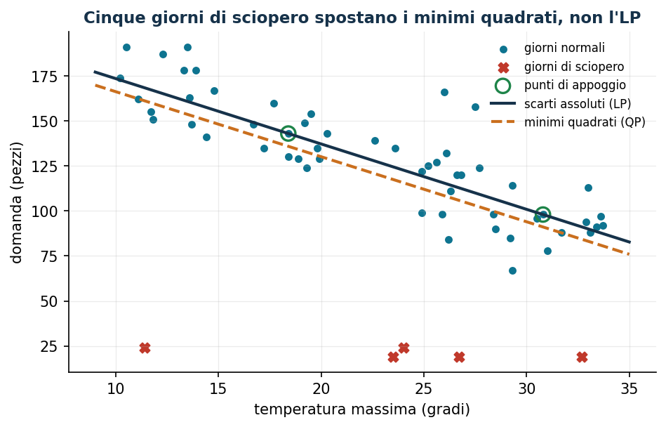
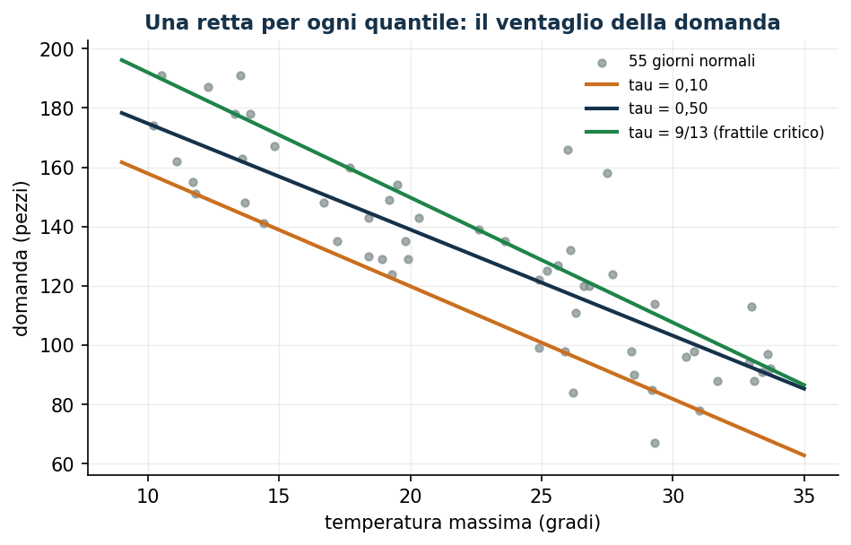
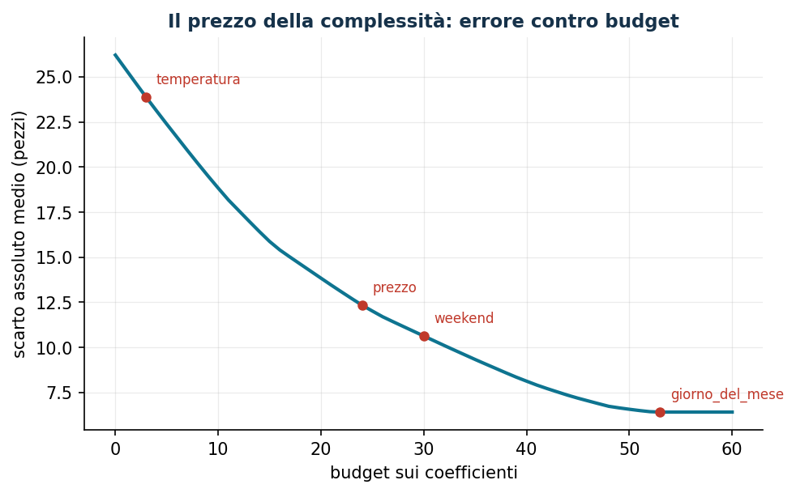

# Regressione robusta e quantile

**Classe: LP** (confronto con QP) · Script: `python/lab16_regressione.py`

Tutti i modelli del laboratorio partono da parametri noti: la curva di domanda
del [pricing](pricing.md), i costi della [produzione](produzione.md), gli scenari
del [newsvendor](newsvendor.md). Quei numeri qualcuno li deve stimare, e la
stima è essa stessa un problema di ottimizzazione. Minimizzando gli scarti
**assoluti** invece che quadratici il problema resta un LP, la stima non si
lascia trascinare dai dati anomali e — pesando in modo asimmetrico gli scarti in
eccesso e in difetto — punta a un **quantile** della domanda invece che al suo
centro: esattamente il numero che serve al newsvendor.

## Il modello

*Dati*: $n$ osservazioni indicizzate da $i \in \{1, 2, \dots, n\}$, con
caratteristiche $x_{ij}$ per $j \in \{1, 2, \dots, p\}$ e valore osservato $y_i$;
il livello $\tau \in \mathbb{Q}$, $0 < \tau < 1$.

*Variabili*: i coefficienti $w_j$ e l'intercetta $b$ (libere), gli scostamenti in
eccesso $u_i$ e in difetto $v_i$ (non negativi).

$$
\begin{aligned}
\min ~ \sum_{i=1}^{n} \bigl[\, \tau\, u_i + (1 - \tau)\, v_i \,\bigr] & & \\
\text{soggetto a} \quad \sum_{j=1}^{p} w_j\, x_{ij} + b + u_i - v_i &= y_i,
   & \forall i \in \{1, 2, \dots, n\}, \\
w_j &\gtreqless 0, & \forall j \in \{1, 2, \dots, p\}, \\
b &\gtreqless 0, \\
u_i,\; v_i &\ge 0, & \forall i \in \{1, 2, \dots, n\}.
\end{aligned}
$$

Lo scostamento ha segno qualunque ma l'obiettivo ne deve pagare il valore
assoluto: spezzandolo in parte positiva e parte negativa l'obiettivo resta
lineare. All'ottimo almeno una delle due è nulla, perché ridurle entrambe della
stessa quantità lascerebbe soddisfatto il vincolo e farebbe scendere l'obiettivo.
È lo stesso trucco delle parti positive del [newsvendor a scenari](newsvendor.md).

!!! example "Senza caratteristiche: torna il quantile empirico"
    Con $p = 0$ resta la sola intercetta. Sette giorni di vendite: 88, 96, 104,
    112, 120, 132, 148 pezzi; la panetteria del capitolo 12 ha $c_u = 9$ e
    $c_o = 4$, quindi $\tau = \alpha^* = 9/13 = 0{,}6923$.

    L'ottimo è $\tilde b = 120$, la quinta osservazione in ordine crescente
    ($4/7 = 0{,}5714 \le \tau \le 5/7 = 0{,}7143$), con valore

    $$
    \tilde z = \tfrac{4}{13}(32 + 24 + 16 + 8) + \tfrac{9}{13}(12 + 28)
             = \tfrac{680}{13} = 52{,}3077 .
    $$

    I duali sono $\tilde\pi = \bigl(-\tfrac{4}{13}, -\tfrac{4}{13},
    -\tfrac{4}{13}, -\tfrac{4}{13}, -\tfrac{2}{13}, \tfrac{9}{13},
    \tfrac{9}{13}\bigr)$: somma nulla, valore duale $680/13$. Senza
    caratteristiche il modello **è** la regola del quantile; con le
    caratteristiche diventa un quantile *condizionato*.

## Caso di studio: lo storico della panetteria

Sessanta giorni di vendite (domanda, temperatura, prezzo, weekend) in
`dati/panetteria_storico.csv`; cinque cadono durante due scioperi dei trasporti,
con le vendite crollate a una ventina di pezzi. Con la sola temperatura:

```text
LP  (mediana)        : domanda = 209,77 - 3,63 * temperatura
QP  (minimi quadrati): domanda = 202,34 - 3,61 * temperatura
Scarto assoluto medio sui 55 giorni normali: LP 13,08 pezzi, QP 14,81 pezzi
QP senza i 5 giorni di sciopero: domanda = 213,58 - 3,72 * temperatura
Distanza dall'intercetta "pulita" 213,58: LP 3,81 pezzi, QP 11,24 pezzi
```



I minimi quadrati pagano lo scarto **al quadrato**: uno scarto di 100 pesa come
diecimila scarti di uno, e cinque giorni su sessanta bastano a spostare
l'intercetta di 11 pezzi. L'LP paga lo scarto una volta sola e arriva da solo
alla retta che il QP trova soltanto dopo che qualcuno ha ripulito a mano lo
storico.

## La lettura duale: i punti di appoggio

Il duale $\pi_i$ del vincolo dell'osservazione $i$ vive in una finestra che
dipende solo da $\tau$, e le due condizioni sulle variabili libere completano il
quadro:

$$
-(1 - \tau) \le \tilde\pi_i \le \tau,
\qquad
\sum_{i=1}^{n} \tilde\pi_i\, x_{ij} = 0 \;\; \forall j,
\qquad
\sum_{i=1}^{n} \tilde\pi_i = 0 .
$$

Gli scarti complementari dicono dove sta ciascun duale:

| Posizione dell'osservazione | Variabile positiva | Duale |
|---|---|---|
| sopra la stima | $\tilde u_i > 0$ | $\tilde\pi_i = \tau$ |
| sotto la stima | $\tilde v_i > 0$ | $\tilde\pi_i = -(1 - \tau)$ |
| sulla stima (interpolata) | $\tilde u_i = \tilde v_i = 0$ | $-(1-\tau) < \tilde\pi_i < \tau$ |

Le osservazioni interpolate sono i **punti di appoggio**: sono $p + 1$, tante
quante le variabili libere, e sono le sole che determinano la stima. Sono per la
regressione quello che i support vector della [SVM](svm.md) sono per la
classificazione.

```text
Osservazioni sopra la retta: 29, sotto: 29, interpolate: 2  <- p + 1 = 2
somma dei duali                        = 0,000000
somma dei duali per la temperatura     = 0,000000
valore duale 616,9960 = valore primale 616,9960   (dualita' forte)
```

La condizione $\sum_i \tilde\pi_i = 0$ è il duale dell'intercetta ed è la
proprietà del quantile in forma algebrica: sostituendo i valori della tabella,
$\tau\,n_+ - (1-\tau)\,n_- + \sum_{\text{interpolate}} \tilde\pi_i = 0$, cioè la
stima lascia sotto di sé una frazione $\tau$ delle osservazioni.

Lo scarto è anche uno strumento diagnostico: con tutte e tre le caratteristiche
i giorni normali hanno scarto al più 23,2 pezzi e i cinque scioperi almeno 67,5.
Una soglia a 40 pezzi li isola esattamente, senza sapere nulla degli scioperi.

## Regressione quantile e scorta di sicurezza

Sui 55 giorni normali, il modello a tre caratteristiche per diversi $\tau$;
l'ultima colonna verifica la proprietà del quantile.

| $\tau$ | intercetta | temperatura | prezzo | weekend | quota sotto la stima |
|---|---:|---:|---:|---:|---:|
| 0,10 | 269,29 | −4,04 | −24,71 | +37,05 | 0,073 |
| 0,50 | 272,01 | −3,85 | −22,24 | +28,74 | 0,455 |
| 9/13 = 0,6923 | 281,19 | −3,96 | −23,21 | +31,47 | 0,673 |
| 0,90 | 287,49 | −3,57 | −25,69 | +27,98 | 0,873 |



Per un giorno caldo di weekend a prezzo pieno (28 gradi, prezzo 3,00):

```text
domanda mediana prevista              126,3 pezzi
quantile 0,6923 previsto              132,1 pezzi   <- quantita' da produrre
scorta di sicurezza                     5,8 pezzi
quantile 0,6923 senza caratteristiche 148,0 pezzi
```

La regola del quantile resta quella del capitolo 12, ma il numero a cui si
applica cambia: il quantile su tutto lo storico dice 148 pezzi, quello
*condizionato* alle condizioni del giorno ne chiede 132. Sedici pezzi al giorno
di invenduto in meno, senza toccare i costi. La differenza fra stima mediana e
stima al frattile critico, 5,8 pezzi, è la scorta di sicurezza — calcolata
direttamente, senza ipotesi sulla distribuzione.

## Selezione delle caratteristiche con un budget

Con abbastanza libertà il modello insegue il rumore. Si mette allora un budget
sui coefficienti: $p$ nuove variabili $z_j \ge 0$ e il dato $t \in
\mathbb{Q}_{\ge 0}$, con

$$
-z_j \le w_j \le z_j \;\; \forall j \in \{1, 2, \dots, p\},
\qquad \sum_{j=1}^{p} z_j \le t .
$$

!!! warning "Standardizzare è obbligatorio"
    Il budget somma coefficienti di caratteristiche misurate in unità diverse
    (gradi, euro, indicatori 0/1): senza standardizzare, la selezione
    dipenderebbe dalle unità di misura. Qui ogni caratteristica ha media nulla e
    deviazione standard unitaria, e ogni coefficiente si legge come *pezzi per
    deviazione standard*.

Alle tre caratteristiche vere se ne aggiungono quattro senza alcun legame con la
domanda (follower, pioggia in una regione vicina, indice di borsa, giorno del
mese).

```text
budget  temperatura  prezzo  weekend  follower  pioggia  borsa  giorno_del_mese
    10       -10,00    0,00     0,00      0,00     0,00   0,00        0,00
    20       -18,16   -1,51     0,00      0,00    -0,33   0,00        0,00
    30       -22,43   -4,45     2,35      0,00    -0,77   0,00        0,00
    45       -26,98   -8,22     9,09      0,00    -0,63   0,00       -0,09

budget  5: scarto medio 22,37 pezzi, prezzo ombra -19,952 pezzi per unita'
budget 10: scarto medio 18,83 pezzi, prezzo ombra -18,665 pezzi per unita'
budget 20: scarto medio 13,84 pezzi, prezzo ombra -10,658 pezzi per unita'
budget 30: scarto medio 10,63 pezzi, prezzo ombra  -7,271 pezzi per unita'
budget 45: scarto medio  7,19 pezzi, prezzo ombra  -4,197 pezzi per unita'
```



Il prezzo ombra del vincolo di budget è il **prezzo della complessità**: quanti
pezzi di errore si risparmiano per ogni unità di budget in più. Vale −19,95 con
budget scarso e −4,20 con budget abbondante: le prime unità comprano la
temperatura, le ultime comprano rumore. Le tre caratteristiche vere entrano
nell'ordine della loro importanza, le quattro irrilevanti non superano mai i 2
pezzi per deviazione standard finché il budget non diventa palesemente
eccessivo. Il budget da scegliere non è quello che minimizza l'errore storico,
ma quello oltre il quale il prezzo ombra diventa trascurabile.

??? example "Mostra lo script completo — `lab16_regressione.py`"
    ```python
    """Capitolo 16 — Regressione robusta e quantile (LP).

    Caso di studio: la panetteria del capitolo 12. Sessanta giorni di storico
    (domanda, temperatura, prezzo, weekend) piu' tre giorni di sciopero dei
    trasporti che fanno crollare la domanda.

    Contenuto:
      1. Senza attributi il modello restituisce il quantile empirico (esempio a mano)
      2. Scarti assoluti (LP) contro minimi quadrati (QP): robustezza agli anomali
      3. Lettura duale: pi_i, scarti complementari, punti di appoggio
      4. Regressione quantile: la scorta di sicurezza del newsvendor dai dati
      5. Selezione delle caratteristiche con un budget sui coefficienti
    """
    import gurobipy as gp
    import numpy as np
    import pandas as pd
    from gurobipy import GRB

    from stile import (ARANCIO, BLU, GRIGIO, ROSSO, TEAL, VERDE, intestazione, plt,
                       salva_dat, salva_dati, salva_figura)

    TAU_NV = 9 / 13                                # frattile critico del capitolo 12


    # ----------------------------------------------------------------------
    # MODELLO: regressione quantile come LP
    # ----------------------------------------------------------------------
    def regressione_quantile(X, y, tau=0.5, budget=None):
        """min sum_i [tau u_i + (1-tau) v_i]  con  X w + b + u - v = y.

        Con `budget` aggiunge sum_j z_j <= budget e -z_j <= w_j <= z_j
        (selezione delle caratteristiche: budget sui coefficienti)."""
        n, p = X.shape
        m = gp.Model("regressione")
        m.Params.OutputFlag = 0
        w = m.addVars(p, lb=-GRB.INFINITY, name="w")
        b = m.addVar(lb=-GRB.INFINITY, name="b")
        u = m.addVars(n, name="u")                 # scostamento in eccesso
        v = m.addVars(n, name="v")                 # scostamento in difetto
        residuo = m.addConstrs(
            (gp.quicksum(X[i, j] * w[j] for j in range(p)) + b + u[i] - v[i] == y[i]
             for i in range(n)), name="residuo")
        vincolo_budget = None
        if budget is not None:
            z = m.addVars(p, name="z")
            m.addConstrs((w[j] <= z[j] for j in range(p)), name="mod_su")
            m.addConstrs((-w[j] <= z[j] for j in range(p)), name="mod_giu")
            vincolo_budget = m.addConstr(gp.quicksum(z[j] for j in range(p)) <= budget,
                                         name="budget")
        m.setObjective(gp.quicksum(tau * u[i] + (1 - tau) * v[i] for i in range(n)),
                       GRB.MINIMIZE)
        m.optimize()
        assert m.Status == GRB.OPTIMAL
        coef = np.array([w[j].X for j in range(p)])
        duali = np.array([residuo[i].Pi for i in range(n)])
        return m, coef, b.X, duali, vincolo_budget


    def minimi_quadrati(X, y):
        """min sum_i r_i^2  con  X w + b + r = y  (QP convesso, stesso solver)."""
        n, p = X.shape
        m = gp.Model("minimi_quadrati")
        m.Params.OutputFlag = 0
        w = m.addVars(p, lb=-GRB.INFINITY, name="w")
        b = m.addVar(lb=-GRB.INFINITY, name="b")
        r = m.addVars(n, lb=-GRB.INFINITY, name="r")
        m.addConstrs((gp.quicksum(X[i, j] * w[j] for j in range(p)) + b + r[i] == y[i]
                      for i in range(n)), name="residuo")
        m.setObjective(gp.quicksum(r[i] * r[i] for i in range(n)), GRB.MINIMIZE)
        m.optimize()
        assert m.Status == GRB.OPTIMAL
        return np.array([w[j].X for j in range(p)]), b.X


    def scarto_medio(X, y, coef, b):
        return float(np.abs(y - (X @ coef + b)).mean())


    # ----------------------------------------------------------------------
    # 1. SENZA ATTRIBUTI: IL MODELLO RESTITUISCE IL QUANTILE EMPIRICO
    # ----------------------------------------------------------------------
    intestazione("Senza attributi: il quantile empirico (esempio svolto a mano)")
    y7 = np.array([88.0, 96.0, 104.0, 112.0, 120.0, 132.0, 148.0])
    X0 = np.zeros((len(y7), 0))
    m0, _, b0, pi0, _ = regressione_quantile(X0, y7, tau=TAU_NV)
    print(f"Sette giorni: {y7.astype(int)}")
    print(f"tau = alpha* = 9/13 = {TAU_NV:.4f}  (panetteria del capitolo 12: cu=9, co=4)")
    print(f"Intercetta ottima b = {b0:.4f}  -> e' il 5o valore ordinato, il quantile 69,23%")
    print(f"Valore ottimo = {m0.ObjVal:.4f} = 680/13")
    print(f"Duali pi = {np.round(pi0, 4)}  (limiti: -(1-tau) = {-(1 - TAU_NV):.4f}, "
          f"tau = {TAU_NV:.4f})")
    print(f"Verifica somma dei duali = {pi0.sum():.6f}  (deve essere 0: duale "
          f"dell'intercetta)")
    sopra = int((y7 > b0 + 1e-9).sum())
    sotto = int((y7 < b0 - 1e-9).sum())
    print(f"Osservazioni: {sotto}/7 sotto la stima, 1/7 sulla stima, {sopra}/7 sopra")
    print(f"  {sotto}/7 = {sotto / 7:.4f}  <=  tau = {TAU_NV:.4f}  <=  "
          f"{sotto + 1}/7 = {(sotto + 1) / 7:.4f}")

    # ----------------------------------------------------------------------
    # 2. DATI: SESSANTA GIORNI DELLA PANETTERIA
    # ----------------------------------------------------------------------
    intestazione("Storico della panetteria: 60 giorni")
    rng = np.random.default_rng(16)
    n = 60
    temperatura = np.round(rng.uniform(10, 34, n), 1)
    prezzo = rng.choice([2.20, 2.60, 3.00, 3.40], n)
    weekend = (rng.random(n) < 0.30).astype(float)
    domanda = (258 - 3.7 * temperatura - 19.0 * prezzo + 33.0 * weekend
               + rng.normal(0, 9, n))
    anomalo = np.zeros(n)
    giorni_sciopero = [11, 22, 29, 41, 46]         # due scioperi dei trasporti
    domanda[giorni_sciopero] = rng.uniform(18, 32, len(giorni_sciopero))
    anomalo[giorni_sciopero] = 1
    domanda = np.round(domanda).astype(float)

    # quattro attributi privi di legame con la domanda (per la selezione)
    follower = np.round(rng.uniform(8, 20, n), 1)
    pioggia = np.round(rng.uniform(0, 12, n), 1)
    borsa = np.round(rng.uniform(95, 115, n), 1)
    giorno_mese = rng.integers(1, 29, n).astype(float)

    dati = pd.DataFrame({
        "giorno": np.arange(1, n + 1),
        "domanda": domanda.astype(int),
        "temperatura": temperatura,
        "prezzo": prezzo,
        "weekend": weekend.astype(int),
        "follower": follower,
        "pioggia": pioggia,
        "indice_borsa": borsa,
        "giorno_del_mese": giorno_mese.astype(int),
        "sciopero": anomalo.astype(int),
    })
    salva_dati(dati, "panetteria_storico")
    print(f"Domanda: min {domanda.min():.0f}, media {domanda.mean():.1f}, "
          f"max {domanda.max():.0f}   giorni di sciopero: {giorni_sciopero}")

    # ----------------------------------------------------------------------
    # 3. SCARTI ASSOLUTI (LP) CONTRO MINIMI QUADRATI (QP)
    # ----------------------------------------------------------------------
    intestazione("Scarti assoluti (LP) contro minimi quadrati (QP)")
    Xt = temperatura.reshape(-1, 1)
    m_lad, w_lad, b_lad, pi_lad, _ = regressione_quantile(Xt, domanda, tau=0.5)
    w_ols, b_ols = minimi_quadrati(Xt, domanda)
    buoni = anomalo == 0
    print(f"LP  (mediana)        : domanda = {b_lad:.2f} {w_lad[0]:+.2f} * temperatura")
    print(f"QP  (minimi quadrati): domanda = {b_ols:.2f} {w_ols[0]:+.2f} * temperatura")
    print(f"Scarto assoluto medio sui 55 giorni normali: "
          f"LP {scarto_medio(Xt[buoni], domanda[buoni], w_lad, b_lad):.2f} pezzi, "
          f"QP {scarto_medio(Xt[buoni], domanda[buoni], w_ols, b_ols):.2f} pezzi")
    w_pul, b_pul = minimi_quadrati(Xt[buoni], domanda[buoni])
    print(f"QP senza i 5 giorni di sciopero: domanda = {b_pul:.2f} "
          f"{w_pul[0]:+.2f} * temperatura  (l'LP ci arriva senza togliere nulla)")
    print(f"Distanza dall'intercetta 'pulita' {b_pul:.2f}: "
          f"LP {abs(b_lad - b_pul):.2f} pezzi, QP {abs(b_ols - b_pul):.2f} pezzi")

    # ----------------------------------------------------------------------
    # 4. LETTURA DUALE: PUNTI DI APPOGGIO E PROPRIETA' DEL QUANTILE
    # ----------------------------------------------------------------------
    intestazione("Lettura duale del modello LP")
    residuo = domanda - (Xt @ w_lad + b_lad)
    appoggio = np.abs(residuo) < 1e-6
    print(f"Osservazioni sopra la retta: {(residuo > 1e-6).sum()}, "
          f"sotto: {(residuo < -1e-6).sum()}, interpolate: {int(appoggio.sum())}")
    print(f"Duali: minimo {pi_lad.min():.4f}, massimo {pi_lad.max():.4f}  "
          f"(limiti -0,5 e +0,5)")
    print(f"pi = +0,5 (punto sopra la retta): {(pi_lad > 0.5 - 1e-6).sum()} punti")
    print(f"pi = -0,5 (punto sotto la retta): {(pi_lad < -0.5 + 1e-6).sum()} punti")
    print(f"-0,5 < pi < +0,5 (punti di appoggio): {int(appoggio.sum())} punti  "
          f"-> p + 1 = 2")
    print(f"Somma dei duali = {pi_lad.sum():.6f} (duale dell'intercetta)")
    print(f"Somma dei duali per la temperatura = {(pi_lad * temperatura).sum():.6f}")
    print(f"Valore duale {float(pi_lad @ domanda):.4f} = valore primale "
          f"{m_lad.ObjVal:.4f}  (dualita' forte)")
    print("Giorni di appoggio:", (np.where(appoggio)[0] + 1).tolist(),
          "-> temperature", np.round(temperatura[appoggio], 1).tolist())

    # i giorni anomali si riconoscono dallo scarto del modello a tre attributi
    X3tot = np.column_stack([temperatura, prezzo, weekend])
    _, w3, b3, _, _ = regressione_quantile(X3tot, domanda, tau=0.5)
    res3 = domanda - (X3tot @ w3 + b3)
    sospetti = np.abs(res3) > 40
    print(f"\nModello a tre attributi su tutti i 60 giorni: "
          f"domanda = {b3:.2f} {w3[0]:+.2f}*temp {w3[1]:+.2f}*prezzo {w3[2]:+.2f}*weekend")
    print(f"Scarto assoluto: {np.abs(res3[anomalo == 0]).max():.1f} pezzi al massimo nei "
          f"giorni normali, {np.abs(res3[anomalo == 1]).min():.1f} al minimo negli anomali")
    print(f"Giorni con scarto oltre 40 pezzi: {(np.where(sospetti)[0] + 1).tolist()}")
    print(f"Sono esattamente i giorni di sciopero: "
          f"{bool((sospetti == (anomalo == 1)).all())}")
    puliti = ~sospetti

    # ----------------------------------------------------------------------
    # 5. REGRESSIONE QUANTILE: LA SCORTA DI SICUREZZA DAI DATI
    # ----------------------------------------------------------------------
    intestazione("Regressione quantile e scorta di sicurezza")
    X3 = np.column_stack([temperatura, prezzo, weekend])[puliti]
    y3 = domanda[puliti]
    print(f"Da qui in avanti: i {int(puliti.sum())} giorni normali")
    righe = []
    for tau in (0.10, 0.50, TAU_NV, 0.90):
        _, w_t, b_t, _, _ = regressione_quantile(X3, y3, tau=tau)
        sotto_t = float((y3 < X3 @ w_t + b_t - 1e-9).mean())
        righe.append({"tau": tau, "intercetta": b_t, "temperatura": w_t[0],
                      "prezzo": w_t[1], "weekend": w_t[2], "quota_sotto": sotto_t})
        print(f"tau = {tau:.4f}: domanda = {b_t:7.2f} {w_t[0]:+6.2f}*temp "
              f"{w_t[1]:+7.2f}*prezzo {w_t[2]:+6.2f}*weekend   "
              f"| osservazioni sotto la stima {sotto_t:.3f}")
    tab_tau = pd.DataFrame(righe)
    salva_dati(tab_tau, "regressione_quantili")

    giorno_tipo = np.array([28.0, 3.00, 1.0])       # caldo, prezzo pieno, weekend
    _, w_med, b_med, _, _ = regressione_quantile(X3, y3, tau=0.5)
    _, w_nv, b_nv, _, _ = regressione_quantile(X3, y3, tau=TAU_NV)
    prev_med = float(giorno_tipo @ w_med + b_med)
    prev_nv = float(giorno_tipo @ w_nv + b_nv)
    q_incond = float(np.quantile(y3, TAU_NV))
    print(f"\nGiorno tipo (28 gradi, prezzo 3,00, weekend):")
    print(f"  domanda mediana prevista        {prev_med:6.1f} pezzi")
    print(f"  quantile {TAU_NV:.4f} previsto        {prev_nv:6.1f} pezzi  <- quantita' da produrre")
    print(f"  scorta di sicurezza             {prev_nv - prev_med:6.1f} pezzi")
    print(f"  quantile {TAU_NV:.4f} senza attributi {q_incond:6.1f} pezzi  "
          f"(capitolo 12: stessa regola, nessun attributo)")

    # ----------------------------------------------------------------------
    # 6. SELEZIONE DELLE CARATTERISTICHE CON UN BUDGET SUI COEFFICIENTI
    # ----------------------------------------------------------------------
    intestazione("Selezione delle caratteristiche: budget sui coefficienti")
    nomi = ["temperatura", "prezzo", "weekend", "follower", "pioggia",
            "indice_borsa", "giorno_del_mese"]
    Xg = np.column_stack([temperatura, prezzo, weekend, follower, pioggia,
                          borsa, giorno_mese])[puliti]
    Xs = (Xg - Xg.mean(axis=0)) / Xg.std(axis=0)    # standardizzazione obbligatoria

    _, w_pieno, b_pieno, _, _ = regressione_quantile(Xs, y3, tau=0.5)
    print("Senza budget (tutti gli attributi):")
    for nome, coeff in zip(nomi, w_pieno):
        print(f"  {nome:16s} {coeff:+8.2f}")
    print(f"  |coefficienti| = {np.abs(w_pieno).sum():.2f}   scarto assoluto medio "
          f"{scarto_medio(Xs, y3, w_pieno, b_pieno):.2f} pezzi")

    SOGLIA = 2.0                                    # rilevanza: 2 pezzi per dev. std.
    griglia_t = np.round(np.arange(0, 60.5, 1.0), 2)
    curva, entrate = [], {}
    for t in griglia_t:
        mt, w_t, b_t, _, vinc = regressione_quantile(Xs, y3, tau=0.5, budget=t)
        mad = scarto_medio(Xs, y3, w_t, b_t)
        curva.append({"budget": t, "scarto_medio": mad, "prezzo_ombra": vinc.Pi,
                      **{nome: w_t[j] for j, nome in enumerate(nomi)}})
        for j, nome in enumerate(nomi):
            if abs(w_t[j]) > SOGLIA and nome not in entrate:
                entrate[nome] = t
    curva = pd.DataFrame(curva)
    salva_dati(curva, "regressione_budget")
    salva_dat(curva[["budget", "scarto_medio", "prezzo_ombra"]], "cap16_budget")

    print(f"\nOrdine di ingresso (coefficiente oltre {SOGLIA:.0f} pezzi per "
          f"deviazione standard):")
    for nome, t in sorted(entrate.items(), key=lambda kv: kv[1]):
        print(f"  budget {t:5.1f} -> entra {nome}")
    mai = [nome for nome in nomi if nome not in entrate]
    print(f"  restano fuori: {', '.join(mai) if mai else '(nessuno)'}")

    print("\nCoefficienti al crescere del budget:")
    print("  budget  " + "".join(f"{nome[:9]:>11s}" for nome in nomi))
    for t in (10.0, 20.0, 30.0, 45.0):
        riga = curva[curva["budget"] == t].iloc[0]
        print(f"  {t:6.0f}  " + "".join(f"{riga[nome]:11.2f}" for nome in nomi))

    for t in (5.0, 10.0, 20.0, 30.0, 45.0):
        riga = curva[curva["budget"] == t].iloc[0]
        print(f"budget {t:5.1f}: scarto medio {riga['scarto_medio']:6.2f} pezzi, "
              f"prezzo ombra {riga['prezzo_ombra']:+7.3f} pezzi per unita' di budget")

    # ----------------------------------------------------------------------
    # 7. FIGURE
    # ----------------------------------------------------------------------
    punti = pd.DataFrame({"temperatura": temperatura, "domanda": domanda,
                          "sciopero": anomalo.astype(int),
                          "appoggio": appoggio.astype(int)})
    salva_dat(punti, "cap16_panetteria")

    fig, ax = plt.subplots()
    ax.scatter(temperatura[buoni], domanda[buoni], s=18, color=TEAL,
               label="giorni normali")
    ax.scatter(temperatura[~buoni], domanda[~buoni], s=45, color=ROSSO, marker="X",
               label="giorni di sciopero")
    ax.scatter(temperatura[appoggio], domanda[appoggio], s=95, facecolors="none",
               edgecolors=VERDE, linewidths=1.6, label="punti di appoggio")
    gr = np.linspace(9, 35, 2)
    ax.plot(gr, b_lad + w_lad[0] * gr, color=BLU, lw=2, label="scarti assoluti (LP)")
    ax.plot(gr, b_ols + w_ols[0] * gr, color=ARANCIO, lw=2, ls="--",
            label="minimi quadrati (QP)")
    ax.set_xlabel("temperatura massima (gradi)")
    ax.set_ylabel("domanda (pezzi)")
    ax.set_title("Cinque giorni di sciopero spostano i minimi quadrati, non l'LP")
    ax.legend(loc="upper right", fontsize=8)
    salva_figura(fig, "cap16_regressione_robusta")

    rette = []
    for tau in (0.10, 0.50, TAU_NV):
        _, w_t, b_t, _, _ = regressione_quantile(Xt[puliti], domanda[puliti], tau=tau)
        rette.append({"tau": tau, "intercetta": b_t, "pendenza": w_t[0]})
    rette = pd.DataFrame(rette)
    salva_dat(rette, "cap16_rette_quantili")

    fig, ax = plt.subplots()
    ax.scatter(temperatura[puliti], domanda[puliti], s=16, color=GRIGIO, alpha=0.7,
               label="55 giorni normali")
    colori = {0.10: ARANCIO, 0.50: BLU, TAU_NV: VERDE}
    for _, riga in rette.iterrows():
        etichetta = ("tau = 9/13 (frattile critico)" if abs(riga["tau"] - TAU_NV) < 1e-9
                     else f"tau = {riga['tau']:.2f}".replace(".", ","))
        ax.plot(gr, riga["intercetta"] + riga["pendenza"] * gr,
                color=colori[riga["tau"]], lw=2, label=etichetta)
    ax.set_xlabel("temperatura massima (gradi)")
    ax.set_ylabel("domanda (pezzi)")
    ax.set_title("Una retta per ogni quantile: il ventaglio della domanda")
    ax.legend(loc="upper right", fontsize=8)
    salva_figura(fig, "cap16_quantili")

    fig, ax = plt.subplots()
    ax.plot(curva["budget"], curva["scarto_medio"], color=TEAL, lw=2)
    for nome, t in sorted(entrate.items(), key=lambda kv: kv[1]):
        riga = curva[curva["budget"] == t].iloc[0]
        ax.plot([t], [riga["scarto_medio"]], "o", color=ROSSO, ms=5)
        ax.annotate(nome, (t, riga["scarto_medio"]), textcoords="offset points",
                    xytext=(6, 8), fontsize=8, color=ROSSO)
    ax.set_xlabel("budget sui coefficienti")
    ax.set_ylabel("scarto assoluto medio (pezzi)")
    ax.set_title("Il prezzo della complessità: errore contro budget")
    salva_figura(fig, "cap16_budget")

    print("\nFatto: capitolo 16 (regressione robusta e quantile).")
    ```

## Esercizi

1. Con i sette giorni dell'esempio (88, 96, 104, 112, 120, 132, 148) e
   $\tau = 1/2$, calcolare a mano la mediana, il valore ottimo e i sette duali;
   verificare che la loro somma sia nulla.
2. Stimare il modello con la sola temperatura e $\tau = 1/2$, poi spostare di
   $+30$ pezzi un'osservazione sopra la retta e rieseguire: la stima cambia? E
   se si sposta di $-30$ uno dei due punti di appoggio? Spiegare con gli scarti
   complementari.
3. La panetteria svende l'invenduto a fine giornata e $c_o$ passa da 4 a 2 euro:
   ricalcolare $\alpha^*$, rieseguire la regressione quantile e dire di quanti
   pezzi cambia la produzione del giorno tipo.
4. Tracciare il valore ottimo con budget per $t \in \{0, 1, \dots, 60\}$ e
   verificare che sia convesso e lineare a tratti; i punti di rottura coincidono
   con i budget a cui cambia il prezzo ombra?
5. Dividere i 55 giorni normali in stima (40) e verifica (15) e tracciare lo
   scarto assoluto medio sui due insiemi per $t \in \{5, 10, \dots, 55\}$: quale
   budget si sceglie?
