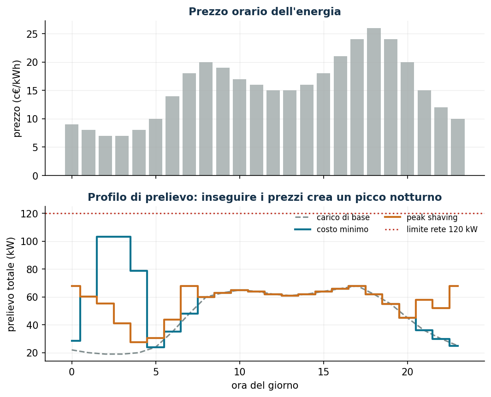
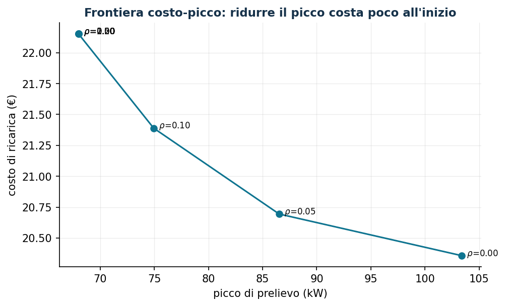

# Ricarica intelligente di veicoli elettrici

**Classe:** LP / QP convesso · **Script:** `python/lab10_ricarica_ev.py`

Una flotta deve arrivare carica al mattino sfruttando le ore economiche — ma se
tutti caricano insieme, il picco di prelievo esplode. Un problema che *sembra*
richiedere variabili di accensione/spegnimento e invece è un LP puro: la decisione
vera — quanta potenza — è continua.

**Il problema a parole.** *Decidiamo* la potenza $x_{vt}$ per veicolo e ora.
*L'obiettivo*: minima spesa energetica. *I vincoli*: energia richiesta entro la
partenza, ricarica solo quando collegati e sotto la potenza del caricatore,
prelievo totale sotto la potenza del contatore.

## Modello

Dati: prezzi orari $\pi_t$, disponibilità $a_{vt} \in \{0,1\}$, energia $e_v$,
potenza massima $\bar p_v$, carico di base $b_t$, limite contatore $k$, rendimento
$\eta$.

$$
\begin{aligned}
\min\;& \sum_{v \in V}\sum_{t \in T} \pi_t\, \Delta t\, x_{vt}\\
\text{s.t.}\;\;& \eta \sum_{t \in T} \Delta t\, x_{vt} \ge e_v && \forall v \in V\\
& 0 \le x_{vt} \le a_{vt}\, \bar p_v && \forall v, t\\
& \sum_{v \in V} x_{vt} + b_t \le k && \forall t \in T
\end{aligned}
$$

!!! example "Esempio a mano (1 veicolo, 2 ore)"
    $e = 10$ kWh, prezzi $(0{,}10;\, 0{,}20)$, $\bar p = 8$ kW: si carica 8 nell'ora
    economica e 2 in quella cara (costo 1,20 €). Duale del fabbisogno = 0,20 €/kWh
    (il prezzo dell'*ora marginale*); duale della potenza = 0,10 €/kW. Con
    $\bar p = 12$: tutto nell'ora economica, duale 0,10.

## Caso di studio

Sei furgoni con finestre notturne diverse, contatore $k = 120$ kW, $\eta = 0{,}95$.

```text
Costo minimo : 20,36 €/notte   picco 103,4 kW
Peak shaving : picco minimo possibile 68,0 kW
Duali fabbisogno: 0,0842 = 0,08/η  oppure  0,0947 = 0,09/η  a seconda del veicolo
```



I duali sono i prezzi delle **ore marginali** di ciascun veicolo, corretti per il
rendimento: la finestra di disponibilità determina quale prezzo orario "vede"
l'ultimo kWh.

## Sensitività



```text
rho = 0    : costo 20,36  picco 103,4      k = 60–65 kW : INAMMISSIBILE
rho = 0,10 : costo 21,39  picco  74,9      k = 70 kW    : 21,93 €
rho = 0,20 : costo 22,15  picco  68,0      k* minimo    : 68 kW
```

Tagliare il picco del 28% costa un euro a notte. Il minimax puro spenderebbe
27,79 €: il compromesso costo + $\rho\,\cdot$ picco ottiene lo stesso picco a
22,15 € — mai ottimizzare un solo obiettivo quando ce ne sono due.

!!! warning "Un bug istruttivo (capitato davvero)"
    Nel vincolo `quicksum(x) + base[t] <= C` Gurobi sposta la costante nel termine
    noto: il RHS memorizzato è `C - base[t]`. Chi scrive `v.RHS = nuovaC` sta
    allentando il vincolo sbagliato. Quando una sensitività non cambia nulla,
    sospettare del proprio codice prima che del modello.


## Codice

Lo script completo del capitolo — dati, modello, soluzione, sensitività e figure —
è [`python/lab10_ricarica_ev.py`](https://github.com/fabiofurini/laboratorio-ricerca-operativa/blob/main/python/lab10_ricarica_ev.py)
(riproducibile con `python3 python/lab10_ricarica_ev.py` dalla cartella `python/`).

??? example "Mostra lo script completo — `lab10_ricarica_ev.py`"

    ```python
    """Capitolo 10 — Ricarica intelligente di veicoli elettrici (LP / QP convesso).

    Caso di studio: deposito aziendale con 6 furgoni elettrici da ricaricare
    durante la notte; prezzi orari dell'energia; carico di base dell'edificio.

    Contenuto:
      1. LP a costo minimo: la ricarica insegue le ore economiche
      2. Peak shaving: minimizzare il picco di prelievo (minimax)
      3. Profilo regolare (QP) e confronto multiobiettivo costo-picco
      4. Prezzi ombra: capacità di rete e fabbisogno energetico
    """
    import gurobipy as gp
    import numpy as np
    import pandas as pd
    from gurobipy import GRB

    from stile import (ARANCIO, GRIGIO, ROSSO, TEAL, intestazione, plt, salva_dat, salva_dati,
                       salva_figura)

    # ----------------------------------------------------------------------
    # 1. DATI
    # ----------------------------------------------------------------------
    ore = list(range(24))                      # ora t = [t, t+1)
    # prezzo €/kWh: alto di giorno e nel picco serale, basso di notte
    prezzo = np.array([0.09, 0.08, 0.07, 0.07, 0.08, 0.10, 0.14, 0.18, 0.20, 0.19,
                       0.17, 0.16, 0.15, 0.15, 0.16, 0.18, 0.21, 0.24, 0.26, 0.24,
                       0.20, 0.15, 0.12, 0.10])
    # carico di base dell'edificio (kW)
    base = np.array([22, 20, 19, 19, 20, 24, 35, 48, 60, 63, 65, 64,
                     62, 61, 62, 64, 66, 68, 62, 55, 45, 36, 30, 25], dtype=float)

    veicoli = [f"V{k}" for k in range(1, 7)]
    # (ora arrivo, ora partenza, energia richiesta kWh, potenza max kW)
    flotta = {
        "V1": (18, 7, 46, 11), "V2": (19, 6, 38, 11), "V3": (20, 8, 55, 22),
        "V4": (17, 6, 30, 7.4), "V5": (21, 7, 42, 11), "V6": (22, 8, 50, 22),
    }
    eta = 0.95            # rendimento di carica
    C_rete = 120.0        # potenza massima prelevabile dal contatore (kW)

    disp = {(v, t): 1 if (flotta[v][0] <= t or t < flotta[v][1]) else 0
            for v in veicoli for t in ore}      # finestre a cavallo della mezzanotte

    salva_dati(pd.DataFrame({"ora": ore, "prezzo": prezzo, "carico_base": base}), "ev_prezzi_base")
    salva_dati(pd.DataFrame([(v, *flotta[v]) for v in veicoli],
                            columns=["veicolo", "arrivo", "partenza", "energia_kWh", "pmax_kW"]),
               "ev_flotta")


    def costruisci():
        m = gp.Model("ricarica_ev")
        m.Params.OutputFlag = 0
        x = m.addVars(veicoli, ore, name="x")       # potenza di carica (kW)
        for v in veicoli:
            for t in ore:
                x[v, t].UB = flotta[v][3] * disp[v, t]     # 0 se non collegato
        v_ene = m.addConstrs((eta * gp.quicksum(x[v, t] for t in ore) >= flotta[v][2]
                              for v in veicoli), name="energia")
        v_rete = m.addConstrs((gp.quicksum(x[v, t] for v in veicoli) + base[t] <= C_rete
                               for t in ore), name="rete")
        return m, x, v_ene, v_rete


    def profilo(x):
        return np.array([sum(x[v, t].X for v in veicoli) for t in ore])


    # ----------------------------------------------------------------------
    # 2. LP COSTO MINIMO
    # ----------------------------------------------------------------------
    intestazione("LP: costo energetico minimo")
    m, x, v_ene, v_rete = costruisci()
    m.setObjective(gp.quicksum(prezzo[t] * x[v, t] for v in veicoli for t in ore), GRB.MINIMIZE)
    m.optimize()
    assert m.Status == GRB.OPTIMAL
    prof_costo = profilo(x)
    costo_min = m.ObjVal
    picco_costo = (prof_costo + base).max()
    print(f"Costo di ricarica: {costo_min:.2f} €   picco di prelievo: {picco_costo:.1f} kW "
          f"(limite {C_rete:.0f})")
    print("\nPrezzi ombra del fabbisogno (costo marginale di 1 kWh in più per veicolo):")
    for v in veicoli:
        print(f"  {v}: {v_ene[v].Pi:.4f} €/kWh")

    # ----------------------------------------------------------------------
    # 3. PEAK SHAVING (minimax) e PROFILO REGOLARE (QP)
    # ----------------------------------------------------------------------
    intestazione("Peak shaving: minimizzare il picco di prelievo")
    mp, xp, _, _ = costruisci()
    z = mp.addVar(name="picco")
    mp.addConstrs((gp.quicksum(xp[v, t] for v in veicoli) + base[t] <= z for t in ore),
                  name="def_picco")
    mp.setObjective(z, GRB.MINIMIZE)
    mp.optimize()
    prof_picco = profilo(xp)
    costo_picco = sum(prezzo[t] * prof_picco[t] for t in ore)
    print(f"Picco minimo possibile: {mp.ObjVal:.1f} kW   costo: {costo_picco:.2f} € "
          f"(+{costo_picco - costo_min:.2f} € rispetto al costo minimo)")

    intestazione("Compromesso: costo + rho · picco")
    compromessi = []
    for rho in [0, 0.05, 0.1, 0.2, 0.5, 1.0, 2.0]:
        mc, xc, _, _ = costruisci()
        zc = mc.addVar(name="picco")
        mc.addConstrs((gp.quicksum(xc[v, t] for v in veicoli) + base[t] <= zc for t in ore))
        mc.setObjective(gp.quicksum(prezzo[t] * xc[v, t] for v in veicoli for t in ore)
                        + rho * zc, GRB.MINIMIZE)
        mc.optimize()
        cc = sum(prezzo[t] * xc[v, t].X for v in veicoli for t in ore)
        compromessi.append((rho, cc, zc.X))
        print(f"  rho = {rho:4.2f}: costo {cc:6.2f} €, picco {zc.X:6.1f} kW")
    salva_dati(pd.DataFrame(compromessi, columns=["rho", "costo", "picco"]), "ev_compromessi")

    # ----------------------------------------------------------------------
    # 4. SENSITIVITÀ: capacità del contatore
    # ----------------------------------------------------------------------
    intestazione("Sensitività: capacità della connessione alla rete")
    # attenzione: nel vincolo "somma x + base[t] <= C" Gurobi sposta la costante base[t]
    # nel termine noto; il RHS memorizzato è C - base[t], quindi va aggiornato così:
    for CC in [60, 65, 70, 80, 90, 120]:
        ms, xs_, _, vr = costruisci()
        for t in ore:
            vr[t].RHS = CC - base[t]
        ms.setObjective(gp.quicksum(prezzo[t] * xs_[v, t] for v in veicoli for t in ore),
                        GRB.MINIMIZE)
        ms.optimize()
        esito = f"costo {ms.ObjVal:6.2f} €" if ms.Status == GRB.OPTIMAL else "INAMMISSIBILE"
        print(f"  C_rete = {CC:3d} kW: {esito}")

    # ----------------------------------------------------------------------
    # 5. FIGURE (dati pgfplots + anteprima matplotlib)
    # ----------------------------------------------------------------------
    salva_dat(pd.DataFrame({"ora": ore, "prezzo_cent": prezzo * 100, "base": base,
                            "totcosto": base + prof_costo, "totpicco": base + prof_picco}),
              "cap10_profili")
    salva_dat(pd.DataFrame(compromessi, columns=["rho", "costo", "picco"]), "cap10_frontiera")

    fig, (ax1, ax2) = plt.subplots(2, 1, figsize=(8.2, 6.4), sharex=True)
    ax1.bar(ore, prezzo * 100, color=GRIGIO, alpha=0.6)
    ax1.set_ylabel("prezzo (c€/kWh)")
    ax1.set_title("Prezzo orario dell'energia")
    ax2.plot(ore, base, color=GRIGIO, ls="--", label="carico di base")
    ax2.plot(ore, base + prof_costo, color=TEAL, lw=2, drawstyle="steps-mid",
             label="costo minimo")
    ax2.plot(ore, base + prof_picco, color=ARANCIO, lw=2, drawstyle="steps-mid",
             label="peak shaving")
    ax2.axhline(C_rete, color=ROSSO, ls=":", label=f"limite rete {C_rete:.0f} kW")
    ax2.set_xlabel("ora del giorno"); ax2.set_ylabel("prelievo totale (kW)")
    ax2.set_title("Profilo di prelievo: inseguire i prezzi crea un picco notturno")
    ax2.legend(fontsize=8, ncol=2)
    salva_figura(fig, "cap10_profili")

    comp = pd.DataFrame(compromessi, columns=["rho", "costo", "picco"])
    fig, ax = plt.subplots()
    ax.plot(comp["picco"], comp["costo"], "-o", color=TEAL)
    for _, r in comp.iterrows():
        ax.annotate(f"  $\\rho$={r['rho']:.2f}", (r["picco"], r["costo"]), fontsize=8)
    ax.set_xlabel("picco di prelievo (kW)")
    ax.set_ylabel("costo di ricarica (€)")
    ax.set_title("Frontiera costo-picco: ridurre il picco costa poco all'inizio")
    salva_figura(fig, "cap10_frontiera")

    print("\nFatto: capitolo 10.")
    ```

## Esercizi

1. $e_1: 46 \to 47$ kWh: costo $+0{,}0947 = 0{,}09/0{,}95$ (verificato).
2. V3 arriva alle 23: come cambiano costo e picco?
3. Profilo regolare QP con $\gamma \sum_t (z_t - z_{t-1})^2$.
4. Frontiera costo-emissioni con intensità carbonica oraria $g_t$.
5. Capacità minima ammissibile per bisezione: $k^* = 68$ kW.
