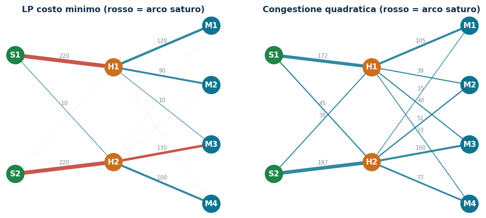
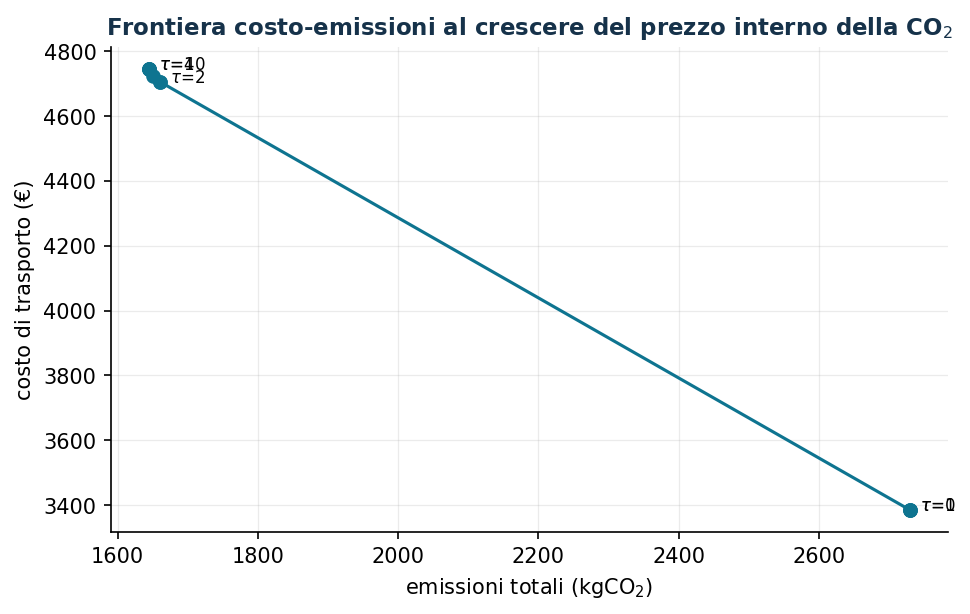

# Supply chain con congestione e sostenibilità

**Classe:** LP / NLP convesso · **Script:** `python/lab05_supplychain.py`

[](https://colab.research.google.com/github/fabiofurini/laboratorio-ricerca-operativa/blob/main/notebooks/lab05_supplychain.ipynb)

I prodotti attraversano una rete di stabilimenti, hub e mercati. Ogni tratta ha
costo, capacità e impronta di CO₂. Come instradare i flussi al minimo costo? Cosa
cambia penalizzando la congestione? Quanto deve valere la CO₂ perché le rotte
"pulite" diventino convenienti?

**Il problema a parole.** *Decidiamo* quante unità far viaggiare su ogni tratta.
*L'obiettivo*: minimo costo di trasporto. *I vincoli*: conservazione del flusso in
ogni nodo e capacità delle tratte.

## Modello

**Dati (input del modello).**

| Simbolo | Tipo | Significato |
|---|---|---|
| $G = (N, A)$ | grafo diretto | nodi $N$ e archi $A \subseteq N \times N$; scriviamo $\lvert N \rvert$ e $\lvert A \rvert$ per il numero di nodi e di archi |
| $b_i$ | $\in \mathbb{Q}$ | saldo del nodo $i \in N$: offerta se $> 0$, domanda se $< 0$, transito se $= 0$ |
| $u_{ij}$ | $\in \mathbb{Q}_{> 0}$ | capacità dell'arco $(i,j) \in A$ (unità) |
| $c_{ij}$ | $\in \mathbb{Q}_{\ge 0}$ | costo di trasporto di un'unità sull'arco $(i,j)$ (€) |
| $e_{ij}$ | $\in \mathbb{Q}_{\ge 0}$ | emissioni per unità trasportata su $(i,j)$ (kg CO₂) |

**Variabili decisionali.** Introduciamo una variabile non negativa per ciascuno degli
$|A|$ archi:

$$
x_{ij} = \text{unità di prodotto inviate sull'arco } (i,j),
\qquad \forall (i,j) \in A.
$$

Usando queste variabili, un modello LP per il problema è il seguente:

$$
\begin{aligned}
\min ~~ \sum_{(i,j) \in A} c_{ij}\, x_{ij} & & \\
\text{soggetto a} \quad \sum_{j :\, (i,j) \in A} x_{ij} - \sum_{j :\, (j,i) \in A} x_{ji} &= b_i, & \forall i \in N, \\
x_{ij} &\le u_{ij}, & \forall (i,j) \in A, \\
x_{ij} &\ge 0, & \forall (i,j) \in A.
\end{aligned}
$$

Descrizione della funzione obiettivo e dei vincoli:

- la funzione obiettivo lineare minimizza il costo totale di trasporto: ogni unità
  che attraversa l'arco $(i,j)$ paga il costo unitario $c_{ij}$;
- i vincoli lineari di **conservazione del flusso** impongono che in ogni nodo ciò
  che esce meno ciò che entra sia pari al saldo $b_i$ — positivo negli stabilimenti,
  negativo nei mercati, nullo negli hub ($|N|$ vincoli lineari); la somma dei saldi
  su tutti i nodi deve essere $\ge 0$, altrimenti il modello è inammissibile;
- i vincoli lineari di **capacità** assicurano che nessuna tratta trasporti più della
  propria capacità ($|A|$ vincoli lineari);
- i vincoli di non negatività su $x_{ij}$ definiscono le variabili del modello.

Varianti sull'obiettivo (i vincoli non cambiano):

$$
\underbrace{\sum_{(i,j) \in A} \bigl(c_{ij}\, x_{ij} + \alpha\, c_{ij}\, x_{ij}^2 / u_{ij}\bigr)}_{\text{congestione (convessa)}}
\qquad
\underbrace{\sum_{(i,j) \in A} (c_{ij} + \tau\, e_{ij})\, x_{ij}}_{\text{prezzo interno CO}_2}
\qquad
\underbrace{\min z \;:\; x_{ij}/u_{ij} \le z, \;\; \forall (i,j) \in A}_{\text{minimax utilizzo}}
$$

dove $\alpha \in \mathbb{Q}_{\ge 0}$ pesa la congestione e
$\tau \in \mathbb{Q}_{\ge 0}$ (€/kg) è il prezzo interno della CO₂.

!!! example "Esempio a mano (due rotte)"
    100 unità; rotta 1: $c_1 = 2$, $u_1 = 80$; rotta 2: $c_2 = 5$. L'LP riempie la
    rotta economica ($x = (80, 20)$, costo 260 €). Con congestione ($\alpha = 1$) si
    eguagliano i costi marginali: $2 + x_1/20 = 5 \Rightarrow x = (60, 40)$ — la
    rotta economica *non* viene più saturata.

## Caso di studio

2 stabilimenti → 2 hub → 4 mercati, 12 archi; le tratte economiche sono "su strada"
(inquinanti), quelle care "su ferro" (pulite). Dati in `dati/supplychain_archi.csv`.

```text
LP costo minimo : costo 3.385,00 EUR  emissioni 2.730 kg  utilizzo max 100%
  archi saturi: S1->H1, S2->H2, H2->M3
  prezzi ombra della domanda: M1 8,00  M2 9,50  M3 10,00  M4 10,50 EUR/unita'
  costi ridotti archi a zero (soglia = SAObjLow):
    S2->H1 +2,00 (soglia 5,00)   H1->M4 +0,50 (soglia 5,50)
    H2->M1 +4,50 (soglia 1,50)   H2->M2 +1,00 (soglia 3,00)  EUR/unita'
Congestione a=1: costo 3.702,81 EUR  emissioni 2.530 kg  utilizzo max  90%
Minimax        : utilizzo massimo minimo possibile 58,4%
```



I prezzi ombra della domanda sono i **costi marginali di servizio** dei mercati: la
base per accettare ordini e per i prezzi di trasferimento interni.

I **costi ridotti** degli archi non usati (`x[a].RC`) sono le loro *soglie di
convenienza*: S2→H1 (costo 7 €, RC +2) entrerebbe in soluzione solo sotto
7 − 2 = 5 €/unità — il numero da portare in una trattativa con il vettore; H1→M4 è
a un passo dall'uso (RC +0,50). Come sempre citiamo anche il range di validità
`SAObjLow/Up`: per una variabile a zero è $[\text{soglia}, +\infty)$ e la soglia è
proprio `SAObjLow`. Le variabili positive hanno costo ridotto nullo.

## Sensitività: il prezzo della CO₂



```text
tau = 0.0 ... 1.0 : costo 3385  emissioni 2730   (rotte su strada)
tau = 1.24        : costo 4025  emissioni 2173   (vertice intermedio)
tau = 1.26        : costo 4265  emissioni 1981
tau = 1.5         : costo 4705  emissioni 1661   (assetto "ferro")
tau = 4.0 e oltre : costo 4745  emissioni 1645   (stabile)
```

Le soluzioni degli LP stanno nei **vertici**: al crescere di $\tau$ l'ottimo resta
fermo su un vertice, poi salta al successivo. Fino a $\tau = 1$ non cambia nulla, tra
$\tau = 1{,}0$ e $\tau = 1{,}5$ la rete attraversa vertici intermedi (a
$\tau = 1{,}24$: 2173 kg) e il salto principale avviene esattamente a
$\tau = 1{,}25$ €/kg: sotto la soglia il prezzo interno della CO₂ non cambia le
rotte, appena sopra ristruttura la rete in blocco. Il modello con congestione,
strettamente convesso, si sposterebbe invece con continuità.

!!! warning "Minimax degenere"
    Il minimax "puro" ($\min z$) accetta qualunque instradamento con utilizzo
    $\le \tilde z$, anche costosissimo: combinare sempre con il costo.


## Codice

Lo script completo del capitolo — dati, modello, soluzione, sensitività e figure —
è [`python/lab05_supplychain.py`](https://github.com/fabiofurini/laboratorio-ricerca-operativa/blob/main/python/lab05_supplychain.py)
(riproducibile con `python3 python/lab05_supplychain.py` dalla cartella `python/`).

Lo stesso codice è disponibile come notebook — [`notebooks/lab05_supplychain.ipynb`](https://github.com/fabiofurini/laboratorio-ricerca-operativa/blob/main/notebooks/lab05_supplychain.ipynb) — che si apre in Colab dal badge in cima alla pagina e gira nel browser, senza installare niente.

??? example "Mostra lo script completo — `lab05_supplychain.py`"

    ```python
    """Capitolo 5 — Supply chain con congestione e sostenibilità (LP / NLP convesso).

    Rete: 2 stabilimenti (S1, S2) → 2 hub (H1, H2) → 4 mercati (M1..M4).

    Contenuto:
      1. Flusso a costo minimo (LP) e prezzi ombra degli archi saturi
      2. Congestione quadratica: i flussi si ripartiscono per evitare la saturazione
      3. Prezzo interno della CO2 (tau): frontiera costo-emissioni
      4. Minimax: minimizzare l'utilizzazione massima della rete
    """
    import gurobipy as gp
    import numpy as np
    import pandas as pd
    from gurobipy import GRB

    from stile import (ARANCIO, GRIGIO, ROSSO, TEAL, VERDE, intestazione, plt, salva_dat,
                       salva_dati, salva_figura, salva_tikz)

    # ----------------------------------------------------------------------
    # 1. DATI
    # ----------------------------------------------------------------------
    offerta = {"S1": 260, "S2": 240}                     # capacità produttiva (unità)
    domanda = {"M1": 120, "M2": 90, "M3": 140, "M4": 100}  # domanda (unità); tot 450 < 500

    #           arco: (capacità U, costo unitario c €/u, emissioni e kgCO2/u)
    # emissioni NON proporzionali ai costi: archi economici ma inquinanti (strada)
    # e archi costosi ma puliti (ferrovia) — così il prezzo della CO2 sposta le rotte
    archi = {
        ("S1", "H1"): (220, 4.0, 3.5),
        ("S1", "H2"): (180, 6.5, 1.2),
        ("S2", "H1"): (150, 7.0, 1.5),
        ("S2", "H2"): (220, 3.5, 4.0),
        ("H1", "M1"): (130, 3.0, 2.8),
        ("H1", "M2"): (100, 4.5, 1.0),
        ("H1", "M3"): (120, 5.0, 1.2),
        ("H1", "M4"): (90, 6.0, 1.0),
        ("H2", "M1"): (80, 6.0, 1.1),
        ("H2", "M2"): (90, 4.0, 2.5),
        ("H2", "M3"): (130, 3.5, 3.0),
        ("H2", "M4"): (110, 4.0, 2.4),
    }
    A = list(archi)
    U = {a: archi[a][0] for a in A}
    c = {a: archi[a][1] for a in A}
    e = {a: archi[a][2] for a in A}
    hub = ["H1", "H2"]

    salva_dati(pd.DataFrame([(i, j, *archi[i, j]) for (i, j) in A],
                            columns=["da", "a", "capacita", "costo", "emissioni"]),
               "supplychain_archi")


    def costruisci(tau=0.0, congestione=0.0):
        """Modello di flusso. tau = prezzo CO2 (€/kg); congestione = peso alpha del termine
        quadratico c_ij*x + alpha*c_ij*x^2/U (convesso)."""
        m = gp.Model("supply_chain")
        m.Params.OutputFlag = 0
        x = m.addVars(A, name="x", ub=U)
        v_off = m.addConstrs((x.sum(s, "*") <= offerta[s] for s in offerta), name="offerta")
        m.addConstrs((x.sum("*", h) == x.sum(h, "*") for h in hub), name="transito")
        v_dom = m.addConstrs((x.sum("*", k) == domanda[k] for k in domanda), name="domanda")
        obj = gp.quicksum((c[a] + tau * e[a]) * x[a] for a in A)
        if congestione > 0:
            obj += gp.quicksum(congestione * c[a] * x[a] * x[a] / U[a] for a in A)
        m.setObjective(obj, GRB.MINIMIZE)
        return m, x, v_off, v_dom


    def riassunto(x):
        costo = sum(c[a] * x[a].X for a in A)
        co2 = sum(e[a] * x[a].X for a in A)
        util_max = max(x[a].X / U[a] for a in A)
        return costo, co2, util_max


    # ----------------------------------------------------------------------
    # 2. LP BASE
    # ----------------------------------------------------------------------
    intestazione("LP: flusso a costo minimo")
    m, x, v_off, v_dom = costruisci()
    m.optimize()
    assert m.Status == GRB.OPTIMAL
    costo0, co20, util0 = riassunto(x)
    print(f"Costo di trasporto: {costo0:,.2f} €   emissioni: {co20:,.1f} kgCO2   "
          f"utilizzo max archi: {util0:.0%}")
    print("\nFlussi ottimi (unità) e utilizzo:")
    for a in A:
        if x[a].X > 1e-6:
            print(f"  {a[0]:>2} → {a[1]:<2}: {x[a].X:6.1f} / {U[a]:3d}  ({x[a].X / U[a]:5.0%})"
                  + ("   ** saturo" if x[a].X > U[a] - 1e-6 else ""))
    print("\nPrezzi ombra della domanda (costo marginale di servire un'unità in più):")
    for k in domanda:
        print(f"  {k}: {v_dom[k].Pi:6.2f} €/unità")
    print("\nCosti ridotti degli archi non usati (di quanto deve scendere il costo unitario"
          "\ndell'arco perché entri nella soluzione ottima):")
    for a in A:
        if x[a].X < 1e-6:
            print(f"  {a[0]:>2} → {a[1]:<2}: costo {c[a]:4.1f} €, RC = {x[a].RC:+5.2f} € "
                  f"→ conveniente sotto {c[a] - x[a].RC:4.1f} €/unità")
    salva_dati(pd.DataFrame([(a[0], a[1], x[a].X, x[a].X / U[a]) for a in A],
                            columns=["da", "a", "flusso", "utilizzo"]), "supplychain_flussi_lp")

    # ----------------------------------------------------------------------
    # 3. CONGESTIONE QUADRATICA
    # ----------------------------------------------------------------------
    intestazione("Congestione quadratica (alpha = 1)")
    mc, xc, _, _ = costruisci(congestione=1.0)
    mc.optimize()
    costoc, co2c, utilc = riassunto(xc)
    print(f"Costo di trasporto: {costoc:,.2f} €   emissioni: {co2c:,.1f} kgCO2   "
          f"utilizzo max archi: {utilc:.0%}")
    print("Il termine quadratico ripartisce i flussi: meno archi saturi, costo lineare più alto.")

    # ----------------------------------------------------------------------
    # 4. PREZZO DELLA CO2: frontiera costo-emissioni
    # ----------------------------------------------------------------------
    intestazione("Frontiera costo-emissioni al variare del prezzo CO2")
    taus = [0, 0.5, 1, 1.5, 2, 3, 4, 6, 8, 10]
    frontiera = []
    for tau in taus:
        mt, xt, _, _ = costruisci(tau=tau)
        mt.optimize()
        ct, et, ut = riassunto(xt)
        frontiera.append((tau, ct, et))
        print(f"  tau = {tau:4.1f} €/kg: costo trasporto {ct:8.2f} €, emissioni {et:7.1f} kg")
    front = pd.DataFrame(frontiera, columns=["tau", "costo", "emissioni"])
    salva_dati(front, "supplychain_frontiera_co2")

    # ----------------------------------------------------------------------
    # 5. MINIMAX: utilizzo massimo minimo
    # ----------------------------------------------------------------------
    intestazione("Minimax: minima utilizzazione massima della rete")
    mm, xm, _, _ = costruisci()
    z = mm.addVar(name="z")
    mm.addConstrs((xm[a] / U[a] <= z for a in A), name="carico")
    mm.setObjective(z, GRB.MINIMIZE)
    mm.optimize()
    print(f"Utilizzo massimo minimo possibile: {mm.ObjVal:.1%} "
          f"(LP a costo minimo: {util0:.0%}, congestione: {utilc:.0%})")

    # ----------------------------------------------------------------------
    # 6. FIGURE (TikZ generato + dati pgfplots + anteprima matplotlib)
    # ----------------------------------------------------------------------
    pos = {"S1": (0, 1), "S2": (0, -1), "H1": (1, 0.8), "H2": (1, -0.8),
           "M1": (2, 1.5), "M2": (2, 0.5), "M3": (2, -0.5), "M4": (2, -1.5)}

    salva_dat(front, "cap05_frontiera_co2")


    def tikz_rete(xx, titolo):
        """Genera il codice TikZ della rete con i flussi della soluzione xx."""
        sx, sy = 3.4, 1.15                              # scala orizzontale e verticale
        r = []
        r.append(f"% Rete della soluzione: {titolo} (generato da lab05_supplychain.py)")
        r.append("\\begin{tikzpicture}[>=stealth,")
        r.append("    nodo/.style={circle, draw=none, text=white, font=\\bfseries\\small,")
        r.append("                 minimum size=8mm, inner sep=0pt}]")
        for a in A:
            (x1, y1), (x2, y2) = pos[a[0]], pos[a[1]]
            f = xx[a].X
            if f > 1e-6:
                saturo = f > U[a] - 1e-6
                colore = "rossomattone" if saturo else "teal"
                spess = 0.4 + 1.6 * f / max(U.values())
                r.append(f"  \\draw[{colore}, line width={spess:.2f}pt] "
                         f"({x1 * sx:.2f},{y1 * sy:.2f}) -- ({x2 * sx:.2f},{y2 * sy:.2f})")
                r.append(f"    node[midway, above, sloped, font=\\tiny, text=black!60] "
                         f"{{{f:.0f}}};")
            else:
                r.append(f"  \\draw[black!25, densely dotted, line width=0.4pt] "
                         f"({x1 * sx:.2f},{y1 * sy:.2f}) -- ({x2 * sx:.2f},{y2 * sy:.2f});")
        stile_nodo = {"S": "verde", "H": "arancio", "M": "teal"}
        for nn, (px, py) in pos.items():
            r.append(f"  \\node[nodo, fill={stile_nodo[nn[0]]}] at ({px * sx:.2f},{py * sy:.2f}) "
                     f"{{{nn}}};")
        r.append(f"  \\node[font=\\small\\bfseries, text=blunotte] at ({sx:.2f},{2.0 * sy:.2f}) "
                 f"{{{titolo}}};")
        r.append("\\end{tikzpicture}")
        return "\n".join(r)


    salva_tikz(tikz_rete(x, "LP a costo minimo"), "cap05_rete_lp")
    salva_tikz(tikz_rete(xc, "Congestione quadratica"), "cap05_rete_congestione")

    fig, assi = plt.subplots(1, 2, figsize=(11, 4.6))
    for ax, (xx, titolo) in zip(assi, [(x, "LP costo minimo"), (xc, "Congestione quadratica")]):
        for a in A:
            (x1, y1), (x2, y2) = pos[a[0]], pos[a[1]]
            f = xx[a].X
            if f > 1e-6:
                colore = ROSSO if f > U[a] - 1e-6 else TEAL
                ax.plot([x1, x2], [y1, y2], color=colore, lw=0.6 + 4.5 * f / max(U.values()),
                        alpha=0.85, zorder=1)
                ax.annotate(f"{f:.0f}", ((x1 + x2) / 2, (y1 + y2) / 2 + 0.06),
                            fontsize=7, color=GRIGIO, ha="center")
            else:
                ax.plot([x1, x2], [y1, y2], color=GRIGIO, lw=0.5, ls=":", alpha=0.4, zorder=0)
        for n, (px, py) in pos.items():
            col = VERDE if n.startswith("S") else (ARANCIO if n.startswith("H") else TEAL)
            ax.scatter([px], [py], s=520, color=col, zorder=2)
            ax.annotate(n, (px, py), color="white", weight="bold", ha="center", va="center", zorder=3)
        ax.set_title(titolo + " (rosso = arco saturo)")
        ax.axis("off")
    salva_figura(fig, "cap05_reti")

    fig, ax = plt.subplots()
    ax.plot(front["emissioni"], front["costo"], "-o", color=TEAL)
    for _, r in front.iterrows():
        if r["tau"] in (0, 1, 2, 4, 10):
            ax.annotate(f"  $\\tau$={r['tau']:.0f}", (r["emissioni"], r["costo"]), fontsize=8)
    ax.set_xlabel("emissioni totali (kgCO$_2$)")
    ax.set_ylabel("costo di trasporto (€)")
    ax.set_title("Frontiera costo-emissioni al crescere del prezzo interno della CO$_2$")
    salva_figura(fig, "cap05_frontiera_co2")

    print("\nFatto: capitolo 5.")
    ```

## Esercizi

1. Verificare per perturbazione i prezzi ombra di M4 e dell'arco H2→M3 (quest'ultimo
   è saturo ma degenere: duale nullo).
2. Hub H2 al 50%: quanto costa il guasto? (+542,50 €) Quali mercati soffrono?
3. Riprodurre la soglia $\tau = 1{,}25$ e identificare gli archi che cambiano.
4. Vincolo $\sum e_{ij} x_{ij} \le 2000$ kg: verificare che il duale coincide con il
   $\tau$ di soglia.
5. Barriera $\alpha x/(u - x)$ al posto della congestione quadratica: confrontare.
