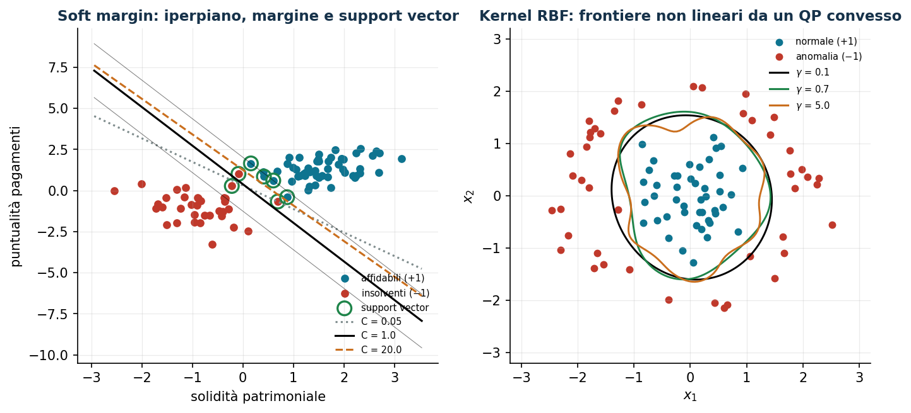
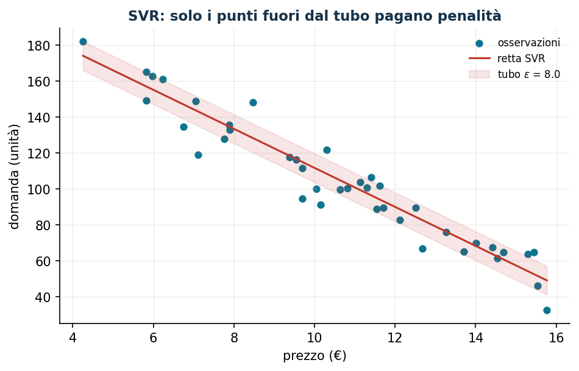

# Support Vector Machine: ottimizzazione per il machine learning

**Classe:** QP convesso · **Script:** `python/lab14_svm.py`

La SVM collega l'ottimizzazione convessa al machine learning: il classificatore si
ottiene risolvendo un QP. Qui **niente librerie di ML**: ogni modello è un QP
scritto e risolto con Gurobi, per capire *che cosa* ottimizza un classificatore.
Le etichette $y_i \in \{-1, +1\}$ sono **dati**; le variabili (coefficienti,
intercetta, scarti, moltiplicatori) tutte continue.

## Hard margin

Dati $n$ punti $\boldsymbol x_i \in \mathbb{R}^p$ con etichette $y_i$:

$$
\min_{\boldsymbol w, b}\; \tfrac12 \|\boldsymbol w\|^2
\quad\text{s.t.}\quad
y_i \Bigl( \sum_{j=1}^{p} w_j x_{ij} + b \Bigr) \ge 1 \quad \forall i = 1, \dots, n
$$

Il margine geometrico è $2/\|\boldsymbol w\|$: minimizzare la norma = massimizzare
il margine.

!!! example "Esempio a mano (2 punti)"
    $\boldsymbol x_1 = (0,0)$, $y_1 = -1$; $\boldsymbol x_2 = (2,2)$, $y_2 = +1$:
    $\boldsymbol w = (0{,}5;\, 0{,}5)$, $b = -1$, margine $2\sqrt2$ = distanza tra i
    punti; entrambi support vector.

## Soft margin e il ruolo di C

$$
\min\; \tfrac12\|\boldsymbol w\|^2 + C \sum_{i=1}^{n} \xi_i
\quad\text{s.t.}\;\;
y_i \Bigl( \sum_j w_j x_{ij} + b \Bigr) \ge 1 - \xi_i,\;\; \xi_i \ge 0 .
$$

Caso di studio (90 clienti, rischio di credito):

```text
C =  0,05: margine 2,42 | errori 2 | nel margine 22   (regolarizzato)
C =  1,00: margine 1,28 | errori 2 | nel margine  7
C = 20,00: margine 0,36 | errori 0 | nel margine  3   (insegue ogni punto)
```



## Il duale e i support vector

$$
\max_{\boldsymbol\alpha}\; \sum_{i=1}^{n} \alpha_i
- \tfrac12 \sum_{i=1}^{n}\sum_{j=1}^{n} \alpha_i \alpha_j y_i y_j\,
\boldsymbol x_i^{\mathsf T} \boldsymbol x_j
\quad\text{s.t.}\;\; \sum_{i=1}^{n} \alpha_i y_i = 0,\;\; 0 \le \alpha_i \le C
$$

```text
w e b dal duale = identici al primale; valore 4,7868 (dualità forte)
alpha = 0     : 83 punti -> irrilevanti per la frontiera
0 < alpha < C :  2 punti -> ESATTAMENTE sul margine (da loro si ricava b)
alpha = C     :  5 punti -> dentro il margine (xi > 0)
```

La soluzione dipende solo dai punti con $\alpha_i > 0$: i **support vector**.
E il duale dipende dai dati solo tramite i prodotti scalari: la porta del kernel.

## Kernel RBF

Sostituendo $\boldsymbol x_i^{\mathsf T}\boldsymbol x_j$ con
$K(\boldsymbol x, \boldsymbol z) = e^{-\gamma\|\boldsymbol x - \boldsymbol z\|^2}$
si ottengono frontiere curve **restando in un QP convesso**.

```text
gamma = 0,1: errori 1, support vector 20   (frontiera regolare)
gamma = 0,7: errori 0, support vector 15
gamma = 5,0: errori 0, support vector 61   <- "memorizza" i punti (overfitting)
```

Convessità del *training* ≠ capacità di *generalizzare*: $C$ e $\gamma$ vanno scelti
per cross-validation.

## Classi sbilanciate e SVR

```text
costi uguali            : precision 1,00   recall insolventi 0,94
costo 10x su insolventi : precision 0,97   recall insolventi 1,00
```

I pesi devono riflettere i **costi decisionali**, non le frequenze delle classi.



**SVR**: tubo di tolleranza $\pm\varepsilon$ senza penalità; sui dati
prezzo→domanda recupera $-10{,}86\,p + 220{,}3$ (vera: $-11p + 220$) usando solo i
14 punti fuori dal tubo.


## Codice

Lo script completo del capitolo — dati, modello, soluzione, sensitività e figure —
è [`python/lab14_svm.py`](https://github.com/fabiofurini/laboratorio-ricerca-operativa/blob/main/python/lab14_svm.py)
(riproducibile con `python3 python/lab14_svm.py` dalla cartella `python/`).

??? example "Mostra lo script completo — `lab14_svm.py`"

    ```python
    """Capitolo 14 — Support Vector Machine come QP convesso (niente sklearn: tutto Gurobi).

    Caso di studio: rischio di credito. 90 clienti descritti da due indicatori
    standardizzati: x1 = solidità patrimoniale, x2 = puntualità nei pagamenti.
    Etichetta y = +1 cliente affidabile, y = -1 cliente insolvente.

    Contenuto:
      1. Hard margin su dati separabili (QP)
      2. Soft margin al variare di C; support vector e violazioni
      3. Formulazione duale: alpha, ricostruzione di w e b, complementarietà
      4. Kernel RBF: frontiera non lineare (dual QP)
      5. Classi sbilanciate: costi asimmetrici C+ / C-
      6. Support Vector Regression su prezzo → domanda
    """
    import gurobipy as gp
    import numpy as np
    import pandas as pd
    from gurobipy import GRB

    from stile import (ARANCIO, GRIGIO, ROSSO, TEAL, VERDE, intestazione, plt, salva_dat,
                       salva_dati, salva_figura, salva_tikz)

    rng = np.random.default_rng(11)

    # ----------------------------------------------------------------------
    # 1. DATI: due gruppi di clienti parzialmente sovrapposti
    # ----------------------------------------------------------------------
    n_pos, n_neg = 55, 35
    X_pos = rng.multivariate_normal([1.6, 1.4], [[0.55, 0.15], [0.15, 0.45]], n_pos)
    X_neg = rng.multivariate_normal([-0.9, -1.1], [[0.65, -0.1], [-0.1, 0.7]], n_neg)
    X = np.vstack([X_pos, X_neg])
    y = np.array([1.0] * n_pos + [-1.0] * n_neg)
    n = len(y)
    salva_dati(pd.DataFrame({"x1": X[:, 0], "x2": X[:, 1], "y": y}), "svm_clienti")


    def svm_primale(C, pesi=None):
        """Soft margin primale: min 1/2||w||^2 + sum C_i xi_i."""
        Ci = np.full(n, C) if pesi is None else pesi
        m = gp.Model("svm_primale")
        m.Params.OutputFlag = 0
        w = m.addVars(2, lb=-GRB.INFINITY, name="w")
        b = m.addVar(lb=-GRB.INFINITY, name="b")
        xi = m.addVars(n, name="xi")
        m.addConstrs((y[i] * (w[0] * X[i, 0] + w[1] * X[i, 1] + b) >= 1 - xi[i]
                      for i in range(n)), name="classif")
        m.setObjective(0.5 * (w[0] * w[0] + w[1] * w[1])
                       + gp.quicksum(Ci[i] * xi[i] for i in range(n)), GRB.MINIMIZE)
        m.optimize()
        assert m.Status == GRB.OPTIMAL
        return (np.array([w[0].X, w[1].X]), b.X,
                np.array([xi[i].X for i in range(n)]), m.ObjVal)


    # ----------------------------------------------------------------------
    # 2. SOFT MARGIN AL VARIARE DI C
    # ----------------------------------------------------------------------
    intestazione("Soft margin primale al variare di C")
    risultati = {}
    for C in [0.05, 1.0, 20.0]:
        w, b, xi, obj = svm_primale(C)
        margine = 2 / np.linalg.norm(w)
        err = int(np.sum(y * (X @ w + b) < 0))
        nsv = int(np.sum(y * (X @ w + b) < 1 + 1e-6))
        risultati[C] = (w, b)
        print(f"  C = {C:5.2f}: w = ({w[0]:6.3f}, {w[1]:6.3f}), b = {b:6.3f} | "
              f"margine = {margine:5.3f} | errori = {err:2d} | punti nel margine = {nsv:2d}")
    print("C piccolo → margine ampio e più violazioni; C grande → margine stretto.")

    C_rif = 1.0
    w1, b1, xi1, _ = svm_primale(C_rif)

    # ----------------------------------------------------------------------
    # 3. FORMULAZIONE DUALE
    # ----------------------------------------------------------------------
    intestazione(f"Duale con C = {C_rif}")
    K_lin = X @ X.T
    md = gp.Model("svm_duale")
    md.Params.OutputFlag = 0
    al = md.addVars(n, ub=C_rif, name="alpha")
    md.addConstr(gp.quicksum(al[i] * y[i] for i in range(n)) == 0, name="somma")
    md.setObjective(gp.quicksum(al[i] for i in range(n))
                    - 0.5 * gp.quicksum(al[i] * al[j] * y[i] * y[j] * K_lin[i, j]
                                        for i in range(n) for j in range(n)), GRB.MAXIMIZE)
    md.optimize()
    assert md.Status == GRB.OPTIMAL
    alpha = np.array([al[i].X for i in range(n)])
    w_dual = (alpha * y) @ X
    sv_margine = [i for i in range(n) if 1e-5 < alpha[i] < C_rif - 1e-5]
    b_dual = float(np.mean([y[i] - w_dual @ X[i] for i in sv_margine]))
    print(f"w dal duale = ({w_dual[0]:.3f}, {w_dual[1]:.3f})  (primale: "
          f"({w1[0]:.3f}, {w1[1]:.3f}))")
    print(f"b dal duale = {b_dual:.3f}  (primale: {b1:.3f})")
    n_zero = int(np.sum(alpha < 1e-5))
    n_marg = len(sv_margine)
    n_C = int(np.sum(alpha > C_rif - 1e-5))
    print(f"alpha = 0 (fuori dal margine): {n_zero} punti — NON influenzano la frontiera")
    print(f"0 < alpha < C (sul margine)  : {n_marg} support vector")
    print(f"alpha = C (dentro/oltre)     : {n_C} punti con xi > 0")
    print(f"Valore duale = {md.ObjVal:.4f} (uguale al primale per dualità forte)")

    sv = alpha > 1e-5
    salva_dat(pd.DataFrame({"x1": X[:, 0], "x2": X[:, 1], "y": y,
                            "alpha": alpha, "sv": sv.astype(int)}), "cap14_punti")
    salva_dat(pd.DataFrame({"C": [0.05, 1.0, 20.0],
                            "w1": [risultati[C][0][0] for C in [0.05, 1.0, 20.0]],
                            "w2": [risultati[C][0][1] for C in [0.05, 1.0, 20.0]],
                            "b": [risultati[C][1] for C in [0.05, 1.0, 20.0]]}), "cap14_rette")

    # ----------------------------------------------------------------------
    # 4. KERNEL RBF
    # ----------------------------------------------------------------------
    intestazione("Kernel RBF (dati a corona: non separabili linearmente)")
    # secondo dataset: anomalie di processo intorno a un funzionamento normale
    n2a, n2b = 45, 45
    raggi = rng.normal(0, 0.55, (n2a, 2))
    angoli = rng.uniform(0, 2 * np.pi, n2b)
    corona = np.column_stack([(2.0 + rng.normal(0, 0.25, n2b)) * np.cos(angoli),
                              (2.0 + rng.normal(0, 0.25, n2b)) * np.sin(angoli)])
    X2 = np.vstack([raggi, corona])
    y2 = np.array([1.0] * n2a + [-1.0] * n2b)
    n2 = len(y2)
    salva_dati(pd.DataFrame({"x1": X2[:, 0], "x2": X2[:, 1], "y": y2}), "svm_corona")
    salva_dat(pd.DataFrame({"x1": X2[:, 0], "x2": X2[:, 1], "y": y2}), "cap14_corona")


    def svm_rbf(gamma, C=5.0):
        K = np.exp(-gamma * ((X2[:, None, :] - X2[None, :, :]) ** 2).sum(-1))
        m = gp.Model("rbf")
        m.Params.OutputFlag = 0
        al = m.addVars(n2, ub=C, name="alpha")
        m.addConstr(gp.quicksum(al[i] * y2[i] for i in range(n2)) == 0)
        m.setObjective(gp.quicksum(al[i] for i in range(n2))
                       - 0.5 * gp.quicksum(al[i] * al[j] * y2[i] * y2[j] * K[i, j]
                                           for i in range(n2) for j in range(n2)), GRB.MAXIMIZE)
        m.optimize()
        aa = np.array([al[i].X for i in range(n2)])
        svm_ = [i for i in range(n2) if 1e-5 < aa[i] < C - 1e-5]
        bb = float(np.mean([y2[i] - sum(aa[j] * y2[j] * K[j, i] for j in range(n2))
                            for i in svm_]))

        def punteggio(P):
            KK = np.exp(-gamma * ((P[:, None, :] - X2[None, :, :]) ** 2).sum(-1))
            return KK @ (aa * y2) + bb

        err = int(np.sum(punteggio(X2) * y2 < 0))
        return punteggio, aa, err


    griglia = np.linspace(-3.2, 3.2, 120)
    GX, GY = np.meshgrid(griglia, griglia)
    P_griglia = np.column_stack([GX.ravel(), GY.ravel()])
    contorni = {}
    for gamma in [0.1, 0.7, 5.0]:
        punteggio, aa, err = svm_rbf(gamma)
        Z = punteggio(P_griglia).reshape(GX.shape)
        contorni[gamma] = Z
        print(f"  gamma = {gamma:4.1f}: errori di training = {err:2d}, "
              f"support vector = {int(np.sum(aa > 1e-5)):2d}")
    print("gamma piccolo → frontiera regolare; gamma grande → frontiera che 'memorizza'.")

    # esporto la frontiera (livello 0) per pgfplots
    for gamma in [0.1, 0.7, 5.0]:
        cs = plt.contour(GX, GY, contorni[gamma], levels=[0.0])
        segmenti = []
        for percorso in cs.allsegs[0]:
            for px, py in percorso:
                segmenti.append((px, py))
            segmenti.append((np.nan, np.nan))       # separatore di linee per pgfplots
        plt.close()
        salva_dat(pd.DataFrame(segmenti, columns=["x", "y"]),
                  f"cap14_rbf_g{str(gamma).replace('.', '_')}")

    # ----------------------------------------------------------------------
    # 5. CLASSI SBILANCIATE: costi asimmetrici
    # ----------------------------------------------------------------------
    intestazione("Classi sbilanciate: perdere un insolvente costa 10 volte tanto")


    def metriche(w, b, XX, yy):
        pred = np.sign(XX @ w + b)
        tp = np.sum((pred == -1) & (yy == -1))     # insolventi individuati
        fp = np.sum((pred == -1) & (yy == 1))
        fn = np.sum((pred == 1) & (yy == -1))
        prec = tp / (tp + fp) if tp + fp else 0
        rec = tp / (tp + fn) if tp + fn else 0
        return prec, rec


    pesi_eq = np.full(n, 1.0)
    pesi_asim = np.where(y == -1, 10.0, 1.0)
    for nome, pesi in [("costi uguali (C = 1)", pesi_eq), ("costo 10x sugli insolventi", pesi_asim)]:
        w, b, xi, _ = svm_primale(1.0, pesi=pesi)
        prec, rec = metriche(w, b, X, y)
        print(f"  {nome:>26}: precision = {prec:.2f}, recall insolventi = {rec:.2f}")
    print("Pesare di più la classe rara sposta la frontiera: si accettano più falsi allarmi")
    print("pur di non lasciar passare un insolvente.")

    # ----------------------------------------------------------------------
    # 6. SUPPORT VECTOR REGRESSION: domanda in funzione del prezzo
    # ----------------------------------------------------------------------
    intestazione("SVR: stima della curva prezzo → domanda")
    np_srv = 40
    prezzi = rng.uniform(4, 16, np_srv)
    domanda_v = 220 - 11 * prezzi + rng.normal(0, 9, np_srv)
    salva_dati(pd.DataFrame({"prezzo": prezzi, "domanda": domanda_v}), "svr_vendite")

    eps_svr, C_svr = 8.0, 10.0
    ms = gp.Model("svr")
    ms.Params.OutputFlag = 0
    w_s = ms.addVar(lb=-GRB.INFINITY, name="w")
    b_s = ms.addVar(lb=-GRB.INFINITY, name="b")
    xi_p = ms.addVars(np_srv, name="xip")
    xi_m = ms.addVars(np_srv, name="xim")
    ms.addConstrs((domanda_v[i] - (w_s * prezzi[i] + b_s) <= eps_svr + xi_p[i]
                   for i in range(np_srv)))
    ms.addConstrs(((w_s * prezzi[i] + b_s) - domanda_v[i] <= eps_svr + xi_m[i]
                   for i in range(np_srv)))
    ms.setObjective(0.5 * w_s * w_s + C_svr * gp.quicksum(xi_p[i] + xi_m[i]
                                                          for i in range(np_srv)), GRB.MINIMIZE)
    ms.optimize()
    fuori = int(sum(1 for i in range(np_srv)
                    if abs(domanda_v[i] - (w_s.X * prezzi[i] + b_s.X)) > eps_svr + 1e-6))
    print(f"Retta SVR: domanda = {w_s.X:.2f} · prezzo + {b_s.X:.2f} (vera: -11 p + 220)")
    print(f"Tubo epsilon = {eps_svr}: {fuori} punti fuori dal tubo su {np_srv} "
          f"(solo questi determinano la retta)")
    salva_dat(pd.DataFrame({"prezzo": prezzi, "domanda": domanda_v,
                            "stima": w_s.X * prezzi + b_s.X}), "cap14_svr")
    salva_dat(pd.DataFrame({"w": [w_s.X], "b": [b_s.X], "eps": [eps_svr]}), "cap14_svr_retta")

    # ----------------------------------------------------------------------
    # 7. FIGURE (anteprima matplotlib)
    # ----------------------------------------------------------------------
    fig, (ax1, ax2) = plt.subplots(1, 2, figsize=(10.8, 4.6))
    ax1.scatter(X[y > 0, 0], X[y > 0, 1], color=TEAL, s=26, label="affidabili (+1)")
    ax1.scatter(X[y < 0, 0], X[y < 0, 1], color=ROSSO, s=26, label="insolventi ($-1$)")
    ax1.scatter(X[sv, 0], X[sv, 1], facecolors="none", edgecolors=VERDE, s=110, lw=1.6,
                label="support vector")
    xs = np.linspace(X[:, 0].min() - 0.4, X[:, 0].max() + 0.4, 10)
    for cc, (colore, stile_l) in zip([0.05, 1.0, 20.0],
                                     [(GRIGIO, ":"), ("k", "-"), (ARANCIO, "--")]):
        w, b = risultati[cc]
        ax1.plot(xs, -(w[0] * xs + b) / w[1], color=colore, ls=stile_l, label=f"C = {cc}")
    w, b = risultati[1.0]
    for delta in (-1, 1):
        ax1.plot(xs, -(w[0] * xs + b - delta) / w[1], color="k", ls="-", lw=0.5, alpha=0.5)
    ax1.set_xlabel("solidità patrimoniale"); ax1.set_ylabel("puntualità pagamenti")
    ax1.set_title("Soft margin: iperpiano, margine e support vector")
    ax1.legend(fontsize=7, loc="lower right")
    ax2.scatter(X2[y2 > 0, 0], X2[y2 > 0, 1], color=TEAL, s=22, label="normale (+1)")
    ax2.scatter(X2[y2 < 0, 0], X2[y2 < 0, 1], color=ROSSO, s=22, label="anomalia ($-1$)")
    for gamma, colore in zip([0.1, 0.7, 5.0], ["k", VERDE, ARANCIO]):
        ax2.contour(GX, GY, contorni[gamma], levels=[0], colors=[colore], linewidths=1.4)
        ax2.plot([], [], color=colore, label=f"$\\gamma$ = {gamma}")
    ax2.set_xlabel("$x_1$"); ax2.set_ylabel("$x_2$")
    ax2.set_title("Kernel RBF: frontiere non lineari da un QP convesso")
    ax2.legend(fontsize=7, loc="upper right")
    salva_figura(fig, "cap14_svm")

    fig, ax = plt.subplots()
    ordina = np.argsort(prezzi)
    ax.scatter(prezzi, domanda_v, color=TEAL, s=24, label="osservazioni")
    ax.plot(prezzi[ordina], (w_s.X * prezzi + b_s.X)[ordina], color=ROSSO, label="retta SVR")
    ax.fill_between(prezzi[ordina], (w_s.X * prezzi + b_s.X)[ordina] - eps_svr,
                    (w_s.X * prezzi + b_s.X)[ordina] + eps_svr, color=ROSSO, alpha=0.12,
                    label=f"tubo $\\varepsilon$ = {eps_svr}")
    ax.set_xlabel("prezzo (€)"); ax.set_ylabel("domanda (unità)")
    ax.set_title("SVR: solo i punti fuori dal tubo pagano penalità")
    ax.legend(fontsize=8)
    salva_figura(fig, "cap14_svr")

    print("\nFatto: capitolo 14.")
    ```

## Esercizi

1. Hard margin con $\boldsymbol x_2 = (4, 0)$: $\boldsymbol w = (0{,}5;\, 0)$,
   $b = -1$, margine 4.
2. Verificare le tre condizioni di complementarietà sui 7 support vector.
3. Curva di validazione in $C$: training monotono, validazione a U.
4. Soglia decisionale $\theta$ con costi 10:1: tracciare precision/recall.
5. One-Class SVM sul dataset a corona al variare di $\nu$.
