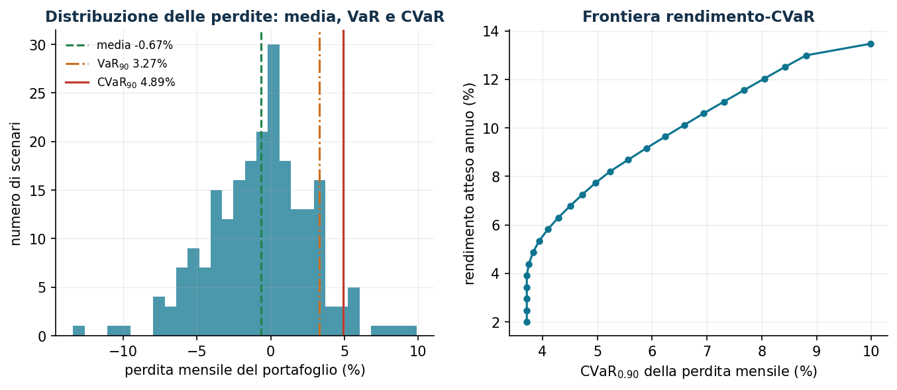

# VaR e CVaR: misurare e ottimizzare il rischio

**Classe:** LP a scenari · **Script:** `python/lab13_var_cvar.py`

[](https://colab.research.google.com/github/fabiofurini/laboratorio-ricerca-operativa/blob/main/notebooks/lab13_var_cvar.ipynb)

Ottimizzare il valore medio può nascondere perdite rare e molto elevate. Il **VaR**
(*Value-at-Risk*) risponde a "qual è una soglia di perdita elevata?"; il **CVaR**
(*Conditional Value-at-Risk*) anche a "quanto perdiamo *in media* quando la soglia
viene superata?". Sorpresa didattica: il CVaR si ottimizza con un semplice LP.

## Definizioni

Per una perdita aleatoria $L$ (maiuscola per aderenza alla letteratura — eccezione
alla convenzione che riserva le maiuscole a insiemi e matrici; realizzazioni
minuscole $\ell_s$) e un livello $\alpha \in (0,1)$:

$$
\mathrm{VaR}_\alpha(L) = \inf\{\eta : \mathbb{P}(L \le \eta) \ge \alpha\}
\qquad
\mathrm{CVaR}_\alpha(L) = \text{media della coda peggiore di massa } 1 - \alpha .
$$

| Proprietà | |
|---|---|
| Convessità | il CVaR è convesso nelle decisioni (se $L$ lo è); il VaR in generale no |
| Subadditività | il CVaR premia la diversificazione; il VaR può violarla |
| Coda | il VaR non distingue due code con lo stesso quantile ma gravità diversa |
| Ottimizzazione | il CVaR ammette una formulazione LP a scenari; il VaR no |

!!! example "Esempio a mano (6 scenari, α = 0,80)"
    Perdite equiprobabili $\{2, 4, 5, 7, 12, 20\}$: VaR $= 12$ (la cumulata tocca
    0,80 lì); CVaR $= 12 + \frac{1}{0{,}20}\cdot\frac{1}{6}(20 - 12) =
    \mathbf{18{,}67}$ — la formula tratta correttamente la massa "a cavallo" del
    quantile. Media $= 8{,}33$: tre numeri, tre storie.

## La formulazione lineare di Rockafellar–Uryasev

**Dati (input del modello).** Il numero di scenari $k \in \mathbb{Z}_{\ge 1}$,
indicizzati da $s \in \{1, 2, \dots, k\}$; per ogni scenario, la probabilità
$\pi_s \in \mathbb{Q}_{\ge 0}$ (con $\sum_{s=1}^{k} \pi_s = 1$) e la perdita
$\ell_s(\boldsymbol x)$, funzione lineare del vettore delle decisioni
$\boldsymbol x$, vincolato in un poliedro $X$; il livello di confidenza
$\alpha \in (0, 1)$.

**Variabili decisionali.** Oltre alle decisioni $\boldsymbol x$, introduciamo una
variabile libera e $k$ variabili non negative:

$$
\begin{cases}
\eta = \text{soglia candidata di perdita (all'ottimo: un VaR)}\\[1ex]
\xi_s = \text{eccesso di perdita oltre } \eta \text{ nello scenario } s
\end{cases}
\qquad \forall s \in \{1, 2, \dots, k\}.
$$

Usando queste variabili, il modello LP di Rockafellar–Uryasev è il seguente:

$$
\begin{aligned}
\min ~~ \eta + \frac{1}{1-\alpha} \sum_{s=1}^{k} \pi_s\, \xi_s & & \\
\text{soggetto a} \quad \xi_s &\ge \ell_s(\boldsymbol x) - \eta, & \forall s \in \{1, 2, \dots, k\}, \\
\boldsymbol x &\in X, & \\
\eta &\gtreqless 0, & \\
\xi_s &\ge 0, & \forall s \in \{1, 2, \dots, k\}.
\end{aligned}
$$

Descrizione della funzione obiettivo e dei vincoli:

- la funzione obiettivo lineare è la soglia $\eta$ più la media pesata degli eccessi
  di coda, amplificata di $1/(1-\alpha)$; *all'ottimo $\tilde\eta$ è un VaR e il
  valore obiettivo è il CVaR*: un solo LP fornisce entrambe le misure;
- i vincoli lineari di **coda** definiscono gli eccessi: solo gli scenari con perdita
  oltre la soglia contribuiscono ($k$ vincoli lineari);
- il vincolo $\boldsymbol x \in X$ raccoglie i vincoli (poliedrali) del problema
  decisionale sottostante;
- i vincoli su $\eta$ e $\xi_s$ definiscono le variabili: $\eta$ è libera (il simbolo
  $\gtreqless$, in Gurobi `addVar(lb=-GRB.INFINITY)`), le $\xi_s$ non negative.

La variabile $\xi_s = (\ell_s - \eta)^+$ è l'eccesso di perdita oltre la soglia
candidata $\eta$ (stesso trucco delle parti positive del Newsvendor). Minimizzare su
$\eta$ bilancia due spinte: alzare $\eta$ riduce gli eccessi ma sposta in su la
soglia; il punto di equilibrio è esattamente il quantile $\alpha$.

## Caso di studio 1: portafoglio mean-CVaR vs Markowitz

Gli stessi otto titoli del capitolo su Markowitz, ma con $k = 220$ scenari mensili
generati con **code grasse** (fattore di mercato $t$ di Student, 4 gradi di libertà).
Perdita di scenario $\ell_s(\boldsymbol x) = -\sum_{i=1}^{n} r_{is}\, x_i$, dove
$r_{is}$ è il rendimento del titolo $i$ nello scenario $s$; minimizziamo
$\mathrm{CVaR}_{0,90}$ con rendimento atteso $\ge 8\%$ annuo.

```text
            | perdita media | VaR90  | CVaR90   (perdite mensili)
  mean-CVaR |       -0,0067 | 0,0327 | 0,0489
  Markowitz |       -0,0067 | 0,0329 | 0,0531
Composizioni: mean-CVaR: ENE 9,9 FIN 1,9 TEC 10,5 SAN 8,6 UTL 46,5 MAT 22,5
              Markowitz: ENE 18,4 FIN 6,4 TEC 6,5 SAN 13,6 UTL 40,4 MAT 14,6
```



A parità di rendimento richiesto e di perdita media, il portafoglio mean-CVaR taglia
la coda: CVaR₉₀ del 4,89% contro 5,31% di Markowitz (−8%). Lo fa riducendo i titoli
ad alto beta (ENE dal 18% al 10%) a favore di UTL e di una quota di TEC che, pur
mediocre in media, si muove in controtendenza negli scenari peggiori di questo
campione. La varianza penalizza simmetricamente sopra e sotto la media; il CVaR
guarda solo dove fa male.

## Caso di studio 2: supply chain a due stadi

Prima di osservare lo scenario si *prenota* capacità dai fornitori; poi, visto lo
scenario, si decide il ricorso. F1 è economico ma fragile (nel 12% degli scenari la
sua disponibilità crolla al 30%); F2 è caro ma affidabile. Penalità di shortage
40 €/unità; $k = 400$ scenari.

**Dati.** Due fornitori indicizzati da $a \in \{1, 2\}$ con costi di prenotazione
$c^{\mathrm{pre}}_a \in \mathbb{Q}_{>0}$ e di acquisto
$c^{\mathrm{uso}}_a \in \mathbb{Q}_{>0}$; $k$ scenari $s \in \{1, 2, \dots, k\}$ con
domanda $d_s \in \mathbb{Q}_{\ge 0}$ e disponibilità $\delta_{as} \in (0, 1]$ (il
dato che modella il guasto); penalità di shortage $g \in \mathbb{Q}_{>0}$; peso del
rischio $\lambda \in [0, 1]$ e livello $\alpha \in (0,1)$.

**Variabili decisionali.** Le variabili non negative $x_a$ (capacità prenotata dal
fornitore $a$, *di primo stadio*: uguale in tutti gli scenari), $f_{as}$ (acquisto
dal fornitore $a$ nello scenario $s$) e $u_s$ (domanda non servita nello scenario
$s$), queste ultime *di ricorso*.

$$
\begin{aligned}
\min ~~ (1-\lambda) \Bigl[ \sum_{a=1}^{2} c^{\mathrm{pre}}_a x_a + \sum_{s=1}^{k} \pi_s\, \phi_s \Bigr] + \lambda\, \mathrm{CVaR}_\alpha & & \\
\text{soggetto a} \quad f_{as} &\le \delta_{as}\, x_a, & \forall a \in \{1, 2\},~\forall s \in \{1, 2, \dots, k\}, \\
f_{1s} + f_{2s} + u_s &\ge d_s, & \forall s \in \{1, 2, \dots, k\}, \\
x_a,\ f_{as},\ u_s &\ge 0, & \forall a \in \{1, 2\},~\forall s \in \{1, 2, \dots, k\},
\end{aligned}
$$

dove $\phi_s = \sum_{a=1}^{2} c^{\mathrm{uso}}_a f_{as} + g\, u_s$ è il costo di
ricorso dello scenario $s$ e $\mathrm{CVaR}_\alpha$ è il CVaR del costo totale,
linearizzato con le variabili $\eta$ e $\xi_s$ del modello di Rockafellar–Uryasev.

Descrizione della funzione obiettivo e dei vincoli:

- la funzione obiettivo combina, con peso $\lambda$, il costo medio (prenotazioni più
  valore atteso di acquisti e penalità) e il CVaR del costo totale;
- i vincoli lineari di **capacità** impongono che nello scenario $s$ si possa usare il
  fornitore $a$ solo fino alla capacità prenotata $x_a$, ridotta dalla disponibilità
  $\delta_{as}$ ($2\,k$ vincoli lineari);
- i vincoli lineari di **domanda** impongono di coprire $d_s$ con i flussi o, in
  mancanza, di conteggiarla come shortage $u_s$, che in obiettivo paga la penalità:
  il modello non è mai inammissibile, "compra" l'inammissibilità al prezzo della
  penalità ($k$ vincoli lineari);
- i vincoli di non negatività su $x_a$, $f_{as}$ e $u_s$ definiscono le variabili del
  modello.

```text
lambda = 0,0: prenoto forn.1 161,5  forn.2 134,2
              costo medio 1.724   CVaR90 2.902   servizio 98,7%
lambda = 0,5: prenoto forn.1  92,7  forn.2 212,7
              costo medio 1.803   CVaR90 2.217   servizio 99,9%
lambda = 1,0: prenoto forn.1  68,5  forn.2 236,9
              costo medio 1.906   CVaR90 2.139   servizio 99,0%
```

Il decisore neutrale compra dal fornitore economico e accetta che nel 12% degli
scenari lo shortage faccia esplodere i costi (CVaR 2.902). Al crescere di $\lambda$
la capacità migra verso il fornitore affidabile: **+79 € di costo medio comprano
−685 € di CVaR** — il costo della resilienza, quantificato.

## Analisi di sensitività

| Parametro | Effetto atteso |
|---|---|
| $\alpha$ | più alto ⇒ coda più estrema stimata da meno scenari: servono più scenari per stime stabili |
| $\lambda$ | controlla il compromesso prestazione media / protezione |
| $\pi_s$ | scenari ripesati o stress test (aggiungere scenari estremi) |
| $k$ | stabilità statistica: ripetere con campioni diversi, come nel Newsvendor |

!!! warning "Limiti statistici"
    Con $\alpha = 0{,}99$ e $k = 220$ scenari la coda contiene solo 2–3 scenari: il
    CVaR stimato è quasi rumore. Regola pratica: servono almeno qualche decina di
    scenari *oltre* il quantile. Inoltre con distribuzioni discrete il VaR può non
    essere unico ($\tilde\eta$ è *un* VaR): confrontare sempre $\tilde\eta$ con il
    quantile empirico.


## Codice

Lo script completo del capitolo — dati, modello, soluzione, sensitività e figure —
è [`python/lab13_var_cvar.py`](https://github.com/fabiofurini/laboratorio-ricerca-operativa/blob/main/python/lab13_var_cvar.py)
(riproducibile con `python3 python/lab13_var_cvar.py` dalla cartella `python/`).

Lo stesso codice è disponibile come notebook — [`notebooks/lab13_var_cvar.ipynb`](https://github.com/fabiofurini/laboratorio-ricerca-operativa/blob/main/notebooks/lab13_var_cvar.ipynb) — che si apre in Colab dal badge in cima alla pagina e gira nel browser, senza installare niente.

??? example "Mostra lo script completo — `lab13_var_cvar.py`"

    ```python
    """Capitolo 13 — VaR e CVaR: modelli lineari e applicazioni (LP a scenari).

    Contenuto:
      1. Esempio a 6 scenari: VaR = 12, CVaR = 18,67,
         verificato con la formulazione lineare di Rockafellar-Uryasev
      2. Portafoglio mean-CVaR (LP) e confronto con Markowitz (QP)
      3. Frontiera rendimento-CVaR
      4. Supply chain a due stadi con scenari avversi: il costo della resilienza
    """
    import gurobipy as gp
    import numpy as np
    import pandas as pd
    from gurobipy import GRB

    from stile import (ARANCIO, GRIGIO, ROSSO, TEAL, VERDE, intestazione, plt, salva_dat,
                       salva_dati, salva_figura)

    rng = np.random.default_rng(42)

    # ----------------------------------------------------------------------
    # 1. ESEMPIO A 6 SCENARI
    # ----------------------------------------------------------------------
    intestazione("Esempio a 6 scenari: VaR e CVaR con la formulazione lineare")
    perdite = np.array([2.0, 4.0, 5.0, 7.0, 12.0, 20.0])
    pi6 = np.full(6, 1 / 6)
    alpha = 0.80

    # calcolo diretto
    cum = np.cumsum(pi6)
    var_diretto = perdite[np.searchsorted(cum, alpha)]
    print(f"Perdite: {perdite.tolist()}, probabilità 1/6 ciascuna, alpha = {alpha}")
    print(f"VaR (quantile): {var_diretto:.2f}")

    # formulazione lineare di Rockafellar-Uryasev: min eta + 1/(1-alpha) sum pi_s xi_s
    m = gp.Model("cvar6")
    m.Params.OutputFlag = 0
    eta = m.addVar(lb=-GRB.INFINITY, name="eta")
    xi = m.addVars(6, name="xi")
    m.addConstrs((xi[s] >= perdite[s] - eta for s in range(6)), name="coda")
    m.setObjective(eta + gp.quicksum(pi6[s] * xi[s] for s in range(6)) / (1 - alpha),
                   GRB.MINIMIZE)
    m.optimize()
    print(f"LP di Rockafellar-Uryasev: eta* = {eta.X:.2f} (un VaR), CVaR = {m.ObjVal:.4f}")
    print(f"Conto a mano: 12 + (1/0,20)·(1/6)·(20-12) = 12 + 6,67 = 18,67  ✓")
    print(f"Valore atteso della perdita: {perdite.mean():.2f} "
          f"→ il CVaR racconta la coda, la media no.")

    # ----------------------------------------------------------------------
    # 2. PORTAFOGLIO MEAN-CVaR vs MARKOWITZ
    # ----------------------------------------------------------------------
    intestazione("Portafoglio mean-CVaR (LP) vs Markowitz (QP)")
    titoli = ["ENE", "FIN", "TEC", "IND", "SAN", "CON", "UTL", "MAT"]
    n = len(titoli)
    beta_f = np.array([1.1, 1.3, 1.5, 1.0, 0.6, 0.8, 0.4, 1.2])
    alfa_ann = np.array([0.05, 0.06, 0.11, 0.05, 0.045, 0.05, 0.035, 0.06])
    sigma_idio = np.array([0.05, 0.055, 0.07, 0.04, 0.03, 0.035, 0.02, 0.06])
    S = 220                                   # scenari mensili (licenza pip: n+2+S vincoli)
    # fattore di mercato con CODE GRASSE (t di Student): scenari estremi realistici
    mercato = 0.004 + 0.035 * rng.standard_t(4, S) / np.sqrt(2)
    R = alfa_ann[None, :] / 12 + np.outer(mercato, beta_f) + rng.normal(0, sigma_idio, (S, n))
    salva_dati(pd.DataFrame(R, columns=titoli), "cvar_scenari_rendimenti")

    mu = R.mean(axis=0) * 12
    Q = np.cov(R.T) * 12
    alpha_c = 0.90


    def porta_cvar(r_min):
        """min CVaR_alpha della perdita mensile -R x  soggetto a  rendimento atteso >= r_min."""
        m = gp.Model("mean_cvar")
        m.Params.OutputFlag = 0
        x = m.addVars(n, name="x")
        eta = m.addVar(lb=-GRB.INFINITY, name="eta")
        xi = m.addVars(S, name="xi")
        m.addConstr(x.sum() == 1)
        m.addConstr(gp.quicksum(mu[i] * x[i] for i in range(n)) >= r_min)
        m.addConstrs((xi[s] >= -gp.quicksum(R[s, i] * x[i] for i in range(n)) - eta
                      for s in range(S)), name="coda")
        m.setObjective(eta + gp.quicksum(xi[s] for s in range(S)) / (S * (1 - alpha_c)),
                       GRB.MINIMIZE)
        m.optimize()
        if m.Status != GRB.OPTIMAL:
            return None, None
        w = np.array([x[i].X for i in range(n)])
        return w, m.ObjVal


    def porta_markowitz(r_min):
        m = gp.Model("mk")
        m.Params.OutputFlag = 0
        x = m.addVars(n, name="x")
        m.addConstr(x.sum() == 1)
        m.addConstr(gp.quicksum(mu[i] * x[i] for i in range(n)) >= r_min)
        m.setObjective(gp.quicksum(Q[i, j] * x[i] * x[j] for i in range(n) for j in range(n)),
                       GRB.MINIMIZE)
        m.optimize()
        return np.array([x[i].X for i in range(n)])


    r_obb = 0.08
    w_cv, cvar_ott = porta_cvar(r_obb)
    w_mk = porta_markowitz(r_obb)
    perd_cv = -R @ w_cv
    perd_mk = -R @ w_mk


    def stat_perdite(perd):
        var_ = np.quantile(perd, alpha_c)
        cvar_ = perd[perd >= var_ - 1e-12].mean()
        return perd.mean(), var_, cvar_


    print(f"Rendimento minimo richiesto: {r_obb:.0%} annuo, alpha = {alpha_c}")
    print(f"{'':>12} | {'perdita media':>13} | {'VaR90':>8} | {'CVaR90':>8}  (perdite mensili)")
    for nome, perd in [("mean-CVaR", perd_cv), ("Markowitz", perd_mk)]:
        mm_, vv_, cc_ = stat_perdite(perd)
        print(f"{nome:>12} | {mm_:13.4f} | {vv_:8.4f} | {cc_:8.4f}")
    print("\nComposizioni (quote > 1%):")
    for nome, w in [("mean-CVaR", w_cv), ("Markowitz", w_mk)]:
        print(f"  {nome:>10}: " + ", ".join(f"{titoli[i]} {w[i]:.1%}"
                                            for i in range(n) if w[i] > 0.01))

    # istogramma delle perdite del portafoglio mean-CVaR
    conteggi, bordi = np.histogram(perd_cv * 100, bins=30)
    salva_dat(pd.DataFrame({"centro": (bordi[:-1] + bordi[1:]) / 2, "freq": conteggi}),
              "cap13_istogramma")
    mm_, var_cv, cvar_cv = stat_perdite(perd_cv)
    salva_dat(pd.DataFrame({"stat": ["media", "VaR", "CVaR"],
                            "valore": [mm_ * 100, var_cv * 100, cvar_cv * 100]}), "cap13_soglie")

    # ----------------------------------------------------------------------
    # 3. FRONTIERA RENDIMENTO-CVaR
    # ----------------------------------------------------------------------
    intestazione("Frontiera rendimento-CVaR")
    r_grid = np.linspace(0.02, mu.max() * 0.999, 25)
    punti = []
    for r in r_grid:
        w, cv = porta_cvar(r)
        if w is not None:
            punti.append((cv * 100, r * 100))
    front = pd.DataFrame(punti, columns=["cvar", "rend"])
    salva_dat(front, "cap13_frontiera")
    print(f"{len(front)} punti calcolati; CVaR minimo {front['cvar'].min():.2f}% "
          f"al rendimento {front.loc[front['cvar'].idxmin(), 'rend']:.1f}%")

    # ----------------------------------------------------------------------
    # 4. SUPPLY CHAIN A DUE STADI CON SCENARI AVVERSI
    # ----------------------------------------------------------------------
    intestazione("Supply chain a due stadi: capacità prenotata + ricorso")
    # Due fornitori (F1 economico ma fragile, F2 caro ma affidabile) → un mercato.
    # 1° stadio: capacità prenotata x_a (€/unità).  2° stadio: flussi f_as e shortage u_s.
    forn = ["F1", "F2"]
    c_pren = {"F1": 2.0, "F2": 3.2}         # costo di prenotazione €/unità
    c_uso = {"F1": 4.0, "F2": 5.0}          # costo di acquisto a consuntivo
    pen = 40.0                              # penalità per unità di domanda non servita
    Ss = 400
    dom_s = np.maximum(rng.normal(200, 40, Ss), 0)
    # disponibilità del fornitore fragile: nel 12% degli scenari crolla al 30%
    disp_f1 = np.where(rng.uniform(size=Ss) < 0.12, 0.3, 1.0)
    disp = {"F1": disp_f1, "F2": np.ones(Ss)}


    def duestadi(lam, alpha_c2=0.90):
        m = gp.Model("duestadi")
        m.Params.OutputFlag = 0
        x = m.addVars(forn, ub=400, name="x")
        f = m.addVars(forn, range(Ss), name="f")
        u = m.addVars(range(Ss), name="u")
        for s in range(Ss):
            for a in forn:
                m.addConstr(f[a, s] <= disp[a][s] * x[a])
            m.addConstr(gp.quicksum(f[a, s] for a in forn) + u[s] >= dom_s[s])
        costo1 = gp.quicksum(c_pren[a] * x[a] for a in forn)
        costo2 = {s: gp.quicksum(c_uso[a] * f[a, s] for a in forn) + pen * u[s]
                  for s in range(Ss)}
        atteso = costo1 + gp.quicksum(costo2[s] for s in range(Ss)) / Ss
        if lam > 0:
            eta = m.addVar(lb=-GRB.INFINITY)
            xi = m.addVars(range(Ss))
            m.addConstrs((xi[s] >= costo1 + costo2[s] - eta for s in range(Ss)))
            cvar = eta + gp.quicksum(xi[s] for s in range(Ss)) / (Ss * (1 - alpha_c2))
            m.setObjective((1 - lam) * atteso + lam * cvar, GRB.MINIMIZE)
        else:
            m.setObjective(atteso, GRB.MINIMIZE)
        m.optimize()
        assert m.Status == GRB.OPTIMAL, m.Status
        tot = np.array([c_pren["F1"] * x["F1"].X + c_pren["F2"] * x["F2"].X
                        + sum(c_uso[a] * f[a, s].X for a in forn) + pen * u[s].X
                        for s in range(Ss)])
        serv = np.array([1 - u[s].X / dom_s[s] for s in range(Ss)])
        return {a: x[a].X for a in forn}, tot, serv


    righe = []
    for lam in [0.0, 0.5, 1.0]:
        cap, tot, serv = duestadi(lam)
        var_t = np.quantile(tot, 0.90)
        cvar_t = tot[tot >= var_t - 1e-9].mean()
        righe.append((lam, cap["F1"], cap["F2"], tot.mean(), cvar_t, serv.mean()))
        print(f"  lambda = {lam:3.1f}: prenoto F1 = {cap['F1']:6.1f}, F2 = {cap['F2']:6.1f} | "
              f"costo medio {tot.mean():8.2f}, CVaR90 {cvar_t:8.2f} | servizio medio {serv.mean():.1%}")
    res2 = pd.DataFrame(righe, columns=["lam", "F1", "F2", "costo_medio", "cvar", "servizio"])
    salva_dat(res2, "cap13_duestadi")
    print("Il decisore avverso al rischio prenota più capacità dal fornitore affidabile:")
    print("paga di più in media, ma taglia la coda degli scenari con shortage.")

    # ----------------------------------------------------------------------
    # 5. FIGURE
    # ----------------------------------------------------------------------
    fig, (ax1, ax2) = plt.subplots(1, 2, figsize=(10.8, 4.0))
    ax1.bar((bordi[:-1] + bordi[1:]) / 2, conteggi, width=np.diff(bordi), color=TEAL, alpha=0.75)
    ax1.axvline(mm_ * 100, color=VERDE, ls="--", label=f"media {mm_ * 100:.2f}%")
    ax1.axvline(var_cv * 100, color=ARANCIO, ls="-.", label=f"VaR$_{{90}}$ {var_cv * 100:.2f}%")
    ax1.axvline(cvar_cv * 100, color=ROSSO, ls="-", label=f"CVaR$_{{90}}$ {cvar_cv * 100:.2f}%")
    ax1.set_xlabel("perdita mensile del portafoglio (%)")
    ax1.set_ylabel("numero di scenari")
    ax1.set_title("Distribuzione delle perdite: media, VaR e CVaR")
    ax1.legend(fontsize=8)
    ax2.plot(front["cvar"], front["rend"], "-o", color=TEAL, ms=4)
    ax2.set_xlabel("CVaR$_{0.90}$ della perdita mensile (%)")
    ax2.set_ylabel("rendimento atteso annuo (%)")
    ax2.set_title("Frontiera rendimento-CVaR")
    salva_figura(fig, "cap13_perdite_frontiera")

    print("\nFatto: capitolo 13.")
    ```

## Esercizi

1. Sei scenari con $\alpha = 0{,}90$: VaR = CVaR = 20 (la coda sta tutta
   sull'ultimo punto).
2. Costruire un esempio in cui il VaR viola la subadditività (due prestiti
   indipendenti) e verificare che il CVaR no.
3. CVaR ottimo per $\alpha \in \{0{,}8;\, 0{,}9;\, 0{,}95;\, 0{,}99\}$: quando
   iniziano le instabilità?
4. Forma vincolata $\max \sum_i \mu_i x_i$ soggetto a $\mathrm{CVaR} \le k$: stessa
   frontiera, duale = rendimento marginale del rischio.
5. Stress test: scenario estremo con probabilità 1% — come cambia la prenotazione?
